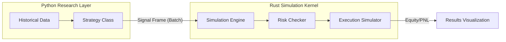

# Backtesting Guide
## Phase 3.5 Rust-Optimized Backtesting

The backtesting engine in Phase 3.5 is a hybrid system that uses Python for research and a high-performance Rust simulation kernel for execution.

---

## 1. Architecture Overview



---

## 2. Strategy Requirements

For production-grade backtesting, strategies must implement the **Batch Signal Interface**. Instead of processing data bar-by-bar, the strategy generates all signals for the period at once and hands them to Rust.

### `generate_signal_frame` Interface
```python
def generate_signal_frame(self, data_by_symbol: dict[str, pd.DataFrame], context: dict) -> pd.DataFrame:
    """
    Generate a complete signal frame for the simulation.

    Required Columns:
    - timestamp: When signal was generated
    - symbol: Target symbol
    - signal_type: LONG, SHORT, EXIT, HOLD
    - strength: 0.0 to 1.0
    - strategy_id: Unique identifier
    """
```

---

## 3. Running a Backtest

```python
from backtesting.engine import BacktestEngine
from backtesting.data_handler import HistoricalDataHandler
from backtesting.portfolio_handler import PortfolioHandler

# 1. Prepare Data
handler = HistoricalDataHandler(symbols=["AAPL", "TSLA"])
handler.load_from_db("2023-01-01", "2023-12-31")

# 2. Initialize Engine
portfolio = PortfolioHandler(initial_capital=100000.0)
strategy = MyStrategy(window=20)

engine = BacktestEngine(
    data_handler=handler,
    portfolio_handler=portfolio,
    strategy=strategy
)

# 3. Execute
results = engine.run()

# 4. View Integrity Report
if results['integrity_report']['is_valid']:
    print("Backtest passed integrity checks")
else:
    print(f"Backtest invalid: {results['integrity_report']['reasons']}")
```

---

## 4. Integrity & Risk Validation

The Phase 3.5 engine automatically validates the run against:
- **Risk Decisions**: Every signal is checked against production-identical Rust risk limits.
- **PNL Drift**: Comparison between Python shadow state and Rust truth.
- **Reconciliation**: Ensuring data integrity across the FFI boundary.

---

## 5. Performance Metrics

Results include a comprehensive metrics suite:
- **Financial**: Sharpe, Sortino, Max Drawdown, Calmar.
- **Operational**: Events/sec, Risk rejection counts, Execution latency.
- **Integrity**: Drift percentages and reconciliation failure counts.

---
**Architect**: Antigravity AI
**Updated**: May 11, 2026