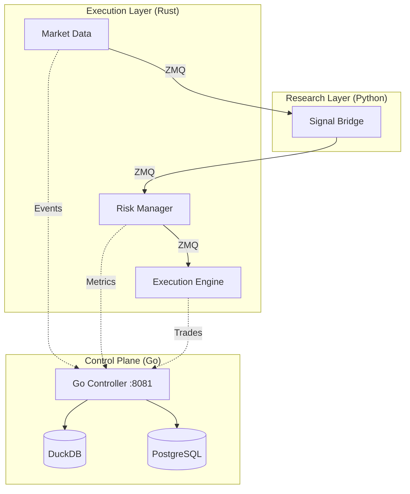

# Observability & Control-Plane Overview

## Introduction

The RustAlgorithmTrading platform uses a **Go-native Control-Plane** (port 8081) for real-time observability, metric aggregation, and system management. This architecture provides high-performance telemetry with minimal overhead to the Rust execution kernel.

## Core Components

| Component | Technology | Role |
|:---|:---|:---|
| **Control Plane** | Go 1.22+ | REST API, WebSocket streaming, and data aggregation |
| **Primary Storage** | DuckDB | High-speed columnar storage for time-series metrics |
| **Secondary Storage** | PostgreSQL | Transactional storage for trade history and metadata |
| **Telemetry Bus** | ZeroMQ | Event-driven messaging between Rust/Python and Go |

## Documentation Roadmap

### 1. APIs & Integration
- **[BACKEND_API.md](./BACKEND_API.md)**: The authoritative REST/WebSocket contract for the Go control plane.
- **[PHASE3_API_PARITY_MATRIX.md](./PHASE3_API_PARITY_MATRIX.md)**: Status of Go-native endpoints vs. legacy requirements.

### 2. Operational Guides
- **[STORAGE_OPERATIONS.md](./STORAGE_OPERATIONS.md)**: How to manage DuckDB/PostgreSQL, backups, and maintenance.
- **[LOGGING_STANDARDS.md](./LOGGING_STANDARDS.md)**: Unified logging patterns for Rust, Python, and Go.
- **[PHASE3_CUTOVER_RUNBOOK.md](./PHASE3_CUTOVER_RUNBOOK.md)**: Procedures for production transition and rollback.

### 3. System Metrics
- **[METRICS_CATALOG.md](./METRICS_CATALOG.md)**: Comprehensive list of all metrics tracked by the system (Latency, P&L, Health).

## System Architecture



## Health & Monitoring

To verify the health of the observability stack:
```bash
# Check Go control plane
curl http://localhost:8081/health

# Check storage readiness
curl http://localhost:8081/health/ready
```

---
**Maintained By**: Trading Infrastructure Team
**Status**: Production Ready (Phase 3.5)
