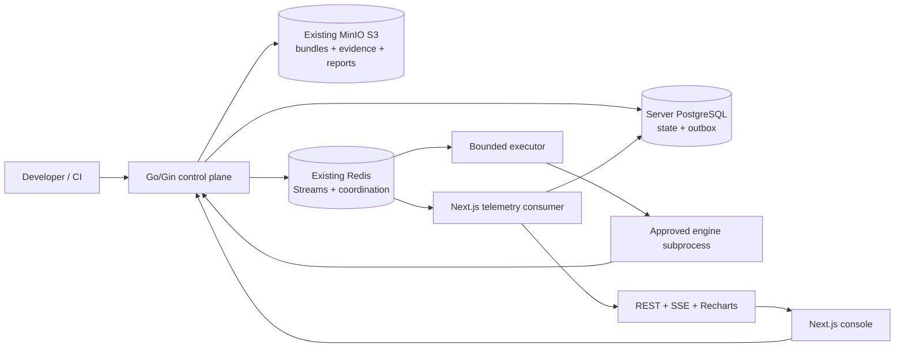
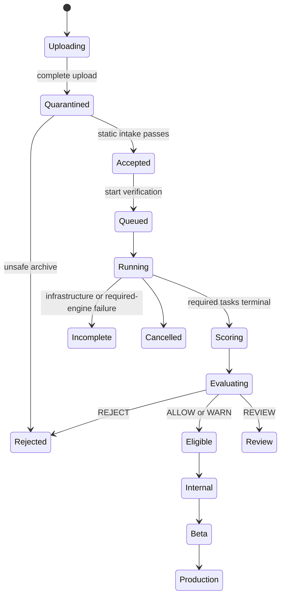
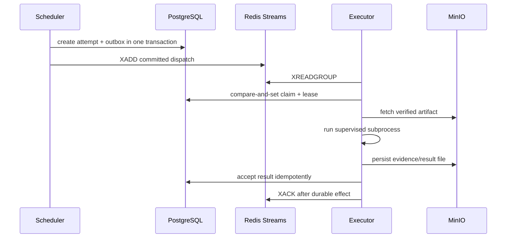

# Web Bundle Verification Platform — Production V1 Blueprint

**Status:** implementation-ready architecture  
**Primary goal:** give engineering agents enough constraints, contracts, phases, and acceptance gates to plan and deliver Production V1  
**Capacity target:** 10,000 uploads/day; 500 logical queued/active runs; physical execution bounded by current Docker limits  
**Infrastructure constraint:** reuse the existing Go gateway, server PostgreSQL, Redis, MinIO S3, and Next.js deployment without adding services or increasing configured resources  
**Source review date:** 2026-07-16

## 1. V1 outcome

The platform accepts an immutable Web Bundle archive, verifies it with independent engines, aggregates normalized evidence, calculates quality/confidence, evaluates a pinned policy, and returns an auditable release eligibility decision.

V1 is a verification platform, not a Playwright test product. Playwright, Lighthouse, axe-core, Semgrep, and scanners are replaceable engines behind versioned contracts.

V1 is complete when it can:

1. safely accept ZIP/TAR.GZ bundles without executing archive content;
2. persist an immutable artifact in existing MinIO S3;
3. run a versioned verification DAG durably through PostgreSQL and Redis Streams;
4. recover from duplicate messages, Redis restart, worker death, timeout, cancellation, and retry exhaustion;
5. produce normalized findings, evidence, score, confidence, and `ALLOW`, `WARN`, `REVIEW`, or `REJECT` policy outcomes;
6. expose stable REST APIs for generic CI and release workflows;
7. provide Next.js dashboards, timelines, metrics, alerts, and SSE updates; and
8. prove decision provenance from artifact checksum through engine and policy versions.

### 1.1 V1 constraints

- PostgreSQL supplied through `DATABASE_URL` is authoritative.
- Redis Streams is delivery and coordination, never the only workflow record.
- Existing MinIO S3 is the durable bundle/evidence/report store.
- Next.js owns verification observability; Go emits bounded structured events.
- NATS is removed from the runtime path; the fixed `LEPOSHIP_EVENTS_V1` Redis Stream is the only event bus.
- No new Compose service, port, volume, bucket, required environment variable, CPU, or memory allocation.
- The current profile may queue 500 logical runs but runs at most one heavy engine subprocess at a time.
- Active browser/DAST execution is restricted to trusted projects until an external sandbox exists.
- Infrastructure failure produces `INCOMPLETE`, never a false bundle rejection.

### 1.2 Non-goals

- public execution of arbitrary tenant engine images;
- a general-purpose workflow product;
- real Safari/device lab or Selenium Grid;
- staged rollout, experimentation, feature flags, analytics, or crash collection;
- a new observability backend, Prometheus server, OpenTelemetry collector, or Grafana stack;
- full release-management replacement.

## 2. Architecture



### 2.1 Ownership

| Owner | Responsibilities | Must not own |
|---|---|---|
| Go control plane | intake, artifact metadata, DAG scheduling, attempts, result acceptance, scoring, policy, report snapshot, release eligibility | raw observability dashboards or unbounded artifact bytes |
| PostgreSQL | canonical run/task/attempt/outbox/inbox/findings/policy/decision state | large traces, screenshots, HAR, videos |
| Redis | task/event delivery, consumer groups, quotas, leases, fairness, short-lived status | canonical decisions or irreplaceable evidence |
| MinIO | immutable bundles, quarantine, screenshots, logs, traces, reports, baselines | workflow state |
| Go worker | Redis Streams build/verification consumption, native tool supervision, artifact/evidence transfer | cron scheduling, release decisions, browser UI |
| Next.js | authorized REST/SSE/UI over PostgreSQL projections | background consumers, build execution, DAG scheduling, scoring, policy, release authority |
| Engine subprocess | one declared capability and normalized result | infrastructure credentials, database access, release decisions |

The execution plane is embedded in the existing Go `gateway` service for `both` and `control-plane` modes, so V1 adds no Docker service, port, resource reservation, bucket, or volume. The same binary also supports `GATEWAY_RUN_MODE=lepoship-worker` for a future isolated deployment without introducing a second executable. It is not a cron scheduler and not a Next.js worker. It consumes `bundle.build_requested.v1` and `verification.task.dispatched.v1` from Redis Streams with one shared heavy-task concurrency slot. Build commands and native scanners run under the Go supervisor. Only browser-specific engines use a compiled `.mjs` subprocess; that subprocess has no PostgreSQL, Redis, or MinIO credentials.

### 2.2 Bounded contexts

1. Bundle Intake
2. Artifact Management
3. Verification Orchestration
4. Engine Registry
5. Findings and Evidence
6. Quality Scoring
7. Policy and Approval
8. Reporting
9. Release Integration
10. Next.js Verification Observability

Contexts communicate through application ports and versioned events. A module must not query another module's tables directly.

## 3. Repository placement

```text
go/internal/modules/
  bundleintake/{domain,application,adapter}
  verification/{domain,application,adapter}
  engineregistry/{domain,application,adapter}
  quality/{domain,application,adapter}
  policy/{domain,application,adapter}
  reporting/{domain,application,adapter}

go/internal/platform/
  events/ execution/ objectstore/ security/

go/engines/
  validation/ browser/ static/ dependency/

nextjs/
  app/api/v1/...verification-observability/
  app/.../verification/
  components/verification/
  lib/server/verification-observability/
  workers/verification-observability/
  prisma/schema.prisma
```

Planning rules:

- schema changes start in `nextjs/prisma/schema.prisma`, then regenerate Ent;
- generated Ent files and lock files are never edited manually;
- keep domain logic independent from Gin, Ent, Redis, MinIO, and engine tools;
- add one engine through the common protocol before duplicating adapters;
- use expand/deploy/backfill/contract for schema evolution;
- deliver phases as independently rollbackable changes.

## 4. Bundle lifecycle



Invariants:

- finalized artifact bytes are immutable and identified by SHA-256 plus MinIO object version/ETag;
- a run pins artifact, pipeline, engine, scoring, policy, browser matrix, and seed versions;
- attempts are append-only; retry creates a new attempt;
- one task has at most one accepted result;
- late/superseded results are auditable but cannot regress state;
- historical policy changes never rewrite a completed decision;
- promotion references the exact accepted run and policy evaluation.

## 5. Upload and intake

1. `POST /v1/projects/{projectId}/bundle-uploads` creates an upload session.
2. Go returns a presigned MinIO upload target.
3. Client uploads directly to MinIO.
4. Completion verifies expected size, SHA-256, object metadata, and idempotency.
5. Intake enumerates the archive before extraction.
6. Safe content is extracted into a temporary workspace, inventoried, then stored under an immutable accepted prefix.
7. Rejected bytes remain in a restricted quarantine prefix for a short incident window.

Mandatory hostile-archive checks:

- absolute paths, `..`, zip-slip, symlinks/hardlinks, devices and special files;
- duplicate/confusable paths and case collisions;
- entry count, compressed size, expanded size, nesting depth and compression-ratio limits;
- checksum/media-type mismatch and unsupported archive format;
- manifest/metadata JSON Schema validation;
- no execution, external fetch, or system extractor in the trust boundary.

## 6. Durable orchestration

### 6.1 Pipeline definition

A pipeline version is immutable JSON with a canonical hash. Each node declares:

```json
{
  "id": "runtime.chromium",
  "engine": "runtime.playwright",
  "engineVersion": "sha256:...",
  "dependsOn": ["bundle.validate", "crawl.discover"],
  "condition": "bundle.has_html && !run.cancelled",
  "required": true,
  "resourceClass": "browser",
  "timeoutSeconds": 900,
  "retry": {"maxAttempts": 2, "initialBackoffSeconds": 15},
  "configuration": {"browser": "chromium"}
}
```

Publication rejects cycles, unknown dependencies, invalid CEL, unknown engines, incompatible schemas, duplicate node IDs, and unsupported resource classes.

### 6.2 Delivery protocol



Required mechanics:

- unique `(task_id, attempt_no)`, `event_id`, and inbox constraints;
- `FOR UPDATE SKIP LOCKED` for scheduler batches;
- task claim leases, heartbeats, deadlines, cancellation, and process-group termination;
- exponential backoff with jitter for declared transient errors only;
- `XREADGROUP`, `XPENDING`, `XAUTOCLAIM`, and `XACK`;
- reconciliation of PostgreSQL tasks/outbox, Redis pending entries, local processes, and deterministic result files;
- safe `XTRIM MINID` only below the oldest acknowledged/replayable ID;
- dead-letter state and operator-visible incident after retry exhaustion;
- tenant/resource admission before dispatch.

Redis loss pauses delivery. Reconciliation replays from PostgreSQL; no publication decision depends solely on Redis retention.

### 6.3 Task states

`queued → ready → dispatched → running → succeeded | bundle_failed | infrastructure_failed | timed_out | cancelled | dead_lettered`

Run states distinguish:

- `FAILED`: verified evidence triggered policy rejection;
- `INCOMPLETE`: required evidence is unavailable because of infrastructure/engine failure;
- `CANCELLED`: explicit user/system cancellation.

## 7. Engine plugin contract

V1 executes only operator-approved pinned tool profiles. Arbitrary tenant OCI images are deferred.

### 7.1 Engine manifest

```json
{
  "apiVersion": "verification.platform/v1",
  "name": "runtime.playwright",
  "version": "1.0.0",
  "imageDigest": "sha256:...",
  "capabilities": ["runtime", "console", "screenshot"],
  "configSchema": "schemas/runtime-playwright-v1.json",
  "inputs": ["bundle", "route-inventory"],
  "outputs": ["verification-result.v1"],
  "resourceClass": "browser",
  "timeoutSeconds": 900,
  "maxAttempts": 2,
  "platformCompatibility": ">=1.0 <2.0"
}
```

Admission requires immutable digest, CI signature/attestation, vulnerability scan, license review, operator approval, compatibility check, and audit history.

### 7.2 Result envelope

`VerificationResult.v1` contains:

- task/attempt/run/engine identity and digest;
- terminal classification and error class;
- normalized findings and metric values;
- evidence references with SHA-256, media type, size, sensitivity, and MinIO key;
- coverage and confidence inputs;
- start/end/duration, exit status, retryability, truncation, and tool versions.

The gateway validates schema, identity, attempt lease, size limits, and object checksums before accepting a result.

Engine subprocesses receive no PostgreSQL, Redis, MinIO, Firebase, or long-lived credentials.

## 8. V1 engine profiles

| Profile | Engines/tools | Default decision behavior |
|---|---|---|
| Mandatory intake | Go archive validation, SHA-256, JSON Schema, deterministic size/inventory | malicious/malformed archive rejects |
| Core static | Semgrep; Syft SBOM; OSV-Scanner | confirmed critical security may reject; quality findings warn |
| Core browser | Playwright Chromium; console/runtime capture; bounded deterministic discovery | reproducible crash/boot failure may reject |
| Core audits | axe-core and Lighthouse performance/SEO | warn/review by default |
| Extended browser | Firefox/WebKit, Robo/Gremlins, offline/network simulation, memory checks | warning until reproduced and policy-approved |
| Heavy security/API | ZAP, Schemathesis, optional secondary Grype or Trivy | trusted projects only; unavailable becomes `INCOMPLETE` when required |
| AI visual | provider adapter | opt-in, redacted, advisory only |

All requested capabilities map into these profiles: validation, static analysis, runtime, crawling, monkey/Robo, performance, accessibility, security, dependencies, API, visual regression, AI visual, SEO, bundle size, memory leak, offline, network failure, compatibility, and console errors.

Playwright is the runtime primitive because it provides Chromium, Firefox, WebKit, tracing, screenshots, network interception, and reliable CI/container behavior. V1 uses a small deterministic route queue to avoid another runtime dependency; Crawlee remains an upgrade for broader discovery. Selenium is deferred to real branded-browser/platform coverage.

## 9. Scoring and confidence

Default weights:

| Dimension | Weight |
|---|---:|
| Runtime stability | 25% |
| Security | 20% |
| Performance | 15% |
| Accessibility | 10% |
| API reliability | 10% |
| Bundle quality | 10% |
| Visual quality | 5% |
| SEO | 5% |

Each dimension starts at 100 and applies versioned, deduplicated penalties. Overall score uses a weighted geometric mean:

`overall = exp(sum(weight_i * ln(max(score_i, 1))) / sum(weight_i))`

Confidence is separate:

`confidence = coverage × completeness × reproducibility × engine_health`

Missing/inconclusive evidence lowers confidence and may yield `INCOMPLETE`; it never silently passes. Scores, flaky exploration, performance variance, visual heuristics, and AI do not reject by default.

## 10. Policy and approval

Use immutable, type-checked CEL policy versions with organization → project → channel inheritance.

Effects:

- `ALLOW`: eligible;
- `WARN`: eligible with warnings;
- `REVIEW`: manual decision required;
- `REJECT`: ineligible.

Default hard gates are limited to:

- malicious/malformed archive;
- reproducible application crash;
- confirmed critical security finding;
- missing/failing required engine when channel policy is fail-closed;
- an explicit deterministic project/channel rule.

Overrides require a different authorized actor, reason, supporting evidence, expiry, scope, and immutable audit event. Historical evaluations pin the exact policy snapshot and input digest.

## 11. Reports

Store machine-readable JSON and human-readable HTML. PDF is optional and rendered through the existing browser profile when capacity permits.

Report snapshot includes:

- decision, score, confidence, completeness, and policy explanation;
- finding summary and remediation recommendations;
- execution timeline, attempts, retries, timeouts, and engine versions;
- failed routes, browser/console/network summaries, and stack references;
- screenshots, visual diffs, traces, HAR, SBOM, scanner reports, and downloadable evidence;
- artifact checksum, pipeline/scoring/policy versions, approvals, overrides, and report hash.

Reports are immutable; correction creates a superseding report/evaluation.

## 12. Data model

| Entity | Key constraints |
|---|---|
| `bundle_uploads` | idempotency, expected/actual checksum and size, status, expiry |
| `bundle_artifacts` | immutable MinIO identity, checksum, media type, provenance |
| `verification_pipeline_versions` | immutable definition and canonical hash |
| `verification_engine_versions` | name/version/digest, manifest, approval/revocation |
| `verification_runs` | pinned artifact/pipeline/scoring/policy, status, decision |
| `verification_tasks` | run/node/resource class/status/next attempt |
| `verification_task_dependencies` | unique acyclic edge |
| `verification_attempts` | unique task/number, lease/deadline/timing/result class |
| `verification_inbox` | unique consumer/message ID |
| `verification_findings` | stable fingerprint per run/source scope |
| `verification_evidence` | MinIO key/version/hash/size/sensitivity/retention |
| `quality_scores` | profile version, dimension and overall results |
| `policy_versions` / `policy_evaluations` | immutable rules, input digest, outcome |
| `verification_reports` | render/schema version and MinIO object hash |
| `release_approvals` / `release_overrides` | actor/reason/evidence/expiry/revocation |
| `outbox_events` | existing event, lease, retry, publication state |
| `verification_telemetry_events` | Next.js-owned event-id dedupe and bounded metadata |
| `verification_metric_rollups` | Next.js-owned windowed aggregates |
| `verification_alerts` | Next.js-owned operational alert lifecycle |

Use relational columns for authorization, scheduling, policy selection, and indexes. JSONB is limited to immutable versioned definitions and bounded raw snapshots. Large artifacts stay in MinIO.

## 13. REST API

Go control-plane resources:

| API | Purpose |
|---|---|
| `POST /v1/projects/{projectId}/bundle-uploads` | create presigned upload session |
| `POST /v1/bundle-uploads/{uploadId}:complete` | finalize intake |
| `POST /v1/projects/{projectId}/verification-runs` | start run |
| `GET /v1/verification-runs/{runId}` | status, decision, links |
| `POST /v1/verification-runs/{runId}:cancel` | cancel |
| `POST /v1/verification-runs/{runId}:retry` | explicit infrastructure retry/new run |
| `GET /v1/verification-runs/{runId}/tasks` | task timeline |
| `GET /v1/verification-runs/{runId}/findings` | filtered findings |
| `GET /v1/verification-runs/{runId}/reports/{format}` | report/download link |
| `POST /v1/projects/{projectId}/pipeline-versions` | publish pipeline |
| `POST /v1/projects/{projectId}/policy-versions` | publish policy |
| `POST /v1/releases/{releaseId}:evaluate-eligibility` | evaluate release |
| `POST /v1/releases/{releaseId}:promote` | guarded promotion |

Next.js observability resources:

| API | Purpose |
|---|---|
| `GET /api/v1/projects/{projectId}/verification-observability/summary` | rollups and health |
| `GET /api/v1/verification-runs/{runId}/timeline` | ordered telemetry |
| `GET /api/v1/verification-runs/{runId}/metrics` | bounded series |
| `GET /api/v1/verification-runs/{runId}/events` | resumable SSE |
| `GET /api/v1/platform/verification-health` | admin health |
| `POST /api/v1/verification-alerts/{alertId}:acknowledge` | audited acknowledgement |

Commands use `Idempotency-Key`, return `202` plus `Location` for asynchronous work, and use `application/problem+json`. Lists use cursor pagination; polling supports ETag. Every endpoint enforces organization/project ownership.

## 14. Embedded telemetry and Next.js observability UI

Go writes bounded telemetry rows in the same PostgreSQL transactions that create verification outbox events. This removes the need for a persistent Next.js background consumer. Next.js:

1. reads tenant-authorized telemetry projections through Prisma;
2. validates/redacts public response shapes using Zod;
3. provides resumable SSE from persisted `event_id` values;
4. serves retry/cancel/review server actions; and
5. renders Recharts dashboards.

Raw logs, HAR, screenshots, video, heap and Playwright traces stay in MinIO. Next.js accesses them through short-lived authorized URLs.

Minimum dashboard signals:

- run queue and end-to-end latency;
- task dispatch/start/execution/result latency;
- Redis stream length, pending age, redelivery and claim count;
- retries, deadlines, dead letters, cancellations, and reconciliation repairs;
- engine duration/crash/timeout and evidence truncation;
- PostgreSQL/Redis/MinIO application-level availability;
- score, confidence, policy, override, and alert rates;
- bytes stored by project/run/engine.

OpenTelemetry and Prometheus are not required by V1. Host/kernel/container monitoring remains an external operations concern if later needed.

## 15. Security gates

- non-root subprocess where available; read-only tool assets and temporary writable workspace;
- no host mounts, Docker socket, infrastructure credentials, or inherited secret environment;
- explicit timeout, output/file/PID limits, context cancellation, and process-group kill;
- loopback-only bundle origin; no published preview port;
- deny metadata, link-local, RFC1918, and service-network destinations;
- allowlisted external traffic only for trusted projects;
- signed URLs, short TTL, sensitivity labels, redaction, tenant authorization, and audit;
- pinned engine/tool versions, CI signature, SBOM, vulnerability scan, and rollback digest;
- AI disabled by default with consent, redaction, retention, provider, and residency controls.

The current shared gateway container is not sufficient isolation for hostile active JavaScript. Untrusted runtime/DAST is a hard production block until an external sandbox is approved.

## 16. Capacity and backpressure

10,000 uploads/day averages 0.116 uploads/s; bursts dominate. V1 accepts metadata quickly, persists state, and queues work.

| Cost class | Weight | Baseline execution |
|---|---:|---|
| utility | 1 | validation/inventory first |
| static | 2 | one subprocess |
| browser | 4 | one subprocess after headroom check |
| security | 4 | trusted project; never parallel with browser |
| external | 0 local | disabled unless existing endpoint is configured |

Scheduling requirements:

- weighted deficit round-robin with tenant aging;
- platform/org/project/resource-class concurrency limits;
- bounded fan-out and admission before Redis publication;
- API/result/cancellation/reconciliation priority over new starts;
- `429` for tenant admission and `503 Retry-After` for platform saturation;
- no automatic resource increase or autoscaling in the baseline;
- capability becomes unavailable instead of causing an OOM loop.

## 17. Implementation phases for agent planning

Each phase must end with tests, metrics/events, rollback instructions, and no unrelated refactor.

### Phase 0 — Contracts and schema

**Deliver:** source Prisma entities, regenerated Ent, domain enums/state transitions, JSON Schemas for pipeline/engine/task/result/report/event, repository ports, and API problem/idempotency conventions.

**Exit:** schema compatibility checks pass; no generated file is hand-edited; invalid DAG/result fixtures are rejected.

### Phase 1 — Intake and artifacts

**Deliver:** presigned MinIO upload session, completion/idempotency, hostile archive validator, quarantine/accepted prefixes, immutable artifact metadata, cleanup/retention reconciliation.

**Exit:** zip-slip/bomb/link/confusable fixtures are rejected; valid ZIP/TAR.GZ produces stable inventory/checksum; gateway never proxies full upload bytes.

### Phase 2 — Orchestration and Redis delivery

**Deliver:** pipeline publication, DAG scheduler, tasks/attempts/outbox/inbox, Redis consumer groups, leases/heartbeats/retries/cancellation, bounded executor, reconciliation, dead letters.

**Exit:** duplicate, restart, stale pending, worker-death, timeout, cancellation, Redis-loss, and late-result tests preserve state invariants.

### Phase 3 — Core engines

**Deliver in order:** validation → Semgrep → Syft/OSV → Playwright Chromium/console → bounded crawl → axe/Lighthouse/visual.

**Exit:** every engine passes the same conformance suite and produces valid normalized results/evidence; required infrastructure failure yields `INCOMPLETE`.

### Phase 4 — Scoring, policy, reports, release eligibility

**Deliver:** versioned score/confidence profiles, CEL policy publication/evaluation, approval/override, immutable JSON/HTML report, release eligibility and guarded promotion integration.

**Exit:** golden score tests, policy pinning/replay, separation-of-duties, override expiry, and decision provenance pass.

### Phase 5 — Next.js observability

**Deliver:** Redis telemetry consumer, Prisma dedupe/rollups/alerts, authorized REST/SSE, verification dashboard, evidence links, consumer recovery and retention.

**Exit:** duplicate events have one effect; SSE resumes by cursor; cross-tenant reads fail; dashboard recovers after Next.js/Redis restart without affecting verification truth.

### Phase 6 — Production hardening

**Deliver:** load/soak/fault tests, resource profiles, runbooks, dashboards/alerts, backup/restore drill, engine update/rollback, privacy/retention review, trusted-project enforcement.

**Exit:** all production gates in §18 pass and rollback is demonstrated.

## 18. Production acceptance gates

### 18.1 Functional

- artifact/run/policy/engine provenance is complete;
- CI can upload, start, poll, cancel, retry, and download report;
- Draft → Internal → Beta → Production promotion checks exact eligibility;
- every required engine has normalized evidence or explicit incomplete status.

### 18.2 Reliability tabletop

| Scenario | Acceptance |
|---|---|
| duplicate Redis message/result | one accepted business effect; duplicate auditable |
| scheduler/gateway death | lease expiry and bounded recovery; no state regression |
| retry exhaustion | required task becomes `INCOMPLETE`, not false reject |
| cancellation at every state | no new starts; active process terminates; late result cannot change state |
| Redis loss/restart | replay from PostgreSQL; consumer group/pending state reconciles |
| PostgreSQL interruption | no accepted command without durable transaction; recovery resumes safely |
| MinIO interruption | evidence/report publication pauses; release promotion blocks |
| policy update during run | pinned version remains authoritative |
| inconsistent scanners | both sources retained; no invented consensus |
| 20 uploads/s burst, 500 logical runs | durable fair queue; bounded subprocess count; no tenant starvation |

### 18.3 Security and operations

- independent threat review completed;
- malicious archives never reach active execution;
- untrusted runtime/DAST is technically blocked;
- backup/restore and MinIO/PostgreSQL reconciliation demonstrated;
- engine digest update and rollback demonstrated;
- retention/deletion/legal-hold behavior verified;
- alert, incident, cancellation, compromise, and evidence-leak runbooks exist;
- no release promotion without immutable artifact, run, policy, and approval provenance.

## 19. Rollout and rollback

1. Deploy schema expansion compatible with old code.
2. Deploy contracts/intake dark, then enable per internal project.
3. Shadow core engines without gating.
4. Compare duration, failures, finding drift, and resource headroom.
5. Enable warnings, then deterministic hard gates for Internal.
6. Promote to Beta/Production only after acceptance gates.

Rollback rules:

- disable pipeline/engine/policy version for new runs;
- deploy previous gateway/tool-profile digest;
- preserve terminal evidence; never mutate historical results;
- create superseding attempt/evaluation/report after correction;
- keep expanded schema until the rollback window closes;
- stop promotion whenever provenance or required evidence is unavailable.

## 20. Primary risks

| Risk | Mitigation / decision trigger |
|---|---|
| custom orchestrator races | formal state machine, idempotency, reconciliation, fault tests; reconsider Temporal after repeated scheduler incidents |
| one subprocess creates long queues | fairness/backpressure; migrate executor only after measured SLO breach |
| shared gateway cannot contain hostile code | trusted-only active execution; external sandbox is mandatory for public tenants |
| heavy tools exceed current memory | headroom admission and unavailable profile; never raise configuration implicitly |
| false-positive security/performance/visual findings | source/confidence/variance retained; warn/review unless deterministic policy |
| Redis stream memory/pending growth | admission, pending-age alerts, replayable outbox, safe acknowledged-watermark trimming |
| Go worker starves build or verification | one shared heavy-task semaphore and Redis pending recovery; scale only after measured pressure |
| MinIO or PostgreSQL loss | backup/restore drills, immutable hashes, reconciliation, promotion stop |
| duplicate release models | adapter-first canonicalization on releases/channels; no V1 destructive migration |

## 21. Required technology additions

| Status | Technology |
|---|---|
| Reuse | Go, Gin, Ent, PostgreSQL, `go-redis/v9`, AWS SDK S3/MinIO, Next.js, Prisma, Zod, Recharts, SSE |
| Add to Go | `cel-go`; one pinned JSON Schema validator; orchestration/contract/security code |
| Add core tool profile | Playwright Chromium, axe-core, Lighthouse, Semgrep, Syft, OSV-Scanner; Node is isolated to the browser runner |
| Add in CI | Cosign/Sigstore verification and tool-profile SBOM/scanning |
| Conditional | Firefox/WebKit, Gremlins, ZAP, Schemathesis, Grype or Trivy, AI adapter |
| Future infrastructure | external sandbox/GKE, Selenium Grid, Temporal/Argo/Tekton, malware daemon/service |

No OpenTelemetry or Prometheus backend is required for Verification V1.

## 22. Final implementation decisions

1. Keep PostgreSQL authoritative and Redis replayable.
2. Use MinIO as the only durable artifact/evidence/report authority.
3. Keep orchestration, acceptance, scoring, policy, and release decisions in Go.
4. Keep observability ingestion, rollups, alerts, REST/SSE, and UI in Next.js.
5. Start with deterministic intake/static/core-browser engines; noisy engines remain advisory.
6. Enforce one common plugin/result contract before adding engine-specific behavior.
7. Treat `INCOMPLETE` separately from bundle rejection.
8. Do not execute hostile active content without an external sandbox.
9. Do not add services or increase Docker resources without measured evidence and separate approval.
10. Plan implementation by phases in §17 and require the gates in §18 before Production.

## 23. Focused references

- [Redis Streams](https://redis.io/docs/latest/develop/data-types/streams/), [`XREADGROUP`](https://redis.io/docs/latest/commands/xreadgroup/), [`XAUTOCLAIM`](https://redis.io/docs/latest/commands/xautoclaim/)
- [MinIO Go SDK](https://github.com/minio/minio-go)
- [CEL for Go](https://github.com/google/cel-go)
- [Playwright browsers](https://playwright.dev/docs/browsers) and [Docker security guidance](https://playwright.dev/docs/docker)
- [Crawlee](https://crawlee.dev/js/docs/introduction), [Lighthouse](https://github.com/GoogleChrome/lighthouse), [axe-core](https://github.com/dequelabs/axe-core)
- [Semgrep](https://semgrep.dev/docs/), [Syft](https://github.com/anchore/syft), [OSV-Scanner](https://github.com/google/osv-scanner)
- [OWASP ZAP Automation Framework](https://www.zaproxy.org/docs/automate/automation-framework/)
- [Sigstore Cosign](https://docs.sigstore.dev/cosign/signing/overview/)
