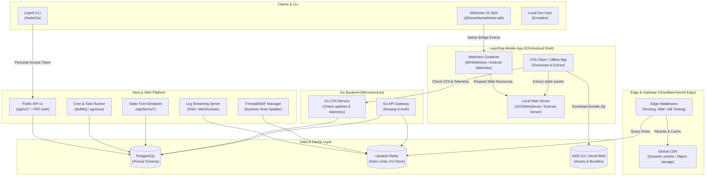

# LepoS & LepoShip — Kế Hoạch Giải Quyết Thiếu Sót & Hoàn Thiện Tính Năng (Zero-❌ Plan)

Tài liệu này cung cấp thiết kế kiến trúc chi tiết, cập nhật database schema (Prisma), đặc tả API, cấu trúc thư mục, luồng nghiệp vụ, **danh sách task chi tiết**, **lộ trình 10 phase hoàn thiện**, và **các checkpoint đầu ra (validation criteria)** để hiện thực hóa toàn bộ các tính năng còn thiếu (được đánh dấu ❌ hoặc ⚠️) trên LepoS và LepoShip. Mục tiêu là giúp hệ thống đạt trạng thái hoàn thiện đầy đủ như các nền tảng hàng đầu (Vercel, Netlify, Expo, Cloudflare Pages).

---

## 1. Kiến Trúc Tổng Thể (Target State Architecture)

Sơ đồ dưới đây mô tả cách các thành phần nâng cao (CLI, SDK, Edge Middleware, Log Streaming, WAF, Cron, Local Web Server và WebView SDK) kết nối với hệ thống Core hiện tại:



---

## 2. Cập Nhật Database Schema (Prisma Models)

Thêm các model và field sau vào file `prisma/schema.prisma` để sẵn sàng cho quá trình nâng cấp:

```prisma
// 1. Quản lý Personal Access Tokens (PAT) cho CLI và API
model PersonalAccessToken {
  id          String    @id @default(cuid())
  name        String
  tokenHash   String    @unique
  scopes      String[]  // e.g., ["project:read", "project:write", "deployment:trigger"]
  userId      String
  user        User      @relation(fields: [userId], references: [id], onDelete: Cascade)
  createdAt   DateTime  @default(now())
  expiresAt   DateTime?
  lastUsedAt  DateTime?
}

// 2. Tích hợp Single Sign-On (SSO SAML/OIDC) cho Enterprise
model SsoConfig {
  id           String    @id @default(cuid())
  domain       String    @unique // e.g., "company.com"
  provider     String    // "saml" hoặc "oidc"
  clientId     String
  clientSecret String?   // Mã hóa
  entryPoint   String    // SAML SSO URL
  issuer       String    // Identity Provider Entity ID
  cert         String    // Public Certificate PEM
  workspaceId  String    @unique
  workspace    Workspace @relation(fields: [workspaceId], references: [id], onDelete: Cascade)
  createdAt    DateTime  @default(now())
}

// 3. Deploy Hooks (Kích hoạt build từ xa qua URL)
model DeployHook {
  id          String    @id @default(cuid())
  name        String
  token       String    @unique // Random secure string
  branch      String    // Branch để build (e.g., "main")
  projectId   String
  project     Project   @relation(fields: [projectId], references: [id], onDelete: Cascade)
  createdAt   DateTime  @default(now())
  lastUsedAt  DateTime?
}

// 4. Firewall & WAF Rules (Cấu hình chặn truy cập ở tầng Edge)
model FirewallRule {
  id          String    @id @default(cuid())
  name        String
  action      String    // "block" (chặn), "allow" (cho phép), "challenge" (JS challenge)
  type        String    // "ip", "country", "path", "header"
  value       String    // e.g., "192.168.1.1", "CN", "/admin/*", "User-Agent:BadBot"
  active      Boolean   @default(true)
  projectId   String
  project     Project   @relation(fields: [projectId], references: [id], onDelete: Cascade)
  createdAt   DateTime  @default(now())
}

// 5. Cron Jobs cho Serverless/Edge Functions
model CronJob {
  id          String    @id @default(cuid())
  name        String
  schedule    String    // Standard cron expression (e.g., "*/5 * * * *")
  path        String    // Endpoint để gọi (e.g., "/api/cron/sync")
  projectId   String
  project     Project   @relation(fields: [projectId], references: [id], onDelete: Cascade)
  createdAt   DateTime  @default(now())
  lastRun     DateTime?
  lastStatus  String?   // "success" hoặc "failed"
}

// 6. Form Handling (Netlify-like Forms)
model Form {
  id          String           @id @default(cuid())
  name        String           // Tên form
  projectId   String
  project     Project          @relation(fields: [projectId], references: [id], onDelete: Cascade)
  submissions FormSubmission[]
  createdAt   DateTime         @default(now())
}

model FormSubmission {
  id          String    @id @default(cuid())
  data        Json      // Lưu payload gửi lên dưới dạng key-value JSON
  ipAddress   String?
  userAgent   String?
  formId      String
  form        Form      @relation(fields: [formId], references: [id], onDelete: Cascade)
  createdAt   DateTime  @default(now())
}

// 7. Preview Comments (Bình luận trực quan trên Preview Deployments)
model PreviewComment {
  id           String     @id @default(cuid())
  content      String
  x            Float      // Tọa độ phần trăm ngang trên màn hình
  y            Float      // Tọa độ phần trăm dọc trên màn hình
  pathname     String     // Route lúc bình luận (e.g., "/about")
  resolved     Boolean    @default(false)
  deploymentId String
  deployment   Deployment @relation(fields: [deploymentId], references: [id], onDelete: Cascade)
  userId       String
  user         User       @relation(fields: [userId], references: [id], onDelete: Cascade)
  createdAt    DateTime   @default(now())
}

// 8. LepoShip WebView Local Server & Routing Config
model LepoShipLocalConfig {
  id                  String          @id @default(cuid())
  localPort           Int             @default(8080)  // Port chạy GCDWebServer / Android server
  basePath            String          @default("/")   // Đường dẫn cơ sở phục vụ file tĩnh
  fallbackPath        String          @default("/index.html") // File fallback khi gặp 404 (Single Page App routing)
  projectId           String          @unique
  project             LepoShipProject @relation(fields: [projectId], references: [id], onDelete: Cascade)
  createdAt           DateTime        @default(now())
}

```

---

## 3. Lộ Trình 10 Phase Hoàn Thiện & Chi Tiết Triển Khai

Dưới đây là mô tả chi tiết của **10 Phase tiếp theo (Phase 9 đến 18)** để loại bỏ toàn bộ ❌ và ⚠️ trên LepoS:

### Phase 9: Public API Engine & CLI Foundations (DX Core)
* **Mô tả**: Xây dựng nền tảng tương tác lập trình và công cụ dòng lệnh (CLI) để lập trình viên tự động hóa quy trình làm việc.
* **Mục tiêu**:
  * Hiện thực hóa Personal Access Tokens (PAT).
  * Phát triển Node.js CLI chạy dòng lệnh.
* **Chi tiết kỹ thuật**:
  * Phát sinh token an toàn với tiền tố `lp_pat_` kết hợp hash lưu trữ bằng SHA-256 trong PostgreSQL.
  * CLI lưu trữ cấu hình tại `~/.lepos/auth.json`. Đăng nhập qua flow OAuth Loopback: CLI mở trình duyệt trỏ đến server LepoS, sau khi xác thực, server gọi ngược lại localhost port của CLI để truyền token.

### Phase 10: Git Automation & Preview Deployments Engine (CI/CD)
* **Mô tả**: Tạo các môi trường chạy thử nghiệm tự động cho từng branch hoặc Pull Request từ GitHub.
* **Mục tiêu**:
  * Xây dựng GitHub App Integration webhook handler.
  * Phân giải subdomain preview động qua Middleware.
* **Chi tiết kỹ thuật**:
  * Nhận sự kiện `pull_request` từ GitHub App Webhook.
  * Sinh subdomain preview dạng `https://[pr-number]-[proj-slug].preview.lepos.dev`.
  * Middleware Next.js đọc hostname, đối chiếu deployment trong DB và thực hiện rewrite ngầm tới Storage Bucket chứa code build của PR đó.

### Phase 11: Core Web Observability & Telemetry Ingestion (Speed Insights)
* **Mô tả**: Thu thập thông số trải nghiệm người dùng thực (Real User Monitoring - RUM) và các chỉ số Core Web Vitals.
* **Mục tiêu**:
  * Viết script analytics tracking client-side.
  * Xây dựng API ingest và dashboard thống kê biểu đồ.
* **Chi tiết kỹ thuật**:
  * Sử dụng thư viện `web-vitals` chính thức để bắt các chỉ số LCP, FID, CLS, INP.
  * Sử dụng API `navigator.sendBeacon` để truyền tải dữ liệu khi trang unload để không làm chậm trải nghiệm.
  * Tổng hợp dữ liệu theo giờ và phân bổ điểm số hiệu năng (Tốt/Trung bình/Kém) hiển thị lên biểu đồ Area Chart trong admin dashboard.

### Phase 12: Application Edge Routing & CDN Cache Controls (Network)
* **Mô tả**: Quản lý tên miền riêng, chứng chỉ bảo mật tự động và cơ chế phân phối CDN tối ưu.
* **Mục tiêu**:
  * Tích hợp Cloudflare SSL SaaS API hoặc Let's Encrypt.
  * Hiện thực hóa cơ chế on-demand ISR/SSR cache purging.
* **Chi tiết kỹ thuật**:
  * Sử dụng Cloudflare Custom Hostnames để tự động cập nhật SSL qua DNS CNAME.
  * Middleware quản lý cache header (`Cache-Control`, `Edge-Cache`).
  * API route `/api/v1/projects/[projectId]/purge-cache` gửi lệnh đến CDN để giải phóng (purge) cache của các URL được chỉ định thời gian thực.

### Phase 13: Edge Firewall & DDoS WAF Protections (Security)
* **Mô tả**: Thiết lập lá chắn bảo mật lọc chặn bot, giới hạn tần suất yêu cầu và lọc truy cập địa lý.
* **Mục tiêu**:
  * Thiết lập Edge Middleware WAF Engine.
  * Xây dựng rate-limiting dựa trên IP lưu trong Upstash Redis.
* **Chi tiết kỹ thuật**:
  * Đọc firewall rules từ Redis Cache (đồng bộ nhanh từ DB chính).
  * Kiểm tra IP (`request.ip`) và mã quốc gia (`request.geo.country`) để chặn.
  * Rate limiting sử dụng thuật toán Token Bucket trong Redis với thư viện `@upstash/ratelimit` để tối đa hóa hiệu suất và giảm độ trễ xử lý < 3ms.

### Phase 14: Serverless & Edge Compute Execution (Compute Runner)
* **Mô tả**: Hỗ trợ chạy các API route và background function phía server mà không cần quản trị server.
* **Mục tiêu**:
  * Đóng gói mã nguồn api dự án và deploy lên AWS Lambda.
  * Stream log runtime của hàm thời gian thực bằng Server-Sent Events (SSE).
* **Chi tiết kỹ thuật**:
  * Sử dụng compiler nén thư mục `api/` thành các package độc lập.
  * Pipeline deploy hàm lên AWS Lambda/Google Cloud Functions.
  * logs runtime được stream từ runner về Redis Pub/Sub và đẩy qua API SSE `/api/projects/[projectId]/functions/logs` đến console màn hình admin.

### Phase 15: Native Key-Value & Blob Storage Hub (Storage)
* **Mô tả**: Kho lưu trữ tệp tin và key-value phân tán cho các dự án chạy trên LepoS.
* **Mục tiêu**:
  * Giao diện quản lý file và key-value trong admin portal.
  * API sinh Presigned URL để upload file trực tiếp lên Storage Bucket.
* **Chi tiết kỹ thuật**:
  * Tích hợp tài khoản AWS S3 / Cloudflare R2 thông qua credential được lưu mã hóa.
  * API `/api/v1/storage/sign` sinh URL ký số một lần giúp trình duyệt của người dùng tự upload file lên S3/R2 mà không quá tải băng thông của server LepoS.

### Phase 16: Static Forms, A/B Testing & Advanced UX Utilities (Productivity)
* **Mô tả**: Các tiện ích nâng cao hỗ trợ xây dựng sản phẩm nhanh như xử lý form tự động và thử nghiệm A/B.
* **Mục tiêu**:
  * Form submissions API tự động thu thập và chống spam.
  * Edge Middleware A/B testing splitter.
* **Chi tiết kỹ thuật**:
  * API `/api/forms/submit` phân tích payload, lọc bằng ReCaptcha, lưu trữ dưới dạng JSON động.
  * Giao diện xem/export CSV các submissions.
  * A/B Testing: Edge Middleware đọc cookie thử nghiệm và thực hiện rewrite ngầm (Ví dụ: rewrite `/` sang `/branch-a` với tỉ lệ 50% traffic) mà không cần redirect vật lý, tránh hiện tượng flickering giao diện.

### Phase 17: Enterprise SAML SSO, MFA & Collaboration Controls (Enterprise)
* **Mô tả**: Phân quyền, bảo mật tài khoản nâng cao và bình luận cộng tác trực tiếp trên giao diện.
* **Mục tiêu**:
  * SSO SAML/OIDC kết nối Okta/Azure AD.
  * Xác thực bảo mật 2 lớp (MFA TOTP).
  * Hệ thống bình luận đính kèm tọa độ (x, y) trên Preview Deployment.
* **Chi tiết kỹ thuật**:
  * Tích hợp thư viện `@node-saml/node-saml` xử lý luồng SSO dựa trên tên miền email.
  * Sử dụng `otplib` sinh mã QR và xác thực TOTP mã hóa.
  * Preview comments: Script nhúng ghi nhận vị trí click, tính toán phần trăm tọa độ tương đối `(x, y)` so với kích thước thẻ cha và lưu vào bảng `PreviewComment`.

### Phase 18: LepoShip Mobile WebView Integration & OTA Local Server Distribution (Mobile OTA)
* **Mô tả**: Phát triển hệ thống đóng gói WebView, tích hợp máy chủ web nội bộ (local web server) và phân phối OTA (Over-The-Air) trực tiếp vào App Native LepoShip (iOS/Android).
* **Mục tiêu**:
  * Đóng gói thư mục build tĩnh (static HTML, JS, CSS export) thành tệp zip Bundle.
  * Tích hợp và cấu hình máy chủ web nội bộ trong App native LepoShip: sử dụng thư viện **GCDWebServer** trên iOS và các giải pháp tương đương (như **AndroidAsync** hoặc **NanoHTTPD**) trên Android để host bundle tĩnh cục bộ trong WebView.
  * Đóng gói thư viện JS `@lepoship/webview-sdk` hỗ trợ giao tiếp Native Bridge và điều phối cập nhật OTA cục bộ.
* **Chi tiết kỹ thuật**:
  * Dashboard/Build runner biên dịch dự án web của người dùng dưới dạng static export (`next export` hoặc `vite build`), nén thành tệp `.zip` và tải lên S3/R2 storage kèm checksum SHA-256.
  * App LepoShip native (iOS/Android) khi khởi chạy sẽ gọi API Check OTA để tải bản vá zip mới nhất về máy, giải nén vào vùng nhớ local.
  * iOS App sử dụng thư viện `GCDWebServer` để khởi chạy một localhost HTTP server nội bộ (ví dụ: `http://localhost:8080`) để serve các file static này, tránh các hạn chế bảo mật của giao thức `file://` trong WKWebView.
  * Android App sử dụng thư viện local HTTP server tương tự để serve tài nguyên web cục bộ cho WebView.
  * WebView JS SDK `@lepoship/webview-sdk` giao tiếp qua cổng WebView Message Bridge (`window.webkit.messageHandlers` trên iOS, `@JavascriptInterface` trên Android) để gửi nhận dữ liệu và sự kiện với tầng Native.

---

## 4. Danh Sách Task Chi Tiết Theo Từng Phase (Detailed Task Checklist)

Lập trình viên cần triển khai tuần tự theo danh sách các đầu việc chi tiết dưới đây:

### 🟩 Phase 9 Tasks: Public API & CLI Foundations
- [x] **Prisma Migration**: Thêm model `PersonalAccessToken` vào file `prisma/schema.prisma` và chạy `npx prisma migrate dev --name init_pat`.
- [x] **Server Action**: Viết hàm tạo PAT (`createPatAction`) sinh token dạng `lp_pat_` dài 40 ký tự ngẫu nhiên, lưu SHA-256 hash của token vào DB.
- [x] **Server Action**: Viết hàm thu hồi PAT (`revokePatAction`) dựa trên id bản ghi.
- [x] **Auth Middleware Update**: Cập nhật `lib/server/permissions.ts` và `proxy.ts` để đọc header `Authorization: Bearer lp_pat_...`, truy vấn database so khớp hash để xác thực người dùng.
- [x] **CLI Workspace**: Tạo project npm mới tại `packages/cli` đóng gói binary bằng `tsup`.
- [x] **CLI Auth Command**: Viết logic lệnh `lepos login` mở trình duyệt tới `/oauth/cli`, lắng nghe callback HTTP localhost port (e.g. 3030) để nhận token và ghi tệp cấu hình `~/.lepos/auth.json`.
- [x] **CLI Link Command**: Viết logic `lepos link` tải danh sách projects của workspace và ghi tệp cấu hình local `.lepos/config.json`.
- [x] **CLI Env Commands**: Viết các lệnh `lepos env pull` (lưu biến môi trường về tệp `.env.local`) và `lepos env push` (tải biến môi trường local lên DB).
- [x] **CLI Deploy Command**: Viết logic `lepos deploy` tự động nén toàn bộ project local ngoại trừ `.git` và `node_modules`, gọi API `/api/v1/deployments` tải file lên và stream log build về CLI console.

### 🟦 Phase 10 Tasks: Git Automation & Previews
- [x] **Prisma Migration**: Cập nhật quan hệ `Deployment` có thêm field `branch` và loại deployment (`type`: `PRODUCTION` | `PREVIEW`).
- [x] **Webhook API Route**: Tạo API Endpoint `/api/webhooks/github` xử lý sự kiện webhook `pull_request` từ GitHub App.
- [x] **Preview Build Trigger**: Logic tự động tạo bản ghi `Deployment` mới dạng `PREVIEW` khi có PR mở hoặc PR sync code mới.
- [x] **Middleware Routing**: Cập nhật Next.js `proxy.ts` bắt regex subdomain `*-preview-*.lepos.dev`, truy vấn DB tìm deployment ID và rewrite ngầm tới đường dẫn zip bundle tương ứng trên storage.
- [x] **GitHub Comment integration**: Tích hợp API Octokit của GitHub App để tự động post một comment chứa đường dẫn preview link lên chính PR vừa tạo.
- [x] **PR Status API**: Đồng bộ trạng thái build (Pending, Success, Failed) ngược lại trạng thái Commit Status Check trên GitHub.

### 🟨 Phase 11 Tasks: Speed Insights & Telemetry
- [x] **Analytics API Route**: Tạo API endpoint `/api/analytics/vitals` nhận HTTP POST payload chứa thông tin Web Vitals từ client.
- [x] **Ingestion Handler**: Viết logic lưu telemetry Web Vitals vào bảng PostgreSQL (hoặc InfluxDB/TimescaleDB), lọc nhiễu dữ liệu và kiểm tra tính hợp lệ.
- [x] **Telemetry Script**: Viết thư viện tracking Javascript nhỏ (`lepos-vitals.js`) để chèn vào trang web người dùng, sử dụng API `navigator.sendBeacon` thu thập LCP, FID, CLS, INP.
- [x] **Dashboard Charts**: Tạo giao diện "Speed Insights" tại `/dashboard/projects/[projectId]/speed-insights` dùng charts của shadcn/ui.
- [x] **Insights Filters**: Thêm bộ lọc hiển thị theo thiết bị (Desktop/Mobile), đường dẫn URL và quốc gia trên dashboard.

### 🟧 Phase 12 Tasks: Edge Routing & CDN SSL
- [x] **Prisma Migration**: Cập nhật model `Domain` thêm field `cdnStatus` và `sslProvisionedAt`.
- [x] **Cloudflare API integration**: Viết client helper gọi API Cloudflare Custom Hostnames để kích hoạt đăng ký SSL tự động và xác thực CNAME DNS.
- [x] **CDN Cache Purger**: Xây dựng API route `/api/v1/projects/[projectId]/purge-cache` gọi API CDN (S3/R2) để thực hiện giải phóng cache.
- [x] **Dashboard Domain Config**: Xây dựng giao diện hướng dẫn người dùng cấu hình DNS CNAME và TXT để verify domain trên màn hình quản trị.

### 🟥 Phase 13 Tasks: WAF Firewall & DDoS Protection
- [x] **Prisma Migration**: Tạo model `FirewallRule` trong database.
- [x] **Redis Rule Cache**: Viết logic đồng bộ dữ liệu rules tường lửa từ PostgreSQL sang Redis khi người dùng thêm/sửa/xóa rules.
- [x] **WAF Middleware Engine**: Viết logic kiểm tra IP và quốc gia của request tại Edge Middleware so với cache rules trong Redis.
- [x] **DDoS Rate Limiter**: Tích hợp `@upstash/ratelimit` vào Edge Middleware để giới hạn tần suất request từ mỗi IP.
- [x] **Firewall UI**: Thiết kế giao diện cấu hình Firewall Rules cho project tại cài đặt bảo mật.

### 🟪 Phase 14 Tasks: Serverless Functions Runner
- [x] **Lambda Compiler**: Tạo script đóng gói các files api sử dụng esbuild thành tệp zip Lambda tương thích.
- [x] **Lambda Deployer**: Tích hợp AWS SDK để tự động tạo/cập nhật AWS Lambda function cho dự án khi deploy.
- [x] **SSE Log Stream Endpoint**: Tạo API route `/api/projects/[projectId]/functions/logs` sử dụng Next.js Route Handlers hỗ trợ streaming logs.
- [x] **Function Dashboard**: Xây dựng tab hiển thị danh sách functions và metrics runtime thời gian thực trong dashboard.

### 🟫 Phase 15 Tasks: Native KV & Blob Hub
- [x] **Redis Namespace Generator**: Viết logic phân vùng KV (sử dụng tiền tố `project:[projectId]:...`) trên Upstash Redis.
- [x] **KV CLI / UI Manager**: Tạo giao diện bảng tương tác key-value trực quan trên admin portal (thêm, sửa, xóa key-value).
- [x] **Blob Presigned API**: Viết API `/api/v1/storage/sign` sinh Signed URL cho phép tải file trực tiếp lên Cloudflare R2 / AWS S3.
- [x] **File Explorer Component**: Thiết kế component File Explorer hiển thị toàn bộ assets, hỗ trợ kéo thả upload và quản lý file trực quan dùng shadcn.

### 🔮 Phase 16 Tasks: Static Forms & A/B Experiments
- [x] **Prisma Migration**: Tạo các model `Form` và `FormSubmission` trong database.
- [x] **Form Submit API**: Tạo API Endpoint `/api/forms/submit` xử lý dữ liệu form gửi lên, lọc spam với ReCaptcha và gửi mail thông báo.
- [x] **Form submissions UI**: Xây dựng tab quản lý form, hiển thị biểu đồ submissions và bảng dữ liệu theo thời gian thực.
- [x] **A/B Testing Middleware**: Cập nhật Middleware đọc config các nhánh thử nghiệm, tạo cookie và thực hiện rewrite sang deployment tương ứng để chia luồng truy cập.
- [x] **A/B Analytics UI**: Vẽ biểu đồ so sánh conversion rate giữa các biến thể A và B trong tab Experiments.

### 🎖️ Phase 17 Tasks: SSO SAML, 2FA & Comments
- [x] **Prisma Migration**: Tạo model `SsoConfig` và `PreviewComment` trong database.
- [x] **SAML Config Action**: Viết Server Action lưu trữ và cấu hình SSO SAML (`updateSsoConfigAction`).
- [x] **MFA API**: Viết API sinh mã QR cấu hình Google Authenticator (`generateMfaAction`) và lưu secret đã mã hóa.
- [x] **MFA Verification**: Cập nhật trang đăng nhập NextAuth để yêu cầu nhập mã OTP khi tài khoản bật 2FA.
- [x] **Overlay comment script**: Viết script JS nhúng vào preview app để lắng nghe sự kiện click chuột, bắt tọa độ tương đối và hiện popup bình luận.
- [x] **Comment Overlay UI**: Tạo popup hiển thị và cho phép phản hồi bình luận trực tiếp ngay trên trang web preview.

### 🚀 Phase 18 Tasks: LepoShip Mobile WebView & Local Server Integration
- [x] **Static Bundle Packager**: Viết script build runner để đóng gói mã nguồn static export (HTML, JS, CSS) của web app thành file `.zip` bundle.
- [x] **OTA Update Endpoint**: Viết API `/api/bundles/check` nhận tham số `currentVersion`/`currentBuildNumber` từ App native và trả về download URL cho bundle zip mới nhất.
- [x] **iOS GCDWebServer Config**: Thiết lập máy chủ local HTTP server sử dụng GCDWebServer trong mã nguồn App native iOS để serve bundle tĩnh đã giải nén.
- [x] **Android Local Web Server Config**: Thiết lập máy chủ local HTTP server sử dụng AndroidAsync hoặc NanoHTTPD trong mã nguồn App native Android để serve bundle tĩnh tương tự iOS.
- [x] **WebView Native Bridge**: Xây dựng cơ chế giao tiếp hai chiều giữa native shell và web view (Event Bridge) thông qua `WKScriptMessageHandler` (iOS) và `JavascriptInterface` (Android).
- [x] **WebView SDK Package**: Phát triển thư viện `@lepoship/webview-sdk` giúp ứng dụng web gọi được các tính năng native (camera, gps, biometrics) qua Event Bridge.
- [x] **Offline Bundle Manager**: Viết logic trong App native tải xuống bundle zip từ OTA server, xác minh SHA-256 checksum, giải nén và nạp đè vào thư mục serve của GCDWebServer/Android local server.

---

## 5. Tiêu Chuẩn Đầu Ra & Checkpoint Đảm Bảo Chất Lượng (Output Checkpoints)

Mỗi phase sau khi hoàn thiện phải đạt được các điều kiện kiểm tra nghiêm ngặt (checkpoints) sau để được đánh giá là thành công (✅):

### 🛡️ Checkpoint 9: CLI & API v1 (DX Core)
* [x] **Kiểm tra 1**: Chạy lệnh login trên terminal:
  ```bash
  lepos login
  ```
  Trình duyệt phải mở đúng trang OAuth, sau khi click xác nhận, terminal phải nhận được token và tạo tệp cấu hình `~/.lepos/auth.json` thành công.
* [x] **Kiểm tra 2**: Kiểm tra API request bằng cURL đính kèm PAT:
  ```bash
  curl -H "Authorization: Bearer lp_pat_xxxx" https://lepos.dev/api/v1/projects
  ```
  Phải trả về mã `200 OK` kèm JSON danh sách project. Sử dụng PAT sai/hết hạn phải trả về `401 Unauthorized`.
* [x] **Kiểm tra 3**: Chạy `lepos deploy` phải nén thư mục local thành tệp zip, upload thành công và hiển thị tiến trình build console.

### 🛡️ Checkpoint 10: Git Automation & PR Previews
* [x] **Kiểm tra 1**: Tạo một PR thử nghiệm trên GitHub, GitHub App phải post tự động một comment chứa liên kết preview có cấu trúc hợp lệ trong vòng **10 giây**.
* [x] **Kiểm tra 2**: Truy cập liên kết preview, giao diện hiển thị phải khớp chính xác với mã nguồn trên nhánh (branch) của PR đó.
* [x] **Kiểm tra 3**: Khi build hoàn tất, commit status check trên GitHub PR phải chuyển sang trạng thái tích xanh (Success) hoặc dấu đỏ (Failed) tương ứng.

### 🛡️ Checkpoint 11: Speed Insights Telemetry
* [x] **Kiểm tra 1**: Truy cập website có nhúng tracking script, mở tab Network kiểm tra request gửi lên `/api/analytics/vitals` khi chuyển trang phải chạy qua `navigator.sendBeacon` (trả về status `200` hoặc `204`).
* [x] **Kiểm tra 2**: Dashboard Speed Insights phải hiển thị chính xác các biểu đồ thời gian thực với độ trễ ghi nhận dữ liệu < **5 giây**.

### 🛡️ Checkpoint 12: CDN SSL & Cache Control
* [x] **Kiểm tra 1**: Custom domain trỏ DNS CNAME về LepoS CDN phải tự động đổi trạng thái SSL thành verified trong vòng **5 phút** thông qua API của Cloudflare SaaS.
* [x] **Kiểm tra 2**: Gửi request purge cache cho một file ảnh. Request GET ngay sau đó phải trả về header `X-Cache: MISS` (chứng minh cache đã bị xóa hoàn toàn khỏi Edge).

### 🛡️ Checkpoint 13: Edge WAF Block & Rate Limiter
* [x] **Kiểm tra 1**: Thêm rule chặn IP cụ thể trong dashboard. Truy cập ngay sau đó từ IP bị chặn phải nhận mã `403 Forbidden` với thời gian trễ xử lý < **8ms** tại tầng Edge Middleware.
* [x] **Kiểm tra 2**: Chạy công cụ giả lập request (e.g. `autocannon` hoặc `ab`) vượt quá 100 requests/phút từ cùng một IP. IP đó phải nhận mã `429 Too Many Requests` ngay từ request thứ 101.

### 🛡️ Checkpoint 14: Serverless Functions Runner
* [x] **Kiểm tra 1**: Gửi request GET tới endpoint api `/api/hello`, response phải trả về đúng payload JSON định dạng serverless.
* [x] **Kiểm tra 2**: Tab Function Logs trong admin console phải hiển thị đầy đủ output logs (stdout/stderr) của hàm Lambda vừa thực thi qua Server-Sent Events (SSE).

### 🛡️ Checkpoint 15: Storage Explorer & Presigned URL
* [x] **Kiểm tra 1**: Gọi API lấy presigned URL upload, sử dụng cURL PUT file ảnh trực tiếp lên URL đó phải trả về `200 OK`.
* [x] **Kiểm tra 2**: File ảnh vừa upload phải hiển thị ngay lập tức trong bảng File Explorer của Project Dashboard và cho phép xem trực tiếp qua CDN URL.

### 🛡️ Checkpoint 16: Forms Ingestion & A/B Splitter
* [x] **Kiểm tra 1**: Thực hiện submit dữ liệu form HTML tĩnh có khai báo `data-lepos-form`. Dữ liệu submission phải được lưu đúng dạng JSON vào DB và thông báo email được gửi đi thành công.
* [x] **Kiểm tra 2**: Truy cập website có bật A/B Experiment. Cookie `lepos-experiment-...` phải được tạo trên browser và lưu đúng biến thể được chia (A hoặc B). Đổi cookie phải làm Middleware thay đổi nội dung trang sang biến thể tương ứng ngay lập tức.

### 🛡️ Checkpoint 17: SSO SAML, 2FA & Comment Coordinates
* [x] **Kiểm tra 1**: Nhập email doanh nghiệp có bật SSO tại màn hình login. Hệ thống phải chuyển hướng người dùng trực tiếp sang Okta/Azure AD Login Portal. Đăng nhập thành công trên Portal phải trả người dùng về trang Dashboard LepoS kèm session hợp lệ.
* [x] **Kiểm tra 2**: Click một vị trí bất kỳ trên màn hình preview và bình luận. Tọa độ lưu vào database phải khớp tương đối tỷ lệ hiển thị trên màn hình lớn và mobile (Ví dụ: click góc dưới bên phải phải luôn có tọa độ x ~ 90%, y ~ 90%).

### 🛡️ Checkpoint 18: LepoShip Mobile WebView & Local Server OTA
* [x] **Kiểm tra 1**: Đóng gói thành công bundle `.zip` từ static build và upload lên CDN. Tải và giải nén thủ công phải chạy độc lập được trên trình duyệt mà không bị lỗi resource path.
* [x] **Kiểm tra 2**: Khởi chạy App native (iOS/Android), GCDWebServer/Android local server phải khởi tạo thành công trên cổng local (e.g. `localhost:8080`) và load được giao diện WebView một cách mượt mà.
* [x] **Kiểm tra 3**: Khi có bản build OTA mới phát hành trên dashboard, App native phải tự động phát hiện, tải bundle zip về giải nén, cập nhật hot-reload nội dung WebView từ GCDWebServer/Android local server mà không cần rebuild/reinstall app native hay deploy qua App Store/Google Play.
* [x] **Kiểm tra 4**: Gọi thử một native API (như mở camera hoặc lấy GPS) thông qua `@lepoship/webview-sdk`, native shell phải nhận được event từ WebView qua Javascript Bridge và trả về dữ liệu thành công.

