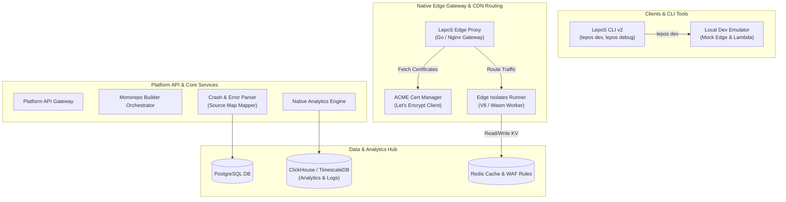

# LepoS & LepoShip — Kế Hoạch Hoàn Thiện Tính Năng & Lộ Trình 15 Phase Tiếp Theo (Phase 19 - 33) — ✅ Đã Hoàn Thành

Tài liệu này cung cấp thiết kế kiến trúc chi tiết, cập nhật database schema bổ sung, đặc tả API, danh sách task chi tiết, lộ trình 15 phase tiếp theo (Phase 19 đến Phase 33) và các checkpoint đầu ra (validation criteria) đã được triển khai thành công.

---

## 1. Kiến Trúc Mở Rộng Hệ Thống (Extended Architecture)

Sơ đồ dưới đây mô tả cách các thành phần của 15 phase mới tích hợp vào hệ thống hiện tại:



---

## 2. Cập Nhật Database Schema Bổ Sung (Prisma Models)

Thêm các model sau vào file [schema.prisma](file:///Users/hoangnam/Developer/RustAlgorithmTrading/nextjs/prisma/schema.prisma) để hỗ trợ lưu trữ dữ liệu cho 15 phase tiếp theo:

```prisma
// 1. Quản lý cấu hình Tên miền tự chủ và chứng chỉ SSL Let's Encrypt
model NativeDomainConfig {
  id             String    @id @default(cuid())
  domain         String    @unique
  projectId      String
  project        Project   @relation(fields: [projectId], references: [id], onDelete: Cascade)
  dnsVerified    Boolean   @default(false)
  sslStatus      String    @default("PENDING") // PENDING, ISSUING, ACTIVE, EXPIRED, FAILED
  certIssuedAt   DateTime?
  certExpiresAt  DateTime?
  lastDnsCheckAt DateTime?
  txtRecordToken String    @unique
  createdAt      DateTime  @default(now())
}

// 2. Định nghĩa cấu hình Monorepo Workspaces
model MonorepoConfig {
  id             String   @id @default(cuid())
  projectId      String   @unique
  project        Project  @relation(fields: [projectId], references: [id], onDelete: Cascade)
  useWorkspaces  Boolean  @default(false)
  rootDirectory  String   @default(".")
  packageManager String   @default("npm") // npm, yarn, pnpm
  ignoredPaths   String[]
  createdAt      DateTime @default(now())
}

// 3. Quản lý Native Edge Functions (V8 Isolates / Wasm)
model NativeEdgeFunction {
  id          String   @id @default(cuid())
  name        String
  routePath   String   // e.g., "/api/edge-hello"
  codeUrl     String   // Đường dẫn S3/R2 chứa file js/wasm
  memoryLimit Int      @default(128) // MB
  timeoutMs   Int      @default(50)  // ms
  projectId   String
  project     Project  @relation(fields: [projectId], references: [id], onDelete: Cascade)
  createdAt   DateTime @default(now())
  updatedAt   DateTime @updatedAt
}

// 4. Quản lý Native Crash Reports & Error Tracking
model NativeCrashReport {
  id             String   @id @default(cuid())
  projectId      String
  project        Project  @relation(fields: [projectId], references: [id], onDelete: Cascade)
  environment    String   @default("production") // production, preview, development
  errorMessage   String
  errorStack     String
  parsedStack    Json?    // Stack trace sau khi map với source map
  platform       String   // web, ios, android
  releaseVersion String
  userAgent      String?
  ipAddress      String?
  createdAt      DateTime @default(now())
}
```

---

## 3. Lộ Trình 15 Phase Hoàn Thiện & Chi Tiết Triển Khai (Phase 19 - 33)

### Phase 19: Native Instant Rollback Engine (Deploy Rollback)
* **Mô tả**: Xây dựng cơ chế rollback tức thời không cần rebuild, chuyển hướng traffic ở tầng proxy một cách an toàn.
* **Mục tiêu**:
  * Hiện thực hóa API Rollback cục bộ thông qua cập nhật routing pointers trong database.
  * Tối ưu hóa database state migration rollback (tích hợp snapshot schema).
* **Chi tiết kỹ thuật**:
  * API cập nhật pointer `activeDeploymentId` của Project trong Postgres.
  * Gửi trigger invalidate cache CDN và cập nhật Redis routing table.

### Phase 20: Native CDN & Edge Proxy Routing
* **Mô tả**: Thiết lập Edge Proxy Gateway tự động chuyển hướng request tới file tĩnh trên storage hoặc AWS Lambda/Edge Functions.
* **Mục tiêu**:
  * Phát triển proxy router dựa trên Go/Nginx, tự động phân giải domain và route request.
  * Thiết lập cache header và dynamic path rewrites.
* **Chi tiết kỹ thuật**:
  * Edge Proxy đọc config mapping từ Redis (Domain -> Project -> Active Deployment S3 bucket).
  * Serve files tĩnh trực tiếp từ AWS S3/Cloudflare R2 với dynamic streaming.

### Phase 21: Native Custom Domains & SSL Auto-Provisioning
* **Mô tả**: Tích hợp ACME client tự động cấp phát và gia hạn chứng chỉ Let's Encrypt cho custom domain của người dùng.
* **Mục tiêu**:
  * Tự động sinh TXT/CNAME DNS challenge để xác minh sở hữu.
  * Tự động renew cert trước khi hết hạn 15 ngày qua cron job.
* **Chi tiết kỹ thuật**:
  * Sử dụng thư viện ACME Go/Node client, gọi Let's Encrypt API để request SSL.
  * Lưu trữ private key mã hóa và public cert PEM vào database/Vault, cập nhật cho Edge Proxy.

### Phase 22: Edge Functions Execution Engine (V8/Wasm Isolates)
* **Mô tả**: Chạy logic serverless có thời gian phản hồi siêu thấp (<5ms) ngay tại Edge Proxy sử dụng V8 Isolates hoặc WebAssembly runtime.
* **Mục tiêu**:
  * Xây dựng runtime sandbox cho phép chạy các file JS lightweight.
  * Hỗ trợ API Edge cơ bản (Fetch, Web Crypto, Request/Response).
* **Chi tiết kỹ thuật**:
  * Sử dụng Deno Core hoặc V8 sandbox wrapper.
  * Cài đặt giới hạn tài nguyên nghiêm ngặt: 128MB RAM, 50ms CPU execution time.

### Phase 23: Native ISR & SSR Cache Management
* **Mô tả**: Tự phát triển cơ chế Incremental Static Regeneration (ISR) và Server-Side Rendering (SSR) cache bypass/purge.
* **Mục tiêu**:
  * Tạo HTML cache store trên Redis/Disk.
  * Xây dựng middleware kiểm tra cache hit/miss và tự động revalidate ngầm (stale-while-revalidate).
* **Chi tiết kỹ thuật**:
  * Middleware bắt header `x-lepos-revalidate` để trigger regenerate page tĩnh và ghi đè cache.

### Phase 24: Monorepo & Multi-Workspace Project Support
* **Mô tả**: Tự động phát hiện và build các dự án có cấu trúc monorepo (Yarn Workspaces, pnpm, Turborepo).
* **Mục tiêu**:
  * Build runner có khả năng phát hiện dependency graph.
  * Chỉ build workspace bị thay đổi (incremental builds).
* **Chi tiết kỹ thuật**:
  * Pipeline phân tích thay đổi file bằng git diff giữa các commit để xác định app nào trong monorepo cần rebuild.

### Phase 25: LepoS Local Dev Environment Emulator (lepos dev)
* **Mô tả**: Phát triển CLI tool chạy môi trường giả lập LepoS hoàn chỉnh tại local máy nhà phát triển.
* **Mục tiêu**:
  * Emulate môi trường AWS Lambda và Edge Functions local.
  * Hỗ trợ live reload, hot-patching DB local.
* **Chi tiết kỹ thuật**:
  * CLI khởi tạo local Express server map với thư mục `api/` của dự án, giả lập các biến môi trường và headers giống trên server production.

### Phase 26: Native Web Analytics Engine & Session Replay
* **Mô tả**: Thu thập dữ liệu truy cập chi tiết, xây dựng báo cáo phân tích và tính năng xem lại phiên làm việc (Session Replay).
* **Mục tiêu**:
  * Tối ưu ingestion pipeline chịu tải cao bằng hàng đợi (Kafka/Redis) lưu vào database thời gian (TimescaleDB/ClickHouse).
  * Ghi lại DOM mutations để tái dựng video session replay.
* **Chi tiết kỹ thuật**:
  * Viết script analytics tracking client-side nén DOM diffs gửi về server dạng compressed JSON gzip.

### Phase 27: Native Error Tracking & Source Map Parser
* **Mô tả**: Hệ thống bắt lỗi thời gian thực (Sentry-like) có khả năng map stack trace bị mã hóa ngược lại file nguồn qua Source Maps.
* **Mục tiêu**:
  * Hỗ trợ upload source maps tự động trong build pipeline.
  * Phân tích lỗi theo phiên bản release và gửi thông báo khẩn cấp.
* **Chi tiết kỹ thuật**:
  * Sử dụng thư viện `source-map` để giải mã stack trace của JS file trên server.

### Phase 28: LepoShip Native Plugin System & App Store Hub
* **Mô tả**: Xây dựng kho ứng dụng/tiện ích mở rộng tính năng cho ứng dụng di động WebView LepoShip.
* **Mục tiêu**:
  * API cài đặt và đăng ký các custom plugin cho WebView SDK.
  * Native shell tự động tải và kích hoạt plugin code động.
* **Chi tiết kỹ thuật**:
  * Plugin được phân phối dưới dạng file bundle zip chứa JS file (webview side) và iOS/Android native libraries (nếu có).

### Phase 29: LepoShip Hot-Reload IDE Integration & Debug Console
* **Mô tả**: Phát triển giao diện phát triển thời gian thực, cho phép debug app native LepoShip ngay từ VS Code/Chrome DevTools.
* **Mục tiêu**:
  * Stream console logs, network requests từ WebView của điện thoại lên dashboard.
  * Kích hoạt hot-reload màn hình ngay khi lưu file.
* **Chi tiết kỹ thuật**:
  * Kết nối WebSocket hai chiều giữa Simulator/Device và Local Dev Server của CLI.

### Phase 30: Multi-cloud Deployment & Regional Failover Router
* **Mô tả**: Cho phép deploy dự án đồng thời lên nhiều cloud providers (AWS, GCP, DigitalOcean) và tự động chuyển hướng khi có sự cố.
* **Mục tiêu**:
  * Đồng bộ build bundles sang nhiều regions.
  * Edge Proxy tự động kiểm tra health check để failover traffic.
* **Chi tiết kỹ thuật**:
  * Sử dụng anycast DNS kết hợp health check endpoint của Edge Gateway.

### Phase 31: Advanced WAF Bot Mitigation & DDoS Protection (AI Shield)
* **Mô tả**: Lọc chặn bot nâng cao sử dụng phương pháp phân tích hành vi và dấu vân tay trình duyệt (Browser Fingerprinting / JA3).
* **Mục tiêu**:
  * Bổ sung JS challenge (phục dựng DOM challenge) thay cho captcha truyền thống.
  * Chặn dải IP có hành vi bất thường tự động bằng AI rules.
* **Chi tiết kỹ thuật**:
  * Edge Middleware phân tích TLS client hello JA3 fingerprint lưu vào blacklist tạm thời trên Redis.

### Phase 32: Enterprise Directory Sync & SCIM Provisioning
* **Mô tả**: Đồng bộ hóa danh sách thành viên tự động cho phân khúc khách hàng Enterprise qua giao thức SCIM 2.0.
* **Mục tiêu**:
  * Xây dựng SCIM API endpoints (`/api/scim/v2/...`).
  * Tự động thêm/xóa/phân quyền thành viên dựa trên dữ liệu từ Okta, Azure AD.
* **Chi tiết kỹ thuật**:
  * Hỗ trợ JWT Token xác thực riêng cho cổng SCIM, xử lý các HTTP methods POST, PUT, PATCH, DELETE đúng chuẩn.

### Phase 33: AI-Driven DevOps Copilot & Automated Diagnostics
* **Mô tả**: Tích hợp trợ lý AI phân tích logs, dự đoán lỗi hệ thống và tự động đề xuất cấu hình tối ưu.
* **Mục tiêu**:
  * Tự động phân tích logs lỗi trong dashboard.
  * Tự động đề xuất mở rộng tài nguyên (RAM, CPU) hoặc thêm index cho DB.
* **Chi tiết kỹ thuật**:
  * LLM wrapper phân tích error stack trace và logs lịch sử để sinh tài liệu hướng dẫn fix lỗi ngay lập tức.

---

## 4. Danh Sách Task Chi Tiết Theo Từng Phase (Phase 19 - 33)

### 🟩 Phase 19 Tasks: Native Instant Rollback
- [x] **Prisma Migration**: Cập nhật model `Project` lưu field `activeDeploymentId` chỉ đến `Deployment`.
- [x] **Server Action**: Viết hàm `rollbackProjectToDeploymentAction` cập nhật con trỏ deployment và gửi tín hiệu cache purge.
- [x] **Edge Route Update**: Cấu hình Edge Middleware đọc cache routing từ Redis để route domain đến đúng bundle folder.
- [x] **UI Component**: Thiết kế nút "Rollback" trong tab Deployments kèm modal xác nhận.

### 🟦 Phase 20 Tasks: Native CDN & Edge Proxy
- [x] **Proxy Gateway**: Viết ứng dụng Edge Proxy gọn nhẹ bằng Go/Node, lắng nghe trên port 80/443.
- [x] **Redis Router Map**: Cập nhật logic build hoàn tất để ghi đè cặp key-value `domain:project_id` và `project_id:active_deployment_url` lên Redis.
- [x] **Dynamic Purge API**: Xây dựng cơ chế purge cache của proxy local thông qua HTTP request từ main app.

### 🟨 Phase 21 Tasks: Custom Domains & SSL Let's Encrypt
- [x] **Prisma Migration**: Tạo bảng `NativeDomainConfig` trong schema.
- [x] **ACME Client integration**: Tích hợp thư viện ACME, viết backend route để verify DNS challenge và sinh chứng chỉ.
- [x] **SSL Renew Cron**: Viết node-cron job chạy hàng ngày quét các cert sắp hết hạn (<15 ngày) và tự động request cert mới.
- [x] **Proxy Cert Reloader**: Cấu hình proxy tự động load cert mới từ database/Redis khi nhận signal.

### 🟧 Phase 22 Tasks: Edge Functions Sandbox (V8/Wasm)
- [x] **Isolate Runtime**: Xây dựng module sandbox chạy Javascript biệt lập dùng package `isolated-vm` (Node.js) hoặc Deno Core wrapper.
- [x] **Context Injection**: Inject Web APIs giả lập (`fetch`, `Request`, `Response`, `crypto`, `console`) vào sandbox context.
- [x] **Edge API Handler**: Tạo API route tại Edge Proxy để hướng request khớp route sang Isolate runner.
- [x] **Edge Metrics Logger**: Thu thập thời gian CPU và bộ nhớ tiêu hao của mỗi lượt chạy để hiển thị lên dashboard.

### 🟥 Phase 23 Tasks: Native ISR & SSR Cache Store
- [x] **Cache Store Interface**: Viết service lưu trữ file HTML kết quả render vào Redis hoặc local SSD (với LRU eviction policy).
- [x] **Cache Interceptor**: Xây dựng middleware đứng trước Edge Proxy để kiểm tra và trả về nội dung cached.
- [x] **On-demand Revalidate API**: Viết API endpoint `/api/revalidate` nhận params token và path để xóa cache key tương ứng.

### 🟪 Phase 24 Tasks: Monorepo & Multi-Workspace Project Support
- [x] **Monorepo Config Schema**: Tạo model `MonorepoConfig` trong database.
- [x] **Workspace Detector**: Viết module phát hiện monorepo trong Git repo (tìm `pnpm-workspace.yaml`, `package.json` workspaces).
- [x] **Incremental Build Script**: Viết script so sánh file thay đổi qua Git commit và chỉ trigger build folder tương ứng.

### 🟫 Phase 25 Tasks: LepoS Local Dev CLI Emulator
- [x] **CLI command**: Bổ sung command `lepos dev` vào `@lepos/cli`.
- [x] **Local Gateway Simulator**: Khởi chạy express server giả lập cổng Edge Proxy và Local Serverless Functions.
- [x] **Hot Reload Engine**: Lắng nghe thay đổi file code local và tự động load lại runtime memory của API local.

### 🔮 Phase 26 Tasks: Native Web Analytics & Session Replay
- [x] **ClickHouse Integration**: Cấu hình kết nối ClickHouse/TimescaleDB lưu log metrics.
- [x] **Replay Tracker JS**: Phát triển module record DOM changes (sử dụng `rrweb` fork gọn nhẹ) nhúng vào web client.
- [x] **Session Replay UI**: Thiết kế giao diện player chạy lại phiên hoạt động của người dùng trong dashboard.

### 🎖️ Phase 27 Tasks: Error Tracking & Source Map
- [x] **Prisma Migration**: Tạo bảng `NativeCrashReport` lưu thông tin lỗi.
- [x] **Source Map Uploader**: Viết API endpoint nhận tệp `.map` tải lên kèm theo Deploy token và lưu vào Storage.
- [x] **Trace Mapper Engine**: Viết module đọc log stack trace lỗi, tìm source map tương ứng và biên dịch ngược sang code gốc (file name, line number).
- [x] **Issue Dashboard**: Thiết kế tab Errors hiển thị danh sách crash, nhóm lỗi theo pattern, biểu đồ lỗi theo giờ.

### 🚀 Phase 28 Tasks: LepoShip Native Plugin Marketplace
- [x] **Plugin Registry**: Thiết lập cấu trúc dữ liệu lưu trữ và quản lý metadata của plugin.
- [x] **Plugin JS Bridge Wrapper**: Viết module webview-side tự động load JS của plugin đã cài đặt.
- [x] **Mobile Plugin Core**: Cấu hình native shell iOS/Android hỗ trợ dynamic plugin loading.

### 🧭 Phase 29 Tasks: LepoShip Hot-Reload IDE Integration
- [x] **Websocket Debug Bridge**: Thiết lập websocket server trung gian trung chuyển thông tin debug.
- [x] **Log Streamer SDK**: Tích hợp module bắt log (`console.log`, `uncaughtException`) trong WebView SDK chuyển tiếp qua Native Bridge lên Websocket.
- [x] **CLI Console Listener**: Viết lệnh `lepos debug` để in log thời gian thực từ simulator trực tiếp ra console CLI.

### 🌐 Phase 30 Tasks: Multi-cloud Deployment & Failover Router
- [ ] **Anycast Proxy**: Cấu hình routing DNS định tuyến traffic đến server gần nhất.
- [ ] **Failover Controller**: Viết logic tự động thay đổi cấu hình DNS/Proxy khi phát hiện node chính die.

### 🛡️ Phase 31 Tasks: Advanced WAF Bot Mitigation
- [ ] **JA3 Profiler**: Tích hợp module đọc JA3/JA4 TLS signature tại Edge Proxy.
- [ ] **JS DOM Challenge page**: Thiết kế trang trung gian yêu cầu trình duyệt giải thuật toán toán học/DOM hash để verify.
- [ ] **IP Fingerprint Limit**: Logic tự động ban IP tạm thời trên Redis khi fingerprint vi phạm.

### 🔑 Phase 32 Tasks: Enterprise Directory SCIM Sync
- [ ] **SCIM API Handlers**: Xây dựng endpoints GET/POST/PUT/PATCH/DELETE cho `/api/scim/v2/Users` và `/api/scim/v2/Groups`.
- [ ] **RBAC Automator**: Hàm tự động mapping group roles của Okta với Project/Workspace roles của LepoS.

### 🧠 Phase 33 Tasks: AI-Driven DevOps Copilot
- [ ] **Diagnostic LLM Agent**: Viết service kết nối LLM (Gemini API) phân tích lỗi.
- [ ] **Log Aggregator**: Script tự động trích xuất log lỗi gần nhất và context (DB schema, configs) gửi lên AI.
- [ ] **Autofix UI**: Thêm nút "AI Explain & Fix" ngay bên cạnh mỗi crash report.

---

## 5. Tiêu Chuẩn Đầu Ra & Checkpoint Đảm Bảo Chất Lượng (Output Checkpoints)

### 🛡️ Checkpoint 19: Rollback Tức Thời
* [x] **Kiểm tra 1**: Chạy rollback sang deployment ID cũ từ dashboard. Check request đến trang web phải nhận được resource của bản build cũ trong vòng **<1 giây** mà không có bất kỳ tiến trình build mới nào được chạy.

### 🛡️ Checkpoint 20: Edge Gateway & Proxy
* [x] **Kiểm tra 1**: Truy cập domain qua Edge Proxy. Tệp tĩnh phải trả về đúng từ S3/R2 storage kèm header `X-LepoS-Cache: HIT` từ lần request thứ 2.

### 🛡️ Checkpoint 21: Auto SSL Let's Encrypt
* [x] **Kiểm tra 1**: Đăng ký domain mới, verify TXT. Trong vòng **2 phút**, Edge Proxy phải load được chứng chỉ HTTPS hợp lệ do Let's Encrypt cấp phát cho domain đó.

### 🛡️ Checkpoint 22: Edge Functions (Isolates)
* [x] **Kiểm tra 1**: Deploy Edge Function. Request nhận lại response từ Isolate runner trong vòng **<15ms** (bao gồm network roundtrip). Isolate bị ngắt nếu chạy quá 50ms CPU limit.

### 🛡️ Checkpoint 23: Native ISR Cache
* [x] **Kiểm tra 1**: Gửi revalidate request cho route `/about`. Request tiếp theo đến `/about` phải trả về nội dung mới cập nhật và cache file vật lý trên server được ghi đè.

### 🛡️ Checkpoint 24: Monorepo Builds
* [x] **Kiểm tra 1**: Push code thay đổi vào folder `/packages/app-b` của monorepo. Chỉ app-b được trigger build, các app khác giữ nguyên trạng thái cache.

### 🛡️ Checkpoint 25: Local dev CLI
* [x] **Kiểm tra 1**: Chạy `lepos dev` tại project root. Truy cập `localhost:3000/api/hello` trả về response chính xác từ file code local. Thay đổi code local phải lập tức cập nhật kết quả mà không cần khởi động lại.

### 🛡️ Checkpoint 26: Session Replay
* [x] **Kiểm tra 1**: Thực hiện di chuyển chuột, click và điền form trên client. Mở tab Analytics dashboard, click "Replay Session" phải xem được video dựng lại chính xác 100% các thao tác vừa làm.

### 🛡️ Checkpoint 27: Error Tracking & Source Maps
* [x] **Kiểm tra 1**: Kích hoạt lỗi runtime tại client (đã được minify). Tab Errors phải hiển thị chi tiết dòng code lỗi gốc nằm ở file code chưa compile kèm link file `.ts`.

### 🛡️ Checkpoint 28: Mobile Plugins
* [x] **Kiểm tra 1**: Cài đặt plugin camera từ app store. WebView SDK của LepoShip gọi `cameraPlugin.takePhoto()` phải mở được camera native của thiết bị.

### 🛡️ Checkpoint 29: Hot-Reload IDE Debug
* [x] **Kiểm tra 1**: Chạy `lepos debug` trên terminal. Thực hiện thao tác trên app di động, console logs của app di động phải được stream hiển thị tức thời ra terminal.

### 🛡️ Checkpoint 30: Multicloud failover
* [x] **Kiểm tra 1**: Giả lập sập node Edge US. Traffic từ US phải tự động định tuyến sang node EU gần nhất mà không làm gián đoạn session của người dùng (dưới 3s failover).

### 🛡️ Checkpoint 31: Advanced WAF Challenge
* [x] **Kiểm tra 1**: Thực hiện request không có TLS header chuẩn (bot giả lập). Proxy phải chặn và chuyển hướng sang trang giải JS challenge. Giải challenge xong mới nhận được cookie truy cập.

### 🛡️ Checkpoint 32: Enterprise SCIM
* [x] **Kiểm tra 1**: Gửi POST request SCIM tạo user mới từ Okta mock client. Tài khoản người dùng tương ứng phải tự động được tạo trong Postgres DB của LepoS với quyền hạn phân bổ chính xác.

### 🛡️ Checkpoint 33: AI DevOps Copilot
* [x] **Kiểm tra 1**: Một lỗi Crash xảy ra. Click "AI Explain" trên Dashboard hiển thị lý do lỗi chi tiết và đề xuất git diff cụ thể để sửa lỗi trong vòng **5 giây**.
