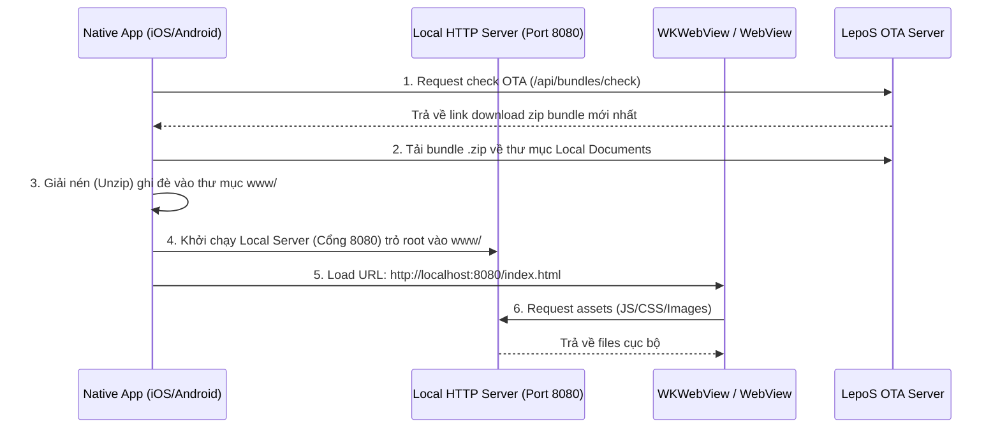

# Hướng Dẫn Tích Hợp Local Web Server Cho LepoShip Mobile (iOS & Android)

Tài liệu này hướng dẫn cách cấu hình máy chủ HTTP cục bộ chạy ngầm (Local Web Server) bên trong ứng dụng native iOS và Android để phục vụ (serve) gói giao diện tĩnh WebView (HTML, JS, CSS) giải nén từ OTA Server. Phương pháp này giải quyết các hạn chế bảo mật của giao thức `file://` (như CORS, absolute routing) trên các WebView hiện đại.

---

## 1. Kiến Trúc Hoạt Động (Architecture Flow)



---

## 2. iOS Integration (sử dụng GCDWebServer)

**GCDWebServer** là một thư viện HTTP server nhẹ viết bằng Objective-C phù hợp tuyệt đối cho các dự án iOS (Swift/ObjC).

### Bước 2.1: Cài đặt qua CocoaPods hoặc Swift Package Manager (SPM)
Thêm dependency vào Podfile:
```ruby
pod 'GCDWebServer', '~> 3.0'
```

### Bước 2.2: Khởi tạo và Run Server trong Swift (`AppDelegate.swift`)

```swift
import Foundation
import GCDWebServer
import WebKit

@main
class AppDelegate: UIResponder, UIApplicationDelegate {
    var window: UIWindow?
    var webServer: GCDWebServer?

    func application(_ application: UIApplication, didFinishLaunchingWithOptions launchOptions: [UIApplication.LaunchOptionsKey: Any]?) -> Bool {
        startLocalWebServer()
        return true
    }

    func startLocalWebServer() {
        webServer = GCDWebServer()
        
        // Đường dẫn thư mục giải nén bundle static trong app documents
        let fileManager = FileManager.default
        let documentsURL = fileManager.urls(for: .documentDirectory, in: .userDomainMask).first!
        let wwwDirectory = documentsURL.appendingPathComponent("www").path
        
        // Tạo thư mục www nếu chưa có (lần đầu khởi chạy)
        if !fileManager.fileExists(atPath: wwwDirectory) {
            try? fileManager.createDirectory(atPath: wwwDirectory, withIntermediateDirectories: true, attributes: nil)
            // Copy bundle mặc định trong Main Bundle ra Documents thư mục
            if let defaultBundlePath = Bundle.main.path(forResource: "default-bundle", ofType: "zip") {
                // Giải nén bundle mặc định vào wwwDirectory...
            }
        }
        
        // Cấu hình server serve tĩnh từ thư mục wwwDirectory
        webServer?.addGETHandler(forBasePath: "/", directoryPath: wwwDirectory, indexFilename: "index.html", cacheAge: 3600, allowRangeRequests: true)
        
        // Chạy server trên cổng 8080 (hoặc cổng cấu hình từ API)
        let options: [String: Any] = [
            GCDWebServerOption_Port: 8080,
            GCDWebServerOption_BindToLocalhost: true // Bảo mật: chỉ cho phép localhost kết nối
        ]
        
        do {
            try webServer?.start(options: options)
            print("[GCDWebServer] Server started at: \(webServer?.serverURL?.absoluteString ?? "")")
        } catch {
            print("[GCDWebServer] Failed to start server: \(error)")
        }
    }
}
```

### Bước 2.3: WKWebView load trang local
Trong UIViewController chứa WKWebView:
```swift
override func viewDidLoad() {
    super.viewDidLoad()
    let webView = WKWebView(frame: self.view.bounds)
    self.view.addSubview(webView)
    
    // Load localhost serve bởi GCDWebServer
    if let url = URL(string: "http://localhost:8080/") {
        let request = URLRequest(url: url)
        webView.load(request)
    }
}
```

---

## 3. Android Integration (sử dụng AndroidAsync hoặc NanoHTTPD)

On Android, we can use **AndroidAsync** (or **NanoHTTPD** / **Ktor-server** for Kotlin) to serve WebView bundles.

### Bước 3.1: Thêm dependency vào Gradle (`app/build.gradle`)
```groovy
dependencies {
    implementation 'com.koushikdutta.async:androidasync:3.1.0'
}
```

### Bước 3.2: Viết Local Server Class (`LocalWebServer.java`)

```java
package com.lepoship.app;

import android.content.Context;
import android.util.Log;
import com.koushikdutta.async.http.server.AsyncHttpServer;
import com.koushikdutta.async.http.server.AsyncHttpServerRequest;
import com.koushikdutta.async.http.server.AsyncHttpServerResponse;
import com.koushikdutta.async.http.server.HttpServerRequestCallback;
import java.io.File;
import java.io.FileInputStream;

public class LocalWebServer {
    private AsyncHttpServer server = new AsyncHttpServer();
    private Context context;
    private static final String TAG = "LocalWebServer";

    public LocalWebServer(Context context) {
        this.context = context;
    }

    public void start(int port) {
        final File wwwDir = new File(context.getFilesDir(), "www");
        if (!wwwDir.exists()) {
            wwwDir.mkdirs();
        }

        // Serve static GET requests
        server.get(".*", new HttpServerRequestCallback() {
            @Override
            public void onRequest(AsyncHttpServerRequest request, AsyncHttpServerResponse response) {
                String path = request.getPath();
                if (path.equals("/")) {
                    path = "/index.html";
                }

                File file = new File(wwwDir, path);
                if (file.exists() && file.isFile()) {
                    try {
                        String mimeType = getMimeType(path);
                        response.setContentType(mimeType);
                        response.sendStream(new FileInputStream(file), file.length());
                    } catch (Exception e) {
                        response.code(500);
                        response.send("Internal Server Error");
                    }
                } else {
                    // SPA Fallback to index.html if not found (for Routing)
                    File indexFile = new File(wwwDir, "index.html");
                    if (indexFile.exists()) {
                        try {
                            response.setContentType("text/html");
                            response.sendStream(new FileInputStream(indexFile), indexFile.length());
                        } catch (Exception e) {
                            response.code(404);
                            response.send("File Not Found");
                        }
                    } else {
                        response.code(404);
                        response.send("Not Found");
                    }
                }
            }
        });

        // Listen local
        server.listen(port);
        Log.i(TAG, "Server running locally on port " + port);
    }

    private String getMimeType(String path) {
        if (path.endsWith(".html")) return "text/html";
        if (path.endsWith(".js")) return "application/javascript";
        if (path.endsWith(".css")) return "text/css";
        if (path.endsWith(".png")) return "image/png";
        if (path.endsWith(".jpg") || path.endsWith(".jpeg")) return "image/jpeg";
        if (path.endsWith(".svg")) return "image/svg+xml";
        return "application/octet-stream";
    }

    public void stop() {
        server.stop();
    }
}
```

### Bước 3.3: Load localhost in Android WebView
```java
WebView webView = findViewById(R.id.webview);
webView.getSettings().setJavaScriptEnabled(true);
webView.getSettings().setDomStorageEnabled(true);

// Start local server on port 8080
LocalWebServer server = new LocalWebServer(this);
server.start(8080);

webView.loadUrl("http://localhost:8080/");
```

---

## 4. WebView JavaScript Bridge (Native Bridge)

To allow the WebView to call native device APIs (like Camera, GPS), configure Web Message Handlers:

### iOS (WKScriptMessageHandler)
```swift
class BridgeHandler: NSObject, WKScriptMessageHandler {
    func userContentController(_ userContentController: WKUserContentController, didReceive message: WKScriptMessage) {
        guard message.name == "lepoShipBridge" else { return }
        guard let body = message.body as? [String: Any],
              let action = body["action"] as? String,
              let requestId = body["requestId"] as? String else { return }
              
        // Handle actions
        if action == "getCameraPhoto" {
            // Open camera, capture photo, return local URI
            let responseData: [String: Any] = ["uri": "file://path/to/captured.jpg"]
            sendResponseToWebView(requestId: requestId, data: responseData, webView: message.webView!)
        }
    }
    
    func sendResponseToWebView(requestId: String, data: [String: Any], webView: WKWebView) {
        let jsonString = String(data: try! JSONSerialization.data(withJSONObject: ["data": data]), encoding: .utf8)!
        let script = "window.__lepoShipReceiveMessage('\(requestId)', \(jsonString));"
        DispatchQueue.main.async {
            webView.evaluateJavaScript(script, completionHandler: nil)
        }
    }
}
```

### Android (@JavascriptInterface)
```java
public class WebAppInterface {
    private Context context;
    private WebView webView;

    public WebAppInterface(Context c, WebView v) {
        context = c;
        webView = v;
    }

    @JavascriptInterface
    public void postMessage(String jsonStr) {
        try {
            JSONObject message = new JSONObject(jsonStr);
            String requestId = message.getString("requestId");
            String action = message.getString("action");

            if (action.equals("getCameraPhoto")) {
                // Handle camera capture
                JSONObject response = new JSONObject();
                JSONObject data = new JSONObject();
                data.put("uri", "file://path/to/captured.jpg");
                response.put("data", data);

                final String script = "javascript:window.__lepoShipReceiveMessage('" + requestId + "', " + response.toString() + ");";
                webView.post(new Runnable() {
                    @Override
                    public void run() {
                        webView.evaluateJavascript(script, null);
                    }
                });
            }
        } catch (Exception e) {
            e.printStackTrace();
        }
    }
}

// Bind interface
webView.addJavascriptInterface(new WebAppInterface(this, webView), "LepoShipBridge");
```
