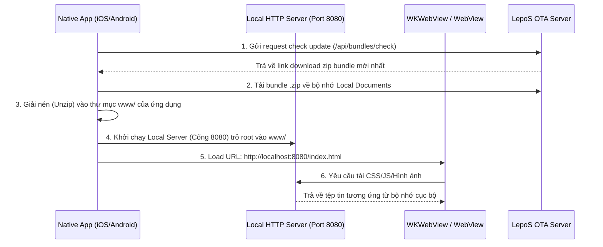

# LepoS & LepoShip: Cẩm Nang Tích Hợp Dành Cho User Developer

Tài liệu này hướng dẫn các nhà phát triển (User Developer) cách tích hợp ứng dụng di động Hybrid sử dụng hệ sinh thái LepoS & LepoShip, cấu hình máy chủ HTTP cục bộ chạy ngầm (Local Web Server), viết Edge Functions và sử dụng công cụ CLI để phát triển dự án.

---

## 1. Tổng Quan Về LepoShip Mobile & Local Web Server

Khi phát triển ứng dụng di động Hybrid sử dụng WebView hiển thị giao diện HTML5 tĩnh từ OTA updates, việc sử dụng giao thức `file://` truyền thống gặp các rào cản bảo mật nghiêm trọng:
*   **CORS (Cross-Origin Resource Sharing)**: Các trình duyệt hiện đại ngăn chặn request AJAX/Fetch từ trang `file://` tới các API endpoint bên ngoài.
*   **Absolute Path Routing**: Các đường dẫn tài nguyên dạng absolute `/static/bundle.js` sẽ tìm kiếm tại thư mục gốc của hệ thống tệp thiết bị thay vì thư mục của ứng dụng.
*   **Web APIs**: Các API hiện đại (Service Workers, Web Crypto, WebGL) yêu cầu môi trường bảo mật (`http://localhost` hoặc `https://`).

**Giải pháp**: Tích hợp một HTTP server siêu nhẹ chạy ngầm ngay trong app native (iOS/Android), trỏ document root vào thư mục chứa bundle web tĩnh đã giải nén từ OTA Server.



---

## 2. Tích Hợp Local Web Server Trên iOS (Swift + GCDWebServer)

**GCDWebServer** là một thư viện HTTP server nhẹ viết bằng Objective-C phù hợp tuyệt đối cho các dự án iOS (Swift/ObjC).

### Bước 2.1: Cài đặt dependency
Thêm dòng sau vào `Podfile` của bạn và chạy `pod install`:
```ruby
pod 'GCDWebServer', '~> 3.0'
```

### Bước 2.2: Khởi chạy Server trong `AppDelegate.swift`
```swift
import Foundation
import GCDWebServer
import WebKit

@main
class AppDelegate: UIResponder, UIApplicationDelegate {
    var window: UIWindow?
    var webServer: GCDWebServer?

    func application(_ application: UIApplication, didFinishLaunchingWithOptions launchOptions: [UIApplication.LaunchOptionsKey: Any]?) -> Bool {
        startLocalWebServer()
        return true
    }

    func startLocalWebServer() {
        webServer = GCDWebServer()
        
        let fileManager = FileManager.default
        let documentsPath = NSSearchPathForDirectoriesInDomains(.documentDirectory, .userDomainMask, true)[0]
        let webFolder = (documentsPath as NSString).appendingPathComponent("www")
        
        // Tạo thư mục www nếu chưa có
        if !fileManager.fileExists(atPath: webFolder) {
            try? fileManager.createDirectory(atPath: webFolder, withIntermediateDirectories: true, attributes: nil)
            // Copy bộ assets mặc định đi kèm Xcode Bundle vào lần chạy đầu tiên
            if let defaultPath = Bundle.main.path(forResource: "default_web", ofType: nil) {
                try? fileManager.copyItem(atPath: defaultPath, toPath: webFolder)
            }
        }

        // Serve nội dung tĩnh từ thư mục www/
        webServer?.addGETHandler(forBasePath: "/", directoryPath: webFolder, indexFilename: "index.html", cacheAge: 0, allowRangeRequests: true)
        
        // Khởi chạy server trên cổng 8080 localhost
        let options: [String: Any] = [
            GCDWebServerOption_Port: 8080,
            GCDWebServerOption_BindToLocalhost: true // Bảo mật: Chỉ lắng nghe yêu cầu nội bộ
        ]
        
        do {
            try webServer?.start(options: options)
            print("Local Web Server running at: \(webServer?.serverURL?.absoluteString ?? "unknown")")
        } catch {
            print("Failed to start local web server: \(error)")
        }
    }
}
```

### Bước 2.3: Load WebView
```swift
import UIKit
import WebKit

class WebViewController: UIViewController, WKNavigationDelegate {
    var webView: WKWebView!

    override func viewDidLoad() {
        super.viewDidLoad()
        
        let config = WKWebViewConfiguration()
        config.preferences.setValue(true, forKey: "allowFileAccessFromFileURLs")
        
        webView = WKWebView(frame: self.view.bounds, configuration: config)
        webView.navigationDelegate = self
        self.view.addSubview(webView)
        
        // Load nội dung qua Local Web Server
        if let url = URL(string: "http://localhost:8080/index.html") {
            webView.load(URLRequest(url: url))
        }
    }
}
```

---

## 3. Tích Hợp Local Web Server Trên Android (Kotlin + AndroidAsync)

### Bước 3.1: Cài đặt dependency
Thêm dòng sau vào `build.gradle` (Module: app):
```groovy
dependencies {
    implementation 'com.koushikdutta.async:androidasync:3.1.0'
}
```

### Bước 3.2: Tạo Service chạy HTTP Server cục bộ (`LocalWebServerService.kt`)
```kotlin
package com.lepoship.app

import android.app.Service
import android.content.Intent
import android.os.IBinder
import android.util.Log
import com.koushikdutta.async.http.server.AsyncHttpServer
import java.io.File

class LocalWebServerService : Service() {
    private val server = AsyncHttpServer()
    private val PORT = 8080

    override fun onCreate() {
        super.onCreate()
        startServer()
    }

    private fun startServer() {
        val wwwDir = File(filesDir, "www")
        if (!wwwDir.exists()) {
            wwwDir.mkdirs()
        }

        server.get("/.*") { request, response ->
            var path = request.path
            if (path == "/") {
                path = "/index.html"
            }
            
            val file = File(wwwDir, path)
            if (file.exists() && file.isFile) {
                val mimeType = getMimeType(file.name)
                response.setContentType(mimeType)
                response.sendFile(file)
            } else {
                response.code(404)
                response.send("404 Not Found")
            }
        }

        // Lắng nghe trên localhost
        server.listen(PORT)
        Log.i("LocalWebServer", "Android Local Server running on port $PORT")
    }

    private fun getMimeType(fileName: String): String {
        return when {
            fileName.endsWith(".html") -> "text/html"
            fileName.endsWith(".js") -> "application/javascript"
            fileName.endsWith(".css") -> "text/css"
            fileName.endsWith(".png") -> "image/png"
            fileName.endsWith(".jpg") || fileName.endsWith(".jpeg") -> "image/jpeg"
            fileName.endsWith(".svg") -> "image/svg+xml"
            else -> "application/octet-stream"
        }
    }

    override fun onDestroy() {
        server.stop()
        super.onDestroy()
    }

    override fun onBind(intent: Intent?): IBinder? = null
}
```

### Bước 3.3: Khởi tạo WebView trong MainActivity
```kotlin
package com.lepoship.app

import android.content.Intent
import android.os.Bundle
import android.webkit.WebSettings
import android.webkit.WebView
import android.webkit.WebViewClient
import androidx.appcompat.app.AppCompatActivity

class MainActivity : AppCompatActivity() {
    private lateinit var webView: WebView

    override fun onCreate(savedInstanceState: Bundle?) {
        super.onCreate(savedInstanceState)
        
        // Khởi chạy ngầm Local Web Server Service
        startService(Intent(this, LocalWebServerService::class.java))
        
        webView = WebView(this)
        setContentView(webView)
        
        webView.settings.apply {
            javaScriptEnabled = true
            domStorageEnabled = true
            allowFileAccess = true
            mixedContentMode = WebSettings.MIXED_CONTENT_COMPATIBILITY_MODE
        }
        
        webView.webViewClient = WebViewClient()
        webView.loadUrl("http://localhost:8080/index.html")
    }
}
```

---

## 4. WebView JavaScript Bridge (Native Bridge)

Để cho phép mã nguồn JS chạy bên trong WebView gọi đến các tính năng Native của hệ điều hành (như Camera, GPS), sử dụng cơ chế Native Bridge:

### 4.1 iOS (WKScriptMessageHandler)
```swift
class BridgeHandler: NSObject, WKScriptMessageHandler {
    func userContentController(_ userContentController: WKUserContentController, didReceive message: WKScriptMessage) {
        guard message.name == "lepoShipBridge" else { return }
        guard let body = message.body as? [String: Any],
              let action = body["action"] as? String,
              let requestId = body["requestId"] as? String else { return }
              
        if action == "getCameraPhoto" {
            // Logic mở Camera native và chụp ảnh
            let responseData: [String: Any] = ["uri": "file://path/to/captured.jpg"]
            sendResponseToWebView(requestId: requestId, data: responseData, webView: message.webView!)
        }
    }
    
    func sendResponseToWebView(requestId: String, data: [String: Any], webView: WKWebView) {
        let jsonString = String(data: try! JSONSerialization.data(withJSONObject: ["data": data]), encoding: .utf8)!
        let script = "window.__lepoShipReceiveMessage('\(requestId)', \(jsonString));"
        DispatchQueue.main.async {
            webView.evaluateJavaScript(script, completionHandler: nil)
        }
    }
}
```

### 4.2 Android (@JavascriptInterface)
```java
public class WebAppInterface {
    private Context context;
    private WebView webView;

    public WebAppInterface(Context c, WebView v) {
        context = c;
        webView = v;
    }

    @JavascriptInterface
    public void postMessage(String jsonStr) {
        try {
            JSONObject message = new JSONObject(jsonStr);
            String requestId = message.getString("requestId");
            String action = message.getString("action");

            if ("getCameraPhoto".equals(action)) {
                // Mở Camera và trả kết quả về WebView
                JSONObject responseData = new JSONObject();
                responseData.put("uri", "file://path/to/captured.jpg");
                sendResponseToWebView(requestId, responseData);
            }
        } catch (Exception e) {
            e.printStackTrace();
        }
    }

    private void sendResponseToWebView(String requestId, JSONObject data) {
        final String script = "javascript:window.__lepoShipReceiveMessage('" + requestId + "', " + data.toString() + ");";
        webView.post(() -> webView.evaluateJavascript(script, null));
    }
}
```

---

## 5. Quy Trình Vận Hành Cập Nhật OTA (Over-The-Air)

Ứng dụng native sẽ check cập nhật định kỳ qua API:
`GET http://<your-lepos-server>/api/bundles/check?platform=ios&version=1.2.0&buildNumber=5`

Nếu có bản cập nhật, server trả về:
```json
{
  "updateAvailable": true,
  "version": "1.2.1",
  "buildNumber": 6,
  "bundleUrl": "https://storage.lepos.dev/bundles/build-6.zip"
}
```
Ứng dụng sẽ tải tệp tin zip này, giải nén ghi đè lên thư mục `www/` rồi thực hiện reload WebView.

---

## 6. Hướng Dẫn Viết Edge Functions

Edge Functions chạy trên môi trường V8 Isolates siêu nhẹ.

### 6.1 Định dạng code mẫu (`edge/hello.js`)
```javascript
export default async function handler(request) {
  const url = new URL(request.url);
  const name = url.searchParams.get("name") || "Developer";

  return new Response(JSON.stringify({
    message: `Hello ${name} from LepoS Edge!`,
    timestamp: new Date().toISOString()
  }), {
    status: 200,
    headers: { "Content-Type": "application/json" }
  });
}
```

### 6.2 Các giới hạn kỹ thuật
*   **Memory Limit**: Tối đa **128MB RAM** cho mỗi Isolate.
*   **Timeout**: CPU execution time tối đa **50ms**.
*   **APIs hỗ trợ**: Các Web APIs tiêu chuẩn như `fetch`, `Request`, `Response`, `crypto`, `console`. Không hỗ trợ Node.js built-ins (`fs`, `child_process`).

---

## 7. Sử Dụng LepoS CLI & Giả Lập Local

### 7.1 Cài đặt CLI
```bash
npm install -g @lepos/cli
```

### 7.2 Giả lập Local (`lepos dev`)
Chạy lệnh sau tại thư mục gốc của dự án để giả lập môi trường Serverless & Edge local:
```bash
lepos dev
```
Express Server giả lập sẽ lắng nghe trên cổng `3000` phục vụ test API cục bộ.

### 7.3 Debug Console (`lepos debug`)
Kết nối và xem stream logs thời gian thực từ simulator di động hoặc device:
```bash
lepos debug
```
Log được thu thập từ WebView SDK sẽ hiển thị trực tiếp lên cửa sổ terminal này.
