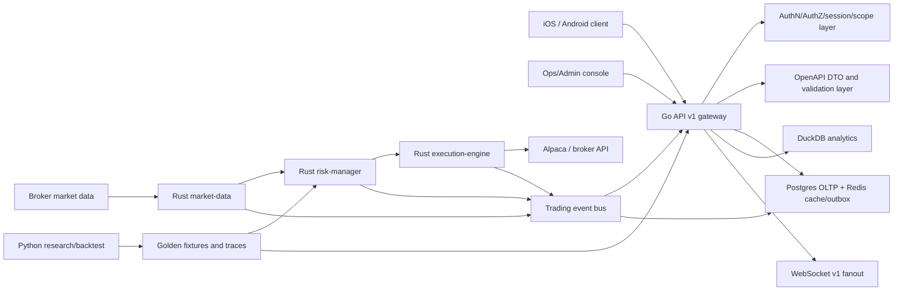

# Trading Observability API Production Grade Plan

Last updated: 2026-07-07

## 1. Executive Decision

The current Go service can support early mobile UI work for system health, metrics,
trade history, incidents, and broker visibility. It is not yet a production-grade
mobile trading backend.

Production direction:

1. Build a clean `/api/v1` Trading Observability and Control API.
2. Treat the existing `/api/metrics`, `/api/trades`, `/api/system`,
   `/api/alpaca`, and `/ws/metrics` surfaces as legacy/internal until replaced.
3. Start mobile integration as read-only: market data, portfolio, positions,
   orders, fills, system status, incidents, and risk state.
4. Keep live trading actions disabled for mobile until auth, authorization,
   order preview, idempotency, audit, risk gates, kill switch, and paper-trading
   soak are complete.
5. Use Go as the API gateway and contract owner, Rust as the low-latency trading
   core, and Python as research/backtest/strategy validation support.

Readiness label: Prototype to early integration. Good enough for mobile UI and
typed client scaffolding. Not good enough for direct production/live trading.

## 2. External Benchmark Summary

The production API should borrow proven patterns from major trading platforms:

| Source | Pattern to adopt |
|---|---|
| [Coinbase Advanced Trade REST](https://docs.cdp.coinbase.com/coinbase-app/advanced-trade-apis/rest-api) | Separate public market data, private accounts, portfolios, orders, fills, order preview, and transaction summary endpoints. |
| [Coinbase Advanced Trade WebSocket](https://docs.cdp.coinbase.com/coinbase-app/advanced-trade-apis/websocket/websocket-overview) | WebSocket channels for market data and user order data; typed messages; subscribe/unsubscribe; sequence numbers. |
| [Binance Spot REST](https://developers.binance.com/docs/binance-spot-api-docs/rest-api) | Explicit API key security types, signed endpoints, timestamp rules, rate-limit responses, and ban semantics. |
| [Binance Market Data](https://developers.binance.com/docs/binance-spot-api-docs/rest-api/market-data-endpoints) | Order book, recent trades, historical trades, klines/candles, tickers, and average price as first-class read endpoints. |
| [Binance WebSocket Streams](https://developers.binance.com/docs/binance-spot-api-docs/web-socket-streams) | Stream topics with event type, event time, symbol, trade id, price, and quantity. |
| [Binance User Data Stream](https://developers.binance.com/legacy-docs/binance-spot-api-docs/user-data-stream) | Account and order events pushed in real time over authenticated streams. |
| [Kraken REST Add Order](https://docs.kraken.com/api-reference/trading/add-order) | Enforce pair metadata, price precision, quantity precision, minimum order size, and trading permissions. |
| [Kraken WebSocket Add Order](https://docs.kraken.com/exchange/api-reference/spot-websocket-v2/add_order) | Rich order types, conditional close, trailing stop, and request/response order workflow over WebSocket. |
| [IBKR Client Portal Web API](https://www.interactivebrokers.com/campus/ibkr-api-page/cpapi-v1/) | Portfolio updates, market data, trading over HTTP and WebSocket, explicit auth/session model, and 2FA constraints. |
| [Alpaca Portfolio History](https://docs.alpaca.markets/us/reference/getaccountportfoliohistory-1) | Account equity and P/L time series with period/timeframe controls. |
| [Alpaca Orders](https://docs.alpaca.markets/us/reference/postorder) | Client order id, multiple order types/classes, time-in-force validation, and paper/live separation. |
| [Alpaca Watchlists](https://docs.alpaca.markets/us/reference/postwatchlist-1) | Account-scoped watchlist resources for mobile workflows. |
| [OWASP API Security Top 10 2023](https://owasp.org/API-Security/editions/2023/en/0x11-t10/) | BOLA, broken auth, object property auth, resource exhaustion, and function-level auth must be designed into the API. |
| [OpenAPI 3.1](https://spec.openapis.org/oas/v3.1.0.html) | Use a language-agnostic contract that removes guesswork for clients and tests. |
| [IETF Idempotency-Key draft](https://datatracker.ietf.org/doc/html/draft-ietf-httpapi-idempotency-key-header-04) | Require idempotency keys for unsafe order actions; return the previous result for duplicate requests. |
| [Google SRE SLO Alerting](https://sre.google/workbook/alerting-on-slos/) | Define SLOs and alert on burn rate before user-impacting reliability budget is consumed. |

## 3. Current Repository Assessment

### 3.1 Go - API and Observability Gateway

Current useful surface:

- `go/internal/server/routes.go` exposes `/health`, `/health/ready`,
  `/health/live`, `/ws/metrics`, `/docs`, and authenticated `/api/*` routes.
- `/api/system` exposes incidents, health, performance, components, logs,
  stats, and integrity validation.
- `/api/metrics` exposes current metrics, history, symbols, and summary.
- `/api/trades` exposes trade list, trade detail, stats summary, and execution
  quality.
- `/api/alpaca` exposes broker account, positions, orders, bars, order creation,
  order cancellation, and close positions.
- Middleware already has correlation id, CORS, API key auth, logging, and rate
  limiting building blocks.
- Tests currently pass for the Go service in the observed environment.

Current blockers:

- `/api/*` uses shared `X-API-Key`, which is not suitable for a mobile user
  client.
- API schemas are not frozen for mobile generation and include dynamic response
  shapes.
- Error responses are not standardized around `code`, `message`,
  `correlation_id`, and `retryable`.
- Trading actions are exposed before user-scoped authorization, preview,
  idempotency, audit, kill switch, and paper/live mode gates are complete.
- WebSocket messages are not yet a stable mobile contract: missing consistent
  envelope, schema version, sequence, topic, reconnect, and resume semantics.
- Runtime data may be sparse or empty when Postgres, exporters, or broker
  clients are not available.

Go target role:

- Own public HTTP and WebSocket contracts.
- Own auth, authorization, request validation, API versioning, OpenAPI, mobile
  DTOs, idempotency entrypoint, and audit entrypoint.
- Adapt Rust and broker outputs into stable client-facing resources.
- Keep internal/legacy observability endpoints private or behind admin auth.

### 3.2 Rust - Trading Core

Current useful surface:

- `rust/common` defines shared trading types, order status, order type, risk
  decisions, messaging, metrics, errors, config, and health HTTP helpers.
- `rust/market-data` has order book structures, snapshots, aggregation, ZMQ
  publisher integration, metrics server wiring, and an Alpaca market data
  service scaffold.
- `rust/risk-manager` has limit checks, PnL tracking, stop-loss management,
  circuit breaker states, hot-reloadable risk config, and metrics server wiring.
- `rust/execution-engine` has an order router, Alpaca order request/response
  conversion, slippage estimation, retry/rate-limit concepts, circuit breaker
  checks, and an in-process idempotency lock.
- `rust/database` has DuckDB persistence for metrics, trades, system events,
  query helpers, schemas, and observability integration examples.
- `rust/signal-bridge` has feature computation, indicators, backtest runtime,
  Python bridge support, and risk-decision traces.

Current blockers:

- `rust/market-data/src/lib.rs` still has a TODO event loop for real market data
  processing, order book updates, bar aggregation, and publishing.
- Stop-loss execution is still marked as a stub that must integrate with the
  order router for live execution.
- Idempotency in Rust is in-process and not yet durable across restarts or
  multiple service instances.
- Rust types are not yet exposed as a stable contract for Go/mobile. The API
  must avoid drifting between Go DTOs, Rust domain structs, broker structs, and
  Python models.
- There is no complete production evidence for live market ingest to risk to
  execution to audit to client WebSocket.

Rust target role:

- Own low-latency market data normalization, order book state, risk evaluation,
  order routing, execution state, fills, and trading-domain events.
- Publish canonical trading events to Go through a durable/evented boundary.
- Provide service health and metrics consumed by Go and ops.
- Stay off the mobile-facing contract unless mediated by Go.

### 3.3 Python - Research, Backtest, and Validation

Current useful surface:

- `python/src/api` exports Alpaca client integration.
- `python/src/data` provides data loading, feature engineering, and technical
  indicators.
- `python/src/strategies` defines strategy, signal, and signal type concepts.
- `python/src/backtesting` includes backtest engine, historical data handler,
  portfolio handler, performance analyzer, and position sizing.
- `python/src/bridge` exposes Rust feature/backtest bridge and ZMQ messaging
  support.
- Python tests include e2e, strategy, unit, integration, benchmark, and
  validation coverage around backtesting, signals, portfolio behavior, and
  paper-trading style flows.

Current blockers:

- Python observability module is minimal and not a production request-path API.
- Python models and Rust/Go DTOs can drift unless a contract and fixtures are
  introduced.
- Strategy/backtest evidence is not the same as live trading safety evidence.
- Test suite may be broad and environment-sensitive; production gates should
  include focused critical-path tests in addition to full pytest.

Python target role:

- Own strategy research, backtest parity, risk decision trace validation,
  offline simulation, fixture generation, and regression baselines.
- Generate or verify deterministic datasets used by Go/Rust integration tests.
- Stay out of the synchronous mobile request path.

### 3.4 Current Validation Snapshot

Observed on 2026-07-07:

| Domain | Command | Result |
|---|---|---|
| Go | `cd go && go test ./...` | Pass. |
| Rust | `cd rust && cargo test --workspace` | Blocked: `rustup` has no installed/default toolchain, so `cargo` cannot run. |
| Python | `cd python && python -m pytest tests -q` | Blocked during collection: missing imports for `backtesting.execution_handler`, `risk`, and `download_historical_data`. |

Interpretation:

- Go is the only domain currently verified green in this environment.
- Rust may still be testable after installing/configuring a Rust toolchain, but
  that was not done during this documentation pass.
- Python has real test-suite/module drift that should be fixed or quarantined
  before using full pytest as a production gate.

## 4. Target Architecture



Primary rules:

- Go is the only public/mobile API surface.
- Rust is the trading runtime and event producer.
- Python is validation/research, not production request serving.
- Broker credentials never reach mobile.
- Live order placement is disabled until all production gates pass.
- Every client-visible object has a stable DTO and schema version.

## 5. Legacy API Removal Policy

Because this capability is still early, the project should prefer a clean API
over preserving unstable legacy routes.

| Current route | Production action |
|---|---|
| `/ws/metrics` | Replace with `/ws/v1`; keep internal until mobile migrates. |
| `/api/metrics/*` | Replace with `/api/v1/observability/*` and `/api/v1/market/*` depending on data type. |
| `/api/trades/*` | Replace with `/api/v1/fills`, `/api/v1/orders`, and `/api/v1/executions` with clear semantics. |
| `/api/system/*` | Split into `/api/v1/system/*` read-only mobile-safe endpoints and `/api/v1/admin/*` privileged endpoints. |
| `/api/alpaca/*` | Do not expose broker-shaped APIs publicly. Replace with normalized `/api/v1/account`, `/api/v1/portfolio`, `/api/v1/positions`, `/api/v1/orders`, `/api/v1/broker/status`. |
| `X-API-Key` mobile access | Retire for mobile. Keep only for internal service calls or admin automation with narrow scopes. |

Legacy retirement gates:

1. OpenAPI `/api/v1` published and reviewed.
2. Mobile typed client generated from `/api/v1`.
3. Read-only `/api/v1` parity exists for all mobile screens.
4. Legacy route telemetry shows no mobile usage.
5. Deprecated routes return `410 Gone` or are moved behind internal auth.

## 6. Production API Blueprint

### 6.1 Contract Rules

- Prefix: `/api/v1`.
- Spec: OpenAPI 3.1.
- All responses use typed DTOs. No public `map[string]interface{}` style
  responses.
- All errors use one envelope:

```json
{
  "error": {
    "code": "ORDER_REJECTED_RISK_LIMIT",
    "message": "Order exceeds max notional limit",
    "correlation_id": "cid_...",
    "retryable": false,
    "details": {}
  }
}
```

- Every response includes or echoes `X-Correlation-ID`.
- Every resource has stable ids, timestamps, and explicit status enums.
- Unsafe endpoints require `Idempotency-Key`.
- Unsafe endpoints include audit events.
- Read endpoints include pagination, cursor, filters, and documented sort order.

### 6.2 Read-Only Market Data

| Method | Endpoint | Purpose |
|---|---|---|
| `GET` | `/api/v1/market/products` | Tradable products and metadata. |
| `GET` | `/api/v1/market/products/{symbol}` | Tick size, lot size, min notional, asset class, tradability. |
| `GET` | `/api/v1/market/ticker?symbols=AAPL,MSFT` | Current best quote/last trade summary. |
| `GET` | `/api/v1/market/order-book/{symbol}` | Current normalized order book snapshot. |
| `GET` | `/api/v1/market/trades/{symbol}` | Recent market trades. |
| `GET` | `/api/v1/market/candles/{symbol}` | OHLCV candles with timeframe and pagination. |
| `GET` | `/api/v1/market/status` | Market clock, session status, data freshness, provider status. |

Required DTOs:

- `Product`
- `Ticker`
- `OrderBookSnapshot`
- `MarketTrade`
- `Candle`
- `MarketStatus`

### 6.3 Account, Portfolio, Positions

| Method | Endpoint | Purpose |
|---|---|---|
| `GET` | `/api/v1/account/status` | Account state, trading mode, restrictions, permissions. |
| `GET` | `/api/v1/portfolio/summary` | Equity, cash, buying power, daily P/L, exposure. |
| `GET` | `/api/v1/portfolio/history` | Equity and P/L time series. |
| `GET` | `/api/v1/positions` | Current open positions. |
| `GET` | `/api/v1/positions/{symbol}` | Single position detail. |
| `GET` | `/api/v1/watchlists` | Account watchlists. |
| `POST` | `/api/v1/watchlists` | Create watchlist. |
| `PATCH` | `/api/v1/watchlists/{id}` | Rename or update watchlist metadata. |
| `POST` | `/api/v1/watchlists/{id}/symbols` | Add symbols. |
| `DELETE` | `/api/v1/watchlists/{id}/symbols/{symbol}` | Remove symbol. |

Required DTOs:

- `AccountStatus`
- `PortfolioSummary`
- `PortfolioPoint`
- `Position`
- `Watchlist`

### 6.4 Orders, Fills, and Trades

Read-only first:

| Method | Endpoint | Purpose |
|---|---|---|
| `GET` | `/api/v1/orders` | List orders with status, symbol, side, date filters. |
| `GET` | `/api/v1/orders/{order_id}` | Order detail and lifecycle. |
| `GET` | `/api/v1/fills` | List fills/executions. |
| `GET` | `/api/v1/fills/{fill_id}` | Fill detail. |
| `GET` | `/api/v1/trades` | Business trade history derived from orders/fills. |

Trading actions later:

| Method | Endpoint | Purpose |
|---|---|---|
| `POST` | `/api/v1/orders/preview` | Validate estimated order before submission. |
| `POST` | `/api/v1/orders` | Submit order. Requires `Idempotency-Key`. |
| `POST` | `/api/v1/orders/{order_id}/cancel` | Cancel order. Requires `Idempotency-Key`. |
| `POST` | `/api/v1/orders/{order_id}/replace` | Replace order. Requires `Idempotency-Key`. |

Required order state machine:

```text
received -> previewed -> accepted -> routed -> broker_acknowledged
         -> partially_filled -> filled
         -> cancel_requested -> canceled
         -> rejected
         -> expired
         -> failed
```

Every transition records:

- `from_status`
- `to_status`
- `timestamp`
- `source` such as `go_api`, `rust_execution`, `broker`, `risk`
- `correlation_id`
- `reason_code`
- `raw_provider_ref` stored internally only

### 6.5 Risk, Safety, and Admin

| Method | Endpoint | Purpose |
|---|---|---|
| `GET` | `/api/v1/risk/status` | Read-only current risk state. |
| `GET` | `/api/v1/risk/limits` | Current effective limits. |
| `GET` | `/api/v1/risk/decisions` | Risk decision audit trail. |
| `POST` | `/api/v1/admin/risk/limits` | Admin-only risk limit update. |
| `POST` | `/api/v1/admin/risk/kill-switch` | Admin-only global halt. |
| `DELETE` | `/api/v1/admin/risk/kill-switch` | Admin-only resume. |
| `POST` | `/api/v1/admin/trading/read-only-mode` | Admin-only force read-only mode. |

Mobile should see risk status, not mutate it.

### 6.6 System Observability

| Method | Endpoint | Purpose |
|---|---|---|
| `GET` | `/api/v1/system/health` | Aggregated health. |
| `GET` | `/api/v1/system/components` | Component states and freshness. |
| `GET` | `/api/v1/system/incidents` | Incidents visible to the signed-in user/admin. |
| `POST` | `/api/v1/system/incidents/{id}/acknowledge` | Admin/ops only. |
| `POST` | `/api/v1/system/incidents/{id}/resolve` | Admin/ops only. |
| `GET` | `/api/v1/observability/metrics/current` | Curated API/system/trading metrics. |
| `GET` | `/api/v1/observability/metrics/history` | Historical metrics with typed query parameters. |

## 7. WebSocket v1 Contract

Endpoint: `/ws/v1`

Client sends:

```json
{
  "type": "subscribe",
  "schema_version": "1.0",
  "request_id": "req_123",
  "topics": ["market.ticker:AAPL", "orders", "fills", "risk.status"]
}
```

Server sends:

```json
{
  "type": "market.ticker",
  "schema_version": "1.0",
  "topic": "market.ticker:AAPL",
  "sequence": 918273,
  "timestamp": "2026-07-07T00:00:00Z",
  "correlation_id": "cid_...",
  "payload": {}
}
```

Required topics:

- `system.health`
- `observability.metrics`
- `market.ticker:{symbol}`
- `market.order_book:{symbol}`
- `portfolio.summary`
- `positions`
- `orders`
- `fills`
- `risk.status`
- `incidents`

Required behavior:

- Authenticated connection.
- Subscribe/unsubscribe ack.
- Server heartbeat and client ping/pong.
- Sequence per topic.
- Resume from last sequence where supported.
- Backpressure policy: drop market snapshots first, never drop order/fill/risk
  state transitions silently.
- Schema version in every message.
- Unknown message types must be safely ignored by clients.

## 8. Data and Storage Plan

Use three storage roles:

| Store | Purpose |
|---|---|
| Postgres | OLTP source of truth for users, sessions, orders, fills, account snapshots, risk decisions, audit events, idempotency records. |
| DuckDB | Analytics, historical metrics, backtest outputs, offline observability queries. |
| Redis or equivalent | Short-lived cache, WebSocket fanout, distributed locks, rate limits, stream/outbox coordination. |

Minimum production tables:

- `api_clients`
- `users`
- `sessions`
- `devices`
- `accounts`
- `account_snapshots`
- `portfolio_snapshots`
- `positions`
- `products`
- `orders`
- `order_transitions`
- `fills`
- `trades`
- `risk_limits`
- `risk_decisions`
- `kill_switch_events`
- `idempotency_keys`
- `audit_events`
- `provider_events`
- `websocket_sessions`
- `incidents`

Idempotency table must include:

- `key`
- `user_id`
- `endpoint`
- `request_hash`
- `status`
- `response_status`
- `response_body`
- `created_at`
- `expires_at`
- `locked_until`

## 9. Security and Compliance Requirements

Mobile auth:

- Replace mobile `X-API-Key` with JWT/session tokens.
- Bind session to user, device, and scopes.
- Use short-lived access token plus refresh-token rotation.
- Require step-up confirmation for live order submission, cancel-all, close-all,
  and risky order types.
- Enforce object ownership on every `account_id`, `order_id`, `position_id`,
  `watchlist_id`, and `incident_id`.

Authorization scopes:

- `market:read`
- `portfolio:read`
- `orders:read`
- `orders:preview`
- `orders:submit:paper`
- `orders:submit:live`
- `orders:cancel`
- `risk:read`
- `risk:admin`
- `system:read`
- `system:admin`

API protection:

- Rate limits per user, device, IP, and endpoint class.
- Signed broker actions server-side only.
- No broker credentials in mobile.
- Audit log for every unsafe action and privileged read.
- Strict request size and pagination limits.
- Correlation id propagated through Go, Rust, broker, storage, and logs.
- Secrets only from managed secret storage or deployment environment.

## 10. Trading Safety Requirements

Before live order submission:

- Market open/close and session validation.
- Product tradability validation.
- Tick size, lot size, min notional, and precision validation.
- Buying power check.
- Position limit check.
- Symbol exposure check.
- Strategy allocation check.
- Max daily loss check.
- Max order size and max notional check.
- Duplicate order/idempotency check.
- Broker permission check.
- Global kill switch check.
- Account read-only mode check.
- Paper/live environment check.
- Preview result must match submitted payload within a short TTL.

High-risk operations:

- Cancel all orders.
- Close all positions.
- Live market order.
- Options/multi-leg orders.
- Short selling.
- Orders outside normal session.

These require explicit product decisions before mobile exposure.

## 11. Cross-Domain Contracts

### Go <-> Rust

Required boundary:

- Rust emits canonical trading events.
- Go consumes events, persists normalized records, and fans out to clients.
- Go calls Rust or consumes Rust decisions for order preview/risk checks.
- Rust exposes component health and metrics consumed by Go system endpoints.

Preferred event envelope:

```json
{
  "event_id": "evt_...",
  "event_type": "order.transition",
  "schema_version": "1.0",
  "sequence": 123,
  "source": "rust.execution-engine",
  "timestamp": "2026-07-07T00:00:00Z",
  "correlation_id": "cid_...",
  "payload": {}
}
```

Must align:

- order ids
- symbol format
- order type enums
- order status enums
- side enums
- fill model
- risk decision model
- error/reason codes
- timestamp precision

### Python <-> Rust

Required boundary:

- Python produces backtest fixtures, signal traces, feature datasets, and
  expected risk-decision traces.
- Rust validates live/backtest risk decisions against canonical fixtures.
- Python benchmark outputs stay clearly labeled as simulation evidence, not live
  production proof.

### Go <-> Python

Required boundary:

- Go does not call Python in the mobile request path.
- Python may produce analytics/backtest artifacts consumed asynchronously.
- Observability tests should verify that Go can expose Python/Rust-derived
  telemetry without blocking or schema drift.

## 12. Roadmap to Production Grade

### Phase 0 - Contract Freeze and Legacy Decision

Goal: make the future API explicit before mobile work depends on unstable
routes.

Work:

- Create `go/internal/contracts` for API DTOs and error envelope.
- Generate or publish OpenAPI 3.1 for `/api/v1`.
- Add correlation id to every response and log.
- Define stable enum sets for orders, fills, risk decisions, incidents, and
  component health.
- Mark legacy routes as internal or deprecated.
- Remove public Alpaca-shaped endpoints from the mobile plan.

Validation:

- `cd go && go test ./...`
- OpenAPI generation check.
- OpenAPI lint.
- Contract snapshot test for core DTOs.

Exit gate:

- iOS and Android can generate typed clients from `/api/v1`.

Rollback:

- Keep existing `/api/*` routes enabled internally until `/api/v1` read-only
  parity is complete.

### Phase 1 - Read-Only Mobile API

Goal: ship useful mobile dashboards without live trading risk.

Work:

- Implement `/api/v1/system/*`.
- Implement `/api/v1/observability/*`.
- Implement `/api/v1/market/*` backed by Rust market data or safe fallback.
- Implement `/api/v1/account/status`.
- Implement `/api/v1/portfolio/*`.
- Implement `/api/v1/positions`.
- Implement `/api/v1/orders` and `/api/v1/fills` read-only.
- Add mock/fixture mode so mobile UI is never empty in local/dev.

Validation:

- `cd go && go test ./...`
- API contract integration tests.
- Mobile client decode tests with fixture responses.

Exit gate:

- Mobile can render System, Metrics, Market, Portfolio, Positions, Orders, and
  Fills from typed read-only API.

Rollback:

- Disable `/api/v1` route group via config flag; leave legacy internal routes
  available for ops.

### Phase 2 - Rust Market, Risk, and Event Integration

Goal: make Go read from real trading-domain events instead of loose broker or
metrics surfaces.

Work:

- Complete Rust market-data event loop.
- Normalize order book, trades, candles, and ticker events.
- Publish trading events through a durable boundary.
- Persist market data freshness and component status.
- Wire Rust risk-manager decisions into preview/read-only risk endpoints.
- Make Rust idempotency and execution correlation durable through Go/Postgres.

Validation:

- `cd rust && cargo test --workspace`
- Python/Rust bridge test for signal and risk traces.
- Go consumer integration test using recorded Rust events.

Exit gate:

- Go can reconstruct market status, positions, orders, fills, and risk status
  from durable events after restart.

Rollback:

- Fall back to read-only broker polling and fixtures. Keep trading actions off.

### Phase 3 - WebSocket v1

Goal: provide stable real-time mobile data.

Work:

- Add `/ws/v1` with auth.
- Implement typed envelope, schema version, sequence, topic, subscribe,
  unsubscribe, heartbeat, and backpressure.
- Add Redis/outbox based fanout.
- Add reconnect/resume behavior for critical topics.
- Separate lossy market snapshots from lossless order/fill/risk state events.

Validation:

- `cd go && go test ./...`
- WebSocket contract tests.
- Reconnect/resume tests.
- Load test with expected mobile connection count.

Exit gate:

- Mobile can stay synchronized across disconnect/reconnect without missing
  order/fill/risk state transitions.

Rollback:

- Disable `/ws/v1`; mobile falls back to REST polling.

### Phase 4 - Paper Trading Preview and Submission

Goal: support end-to-end trading safely in paper mode.

Work:

- Implement `/api/v1/orders/preview`.
- Implement paper-only `/api/v1/orders`.
- Implement idempotency table and request hash checks.
- Add audit events for preview, submit, cancel, replace.
- Enforce risk gates and account/trading mode gates.
- Require step-up confirmation for paper order submission if product requires.
- Keep live mode disabled at config level.

Validation:

- `cd go && go test ./...`
- `cd rust && cargo test --workspace`
- Paper broker sandbox integration tests.
- Duplicate idempotency tests.
- Risk rejection tests.
- Order lifecycle tests.

Exit gate:

- 7 day paper-trading soak with zero duplicate orders, zero missing terminal
  statuses, and audited risk decisions.

Rollback:

- Force read-only mode through config and kill switch.

### Phase 5 - Live Trading Controlled Rollout

Goal: enable live trading only after paper evidence is strong.

Work:

- Add live trading feature flag per user/account/device.
- Require broker permission check and account restrictions check.
- Add live order preview TTL and payload binding.
- Add cancel/replace live gates.
- Add manual kill switch runbook and automated halt triggers.
- Add production SLO alerts.
- Add emergency broker disconnect handling.

Validation:

- Full Go/Rust/Python test matrix.
- Security review against OWASP API Top 10.
- Load and chaos tests.
- Broker sandbox plus limited live canary.
- Audit log review.

Exit gate:

- Live trading enabled only for explicit allowlisted accounts with a rollback
  owner on call.

Rollback:

- Disable live feature flag.
- Enable global read-only mode.
- Trigger kill switch.
- Reconcile open orders and positions with broker.

### Phase 6 - Production Operations

Goal: make the system operable after launch.

Work:

- Add dashboards for API, WebSocket, broker, Rust services, risk, order
  lifecycle, and storage.
- Add SLOs and burn-rate alerts.
- Add incident templates and runbooks.
- Add backup/recovery and broker reconciliation jobs.
- Add periodic OpenAPI compatibility check.
- Add mobile forced-upgrade policy when contract changes require it.

Validation:

- Incident drill.
- Restore drill.
- Broker reconciliation drill.
- Kill switch drill.

Exit gate:

- Ops can detect, mitigate, and recover from failed broker, failed Redis,
  failed Postgres, delayed market data, duplicate order attempt, and partial
  WebSocket outage.

Rollback:

- Read-only mode plus broker reconciliation is the default safe state.

## 13. Production Release Gates

No production/live trading until all gates pass:

| Gate | Requirement |
|---|---|
| Contract | OpenAPI 3.1 published, linted, diff-tested, and consumed by mobile. |
| Auth | Mobile JWT/session auth with scopes and ownership checks. |
| Authorization | BOLA and function-level auth tests for accounts, orders, positions, incidents, and watchlists. |
| DTOs | No dynamic public response shapes. |
| Errors | Standard error envelope everywhere. |
| Idempotency | Durable idempotency for all unsafe actions. |
| Audit | Every unsafe action and privileged read is persisted. |
| Risk | Rust risk decisions are enforced and visible in Go audit trail. |
| Kill switch | Global and account-level read-only/kill switch tested. |
| WebSocket | Auth, topic ACL, sequence, heartbeat, reconnect/resume, and backpressure tested. |
| Storage | Postgres source of truth; DuckDB analytics not used as OLTP authority. |
| Broker | Paper/live environments separated; broker permissions checked. |
| Tests | Go, Rust, Python, cross-domain contract, security, load, and chaos tests pass. |
| Soak | Paper trading soak passes with reconciliation. |
| Ops | SLOs, alerts, runbooks, dashboards, and rollback drills complete. |

## 14. Validation Matrix

Required local/domain checks:

```bash
cd go && go test ./...
cd rust && cargo test --workspace
cd python && python -m pytest tests -q
```

Cross-domain checks from the playbook:

```bash
cd python && python -m pytest tests/integration/test_backtest_signal_flow.py -q
cd rust && cargo test -p signal-bridge
cd python && python -m pytest tests/observability/ -q
cd go && go test ./...
bash ops/scripts/check_dependencies.sh
```

Additional production checks to add:

- OpenAPI lint and diff.
- Generated mobile client compile.
- REST contract snapshot tests.
- WebSocket contract tests.
- Broker sandbox integration tests.
- Idempotency replay tests.
- Risk rejection matrix tests.
- Kill switch tests.
- Load test for REST and WebSocket.
- Chaos tests for broker unavailable, Redis unavailable, Postgres unavailable,
  Rust service unavailable, and stale market data.
- Security tests for BOLA, broken auth, function-level auth, excessive payloads,
  and rate limit bypass.

## 15. SLO and Observability Targets

Initial SLOs:

| Capability | Target |
|---|---|
| REST read availability | 99.9 percent monthly. |
| REST unsafe action availability | 99.5 percent monthly while trading enabled. |
| WebSocket critical event delivery | 99.9 percent for order/fill/risk events. |
| Market data freshness | p95 less than 2 seconds for watched symbols during market hours. |
| Order preview latency | p95 less than 300 ms in paper mode. |
| Order submit API latency | p95 less than 500 ms excluding broker latency. |
| Broker reconciliation lag | p95 less than 30 seconds. |
| Duplicate order rate | 0 accepted duplicates from same idempotency key. |
| Missing terminal order state | 0 after reconciliation window. |

Core metrics:

- `api_requests_total`
- `api_request_duration_seconds`
- `api_errors_total`
- `auth_failures_total`
- `rate_limited_requests_total`
- `ws_connections_active`
- `ws_messages_sent_total`
- `ws_backpressure_drops_total`
- `market_data_freshness_seconds`
- `order_preview_total`
- `order_submit_total`
- `order_rejected_total`
- `order_duplicate_idempotency_total`
- `risk_decisions_total`
- `kill_switch_state`
- `broker_request_duration_seconds`
- `broker_errors_total`
- `broker_reconciliation_mismatches_total`

## 16. Risk Register

| Risk | Severity | Current state | Mitigation |
|---|---:|---|---|
| Mobile shared API key leak | High | Current `/api/*` uses API key auth. | Replace with user session/JWT scopes before mobile production. |
| Broker-shaped API exposed | High | `/api/alpaca/*` mirrors broker operations. | Normalize behind `/api/v1`; hide provider routes. |
| Live orders without durable idempotency | Critical | Rust has in-process lock; Go does not yet have durable key table. | Implement Postgres idempotency before unsafe endpoints. |
| Order/risk schema drift | High | Go, Rust, Python models are separate. | Create canonical DTOs, fixtures, and contract tests. |
| WebSocket message loss | High | Current WS is metrics-oriented. | Add topic sequence, resume, outbox, and critical-topic policy. |
| Empty or stale data | Medium | Exporters/Postgres/broker can be absent. | Add freshness fields, fallback fixtures, and component health. |
| Risk manager not enforced in API | Critical | Risk exists in Rust but not fully wired into Go actions. | All order preview/submit paths must call risk and persist decision. |
| Market data runtime incomplete | High | Rust market-data loop has TODO. | Complete event loop and prove ingest to API path. |
| Stop-loss execution incomplete | High | Stop-loss executor has stub note. | Integrate with order router before live exposure. |
| Ops cannot rollback fast | High | Kill switch/read-only mode not mobile-gated yet. | Add global read-only mode, account-level kill switch, and drill. |
| Simulation mistaken for live proof | Medium | Python backtest is strong but not live evidence. | Label evidence type and require paper/live soak. |

## 17. Recommended Implementation Order

1. Create `/api/v1` contracts and error envelope in Go.
2. Deprecate public use of legacy routes and hide broker-shaped endpoints.
3. Build read-only REST API for mobile dashboards.
4. Build contract fixtures and generated mobile client tests.
5. Complete Rust market-data event loop and event publication.
6. Wire Rust risk decisions into Go read-only risk and later order preview.
7. Build WebSocket v1 with sequence/resume semantics.
8. Add durable Postgres idempotency and audit.
9. Enable paper order preview and submission.
10. Run paper soak and reconciliation.
11. Add live trading behind allowlist, feature flag, step-up, and kill switch.

## 18. Definition of Production Grade

This API can be called production grade when:

- Mobile no longer depends on legacy `/api/*` or `/ws/metrics` contracts.
- OpenAPI `/api/v1` is the source of truth.
- Mobile auth is user-scoped and device-aware.
- Every public response is typed.
- Every error is standardized.
- Every unsafe request is idempotent and audited.
- Rust risk gates are enforced in the order path.
- Broker state and internal state reconcile automatically.
- WebSocket critical events are sequenced and resumable.
- Paper trading has passed soak.
- Live trading is feature-flagged and reversible.
- Ops has dashboards, SLO alerts, runbooks, and tested rollback drills.

Until then, the safe product stance is:

> Mobile may consume read-only trading observability data. Mobile must not
> submit live orders directly.
