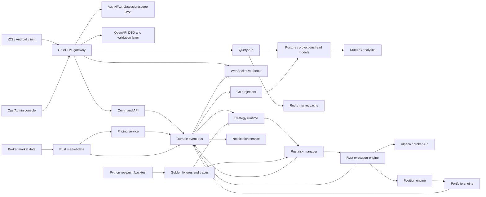

# Trading Observability API Production Grade Plan

Last updated: 2026-07-07

## 1. Executive Decision

The current Go service can support early mobile UI work for system health, metrics,
trade history, incidents, and broker visibility. It is not yet a production-grade
mobile trading backend.

Production direction:

1. Build a clean `/api/v1` Trading Observability and Control API.
2. Treat the existing `/api/metrics`, `/api/trades`, `/api/system`,
   `/api/alpaca`, and `/ws/metrics` surfaces as legacy/internal until replaced.
3. Start mobile integration as read-only: market data, portfolio, positions,
   orders, fills, system status, incidents, and risk state.
4. Keep live trading actions disabled for mobile until auth, authorization,
   order preview, idempotency, audit, risk gates, kill switch, and paper-trading
   soak are complete.
5. Use Go as the API gateway and contract owner, Rust as the low-latency trading
   core, and Python as research/backtest/strategy validation support.

Readiness label: Prototype to early integration. Good enough for mobile UI and
typed client scaffolding. Not good enough for direct production/live trading.

## 2. External Benchmark Summary

The production API should borrow proven patterns from major trading platforms:

| Source | Pattern to adopt |
|---|---|
| [Coinbase Advanced Trade REST](https://docs.cdp.coinbase.com/coinbase-app/advanced-trade-apis/rest-api) | Separate public market data, private accounts, portfolios, orders, fills, order preview, and transaction summary endpoints. |
| [Coinbase Advanced Trade WebSocket](https://docs.cdp.coinbase.com/coinbase-app/advanced-trade-apis/websocket/websocket-overview) | WebSocket channels for market data and user order data; typed messages; subscribe/unsubscribe; sequence numbers. |
| [Binance Spot REST](https://developers.binance.com/docs/binance-spot-api-docs/rest-api) | Explicit API key security types, signed endpoints, timestamp rules, rate-limit responses, and ban semantics. |
| [Binance Market Data](https://developers.binance.com/docs/binance-spot-api-docs/rest-api/market-data-endpoints) | Order book, recent trades, historical trades, klines/candles, tickers, and average price as first-class read endpoints. |
| [Binance WebSocket Streams](https://developers.binance.com/docs/binance-spot-api-docs/web-socket-streams) | Stream topics with event type, event time, symbol, trade id, price, and quantity. |
| [Binance User Data Stream](https://developers.binance.com/legacy-docs/binance-spot-api-docs/user-data-stream) | Account and order events pushed in real time over authenticated streams. |
| [Kraken REST Add Order](https://docs.kraken.com/api-reference/trading/add-order) | Enforce pair metadata, price precision, quantity precision, minimum order size, and trading permissions. |
| [Kraken WebSocket Add Order](https://docs.kraken.com/exchange/api-reference/spot-websocket-v2/add_order) | Rich order types, conditional close, trailing stop, and request/response order workflow over WebSocket. |
| [IBKR Client Portal Web API](https://www.interactivebrokers.com/campus/ibkr-api-page/cpapi-v1/) | Portfolio updates, market data, trading over HTTP and WebSocket, explicit auth/session model, and 2FA constraints. |
| [Alpaca Portfolio History](https://docs.alpaca.markets/us/reference/getaccountportfoliohistory-1) | Account equity and P/L time series with period/timeframe controls. |
| [Alpaca Orders](https://docs.alpaca.markets/us/reference/postorder) | Client order id, multiple order types/classes, time-in-force validation, and paper/live separation. |
| [Alpaca Watchlists](https://docs.alpaca.markets/us/reference/postwatchlist-1) | Account-scoped watchlist resources for mobile workflows. |
| [OWASP API Security Top 10 2023](https://owasp.org/API-Security/editions/2023/en/0x11-t10/) | BOLA, broken auth, object property auth, resource exhaustion, and function-level auth must be designed into the API. |
| [OpenAPI 3.1](https://spec.openapis.org/oas/v3.1.0.html) | Use a language-agnostic contract that removes guesswork for clients and tests. |
| [IETF Idempotency-Key draft](https://datatracker.ietf.org/doc/html/draft-ietf-httpapi-idempotency-key-header-04) | Require idempotency keys for unsafe order actions; return the previous result for duplicate requests. |
| [Google SRE SLO Alerting](https://sre.google/workbook/alerting-on-slos/) | Define SLOs and alert on burn rate before user-impacting reliability budget is consumed. |

## 3. Current Repository Assessment

### 3.1 Go - API and Observability Gateway

Current useful surface:

- `go/internal/server/routes.go` exposes `/health`, `/health/ready`,
  `/health/live`, `/ws/metrics`, `/docs`, and authenticated `/api/*` routes.
- `/api/system` exposes incidents, health, performance, components, logs,
  stats, and integrity validation.
- `/api/metrics` exposes current metrics, history, symbols, and summary.
- `/api/trades` exposes trade list, trade detail, stats summary, and execution
  quality.
- `/api/alpaca` exposes broker account, positions, orders, bars, order creation,
  order cancellation, and close positions.
- Middleware already has correlation id, CORS, API key auth, logging, and rate
  limiting building blocks.
- Tests currently pass for the Go service in the observed environment.

Current blockers:

- `/api/*` uses shared `X-API-Key`, which is not suitable for a mobile user
  client.
- API schemas are not frozen for mobile generation and include dynamic response
  shapes.
- Error responses are not standardized around `code`, `message`,
  `correlation_id`, and `retryable`.
- Trading actions are exposed before user-scoped authorization, preview,
  idempotency, audit, kill switch, and paper/live mode gates are complete.
- WebSocket messages are not yet a stable mobile contract: missing consistent
  envelope, schema version, sequence, topic, reconnect, and resume semantics.
- Runtime data may be sparse or empty when Postgres, exporters, or broker
  clients are not available.

Go target role:

- Own public HTTP and WebSocket contracts.
- Own auth, authorization, request validation, API versioning, OpenAPI, mobile
  DTOs, idempotency entrypoint, and audit entrypoint.
- Adapt Rust and broker outputs into stable client-facing resources.
- Keep internal/legacy observability endpoints private or behind admin auth.

### 3.2 Rust - Trading Core

Current useful surface:

- `rust/common` defines shared trading types, order status, order type, risk
  decisions, messaging, metrics, errors, config, and health HTTP helpers.
- `rust/market-data` has order book structures, snapshots, aggregation, ZMQ
  publisher integration, metrics server wiring, and an Alpaca market data loop
  that processes trades, quotes, bars, order book updates, bar aggregation, and
  canonical market events.
- `rust/risk-manager` has limit checks, PnL tracking, stop-loss management,
  circuit breaker states, hot-reloadable risk config, and metrics server wiring.
- `rust/execution-engine` has a trading mode model for `SIMULATED`, `PAPER`,
  and `LIVE`, broker adapters, an order router, Alpaca order request/response
  conversion, slippage estimation, retry/rate-limit handling, circuit breaker
  checks, runtime kill-switch checks, live external-precondition checks, event
  emission, reconciliation scaffolding, and an in-process idempotency lock.
- `rust/database` has DuckDB persistence for metrics, trades, system events,
  query helpers, schemas, and observability integration examples.
- `rust/signal-bridge` has feature computation, indicators, backtest runtime,
  Python bridge support, and risk-decision traces.

Current blockers:

- The market-data event loop and stop-loss router integration have been
  implemented, so they are no longer the primary Rust blockers. They still need
  broker-backed paper soak, restart drills, and production telemetry evidence.
- Stop-loss orders route through the execution pipeline, but live stop-loss
  execution still needs external proof/preview wiring so live-mode guards do not
  reject internally generated protective orders.
- Idempotency in Rust is in-process and not yet durable across restarts or
  multiple service instances. Go/Postgres must remain the durable idempotency
  and audit source of truth before production live trading.
- Order lifecycle events need a stricter production contract. In particular,
  duplicate-order handling must not emit a misleading accepted lifecycle before
  idempotency is confirmed.
- Rust event envelopes now include schema/version metadata, event id, source,
  sequence, correlation id, trading mode, and payload. The remaining gap is a
  frozen cross-language contract with conformance tests so Go DTOs, Rust domain
  structs, broker structs, and Python fixtures cannot drift.
- There is no complete production evidence for live market ingest to risk to
  execution to audit to client WebSocket.

Rust target role:

- Own low-latency market data normalization, order book state, risk evaluation,
  order routing, execution state, fills, and trading-domain events.
- Publish canonical trading events to Go through a durable/evented boundary.
- Provide service health and metrics consumed by Go and ops.
- Stay off the mobile-facing contract unless mediated by Go.

### 3.3 Python - Research, Backtest, and Validation

Current useful surface:

- `python/src/api` exports Alpaca client integration.
- `python/src/data` provides data loading, feature engineering, and technical
  indicators.
- `python/src/strategies` defines strategy, signal, and signal type concepts.
- `python/src/backtesting` includes backtest engine, historical data handler,
  portfolio handler, performance analyzer, position sizing, risk integrity
  comparison, and legacy-compatible simulated execution shims for tests.
- `python/src/bridge` exposes Rust feature/backtest bridge and ZMQ messaging
  support.
- `python/download_historical_data.py` and `python/scripts/download_historical_data.py`
  provide a testable historical-data downloader module and CLI wrapper.
- Python tests include e2e, strategy, unit, integration, benchmark, and
  validation coverage around backtesting, signals, portfolio behavior, and
  paper-trading style flows.
- Python now has deterministic signal, risk decision, and backtest output
  fixtures plus parity tests around `compare_risk_decision_traces`.

Current blockers:

- Python observability is support/evidence code, not a production request-path
  API. Keep it out of mobile/API serving.
- Python fixtures and parity tests exist, but they are local deterministic
  evidence. They are not yet a generated or enforced cross-language contract
  across Go, Rust, broker payloads, and Python models.
- Strategy/backtest evidence is not the same as live trading safety evidence.
- Full pytest is now a usable production gate in this environment, but many
  tests still skip when `signal_bridge`, Go services, historical data, or Alpaca
  credentials are unavailable. Keep focused critical-path gates alongside full
  pytest.

Python target role:

- Own strategy research, backtest parity, risk decision trace validation,
  offline simulation, fixture generation, and regression baselines.
- Generate or verify deterministic datasets used by Go/Rust integration tests.
- Stay out of the synchronous mobile request path.

### 3.4 Strategy Lab and Paper Research Impact

Strategy Lab and Paper Research require changes in both Rust and Python, but
not in the same way.

Rust impact:

- Rust should not accept arbitrary mobile formulas or become the public strategy
  editor. Go owns the API, strategy version state, permissions, and promotion
  workflow.
- Rust must carry `strategy_id`, `strategy_version_id`, `paper_session_id`, and
  `promotion_state` through risk reports, order preview, order routing, fills,
  and canonical events so Go can audit every decision.
- Rust should execute only approved immutable strategy versions or validated
  signal streams. Draft strategies and unvalidated formulas must be rejected
  before order routing.
- Paper-mode execution should support strategy-scoped sessions so order, fill,
  slippage, risk, and reconciliation events can be attributed to the tested
  method.
- Expected Rust effort is Medium if Rust consumes approved signals/versions from
  Go/Python, and High if Rust must evaluate user formulas directly in the live
  runtime.

Python impact:

- Python needs the larger change because it owns research, backtest, evaluation,
  and fixture evidence.
- Python should evaluate the constrained strategy DSL/expression schema,
  validate formulas and weights, run deterministic backtests, compare strategy
  versions, and generate stability reports.
- Python must clearly label evidence as backtest, paper, or live-derived. A good
  backtest or profitable paper run is not enough to approve live trading.
- Python should produce golden fixtures for signals, risk decisions, backtest
  outputs, and paper-session traces so Go/Rust contract tests can detect drift.
- Expected Python effort is Medium to High because current backtesting exists,
  but generic user-defined formula validation, strategy version comparison, and
  stability scoring still need product-grade contracts.

Go impact:

- Go remains the source of truth for strategy drafts, immutable versions,
  promotion requests, live approvals, audit records, idempotency, and mobile
  APIs.
- Go may call Python asynchronously for backtests and reports, but never in the
  synchronous mobile request path.

### 3.5 Current Validation Snapshot

Observed on 2026-07-07:

| Domain | Command | Result |
|---|---|---|
| Go | `cd go && go test ./...` | Pass. |
| Rust | `cd rust && cargo test --workspace` | Pass in the latest Rust hardening run. |
| Rust | `cd rust && cargo fmt --all --check` | Pass in the latest Rust hardening run. |
| Rust | `cd rust && cargo clippy --workspace -- -D warnings` | Pass in the latest Rust hardening run. |
| Python | `cd python && python -m pytest tests -q` | Pass: 478 passed, 153 skipped, 1 warning in the latest Python gate run. |
| Python | `cd python && black --check src tests download_historical_data.py scripts/download_historical_data.py` | Pass. |
| Python | `cd python && ruff check src tests download_historical_data.py scripts/download_historical_data.py` | Pass. |

Interpretation:

- Go, Rust, and Python all have local green gates for their current roles.
- Rust is now a production-candidate trading core foundation, not production
  live trading. Durable idempotency, broker-backed paper soak, reconciliation
  drills, event-contract conformance, and live E2E evidence remain required.
- Python is now production-gate trustworthy for research/backtest/parity
  support, not production request serving. Skips tied to unavailable local
  services or extensions must not be mistaken for live trading evidence.

## 4. Target Architecture



Primary rules:

- Go is the only public/mobile API surface.
- Go command endpoints append commands/events through the durable event bus;
  query endpoints read from projections and caches.
- Rust is the trading runtime and event producer. Direct synchronous calls are
  allowed only for narrow health or explicitly designed preview paths; trading
  state must not depend on hidden point-to-point side effects.
- Python is validation/research, not production request serving.
- Broker credentials never reach mobile.
- Live order placement is disabled until all production gates pass.
- Every client-visible object has a stable DTO and schema version.
- Orders, positions, portfolio valuation, and risk state are reconstructed from
  immutable events plus projections. Mutable rows are read models, not the only
  source of truth.
- Redis market cache is derived and disposable. Postgres event/audit records are
  authoritative for business state.

#### 4.1 Event, CQRS, and Runtime Engine Requirements

To reach production grade at Robinhood/Coinbase-like scale, the architecture must treat trading state as evented domain state, not only CRUD rows.

#### 4.1.1 CQRS & Event Sourcing (Order Lifecycle)

- **Command API (Write Path)**:
  - Processes client requests (`SubmitOrder`, `CancelOrder`, `ReplaceOrder`, `TriggerKillSwitch`).
  - Validates request payload against OpenAPI contract and pre-trade risk policy.
  - Appends command/events to the Event Store and returns immediately with a tracking ID (HTTP `202 Accepted`).
  - Never performs blocking broker database writes or synchronous external HTTP calls in the request path.
- **Query API (Read Path)**:
  - Serves from highly optimized read models/projections stored in Postgres and Redis.
  - Exposes trade logs, order state, account balances, positions, and analytics.
- **Order Aggregate Event Lifecycle**:
  Every order state transition is logged as an immutable event in the Event Store:
  ```json
  // Example: OrderCreated
  {
    "event_id": "evt_01j789abcde",
    "event_type": "OrderCreated",
    "timestamp": "2026-07-07T17:55:00.000Z",
    "aggregate_id": "ord_01j78912345",
    "version": 1,
    "payload": {
      "client_order_id": "cl_ord_abc123",
      "symbol": "AAPL",
      "side": "BUY",
      "order_type": "LIMIT",
      "limit_price": 185.50,
      "quantity": 100,
      "time_in_force": "GTC",
      "account_id": "acc_998877"
    }
  }
  ```
  - Subsequent events: `RiskAccepted`, `BrokerSubmitted`, `BrokerAccepted`, `PartiallyFilled`, `Filled`, `CancelRequested`, `Canceled`, `Rejected`.
- **Projector and Offset Tracking**:
  - Projections are updated asynchronously by subscribing to event topics.
  - Each projector maintains a state offset table (`projection_offsets`):
    ```sql
    CREATE TABLE projection_offsets (
        projection_name VARCHAR(100) PRIMARY KEY,
        last_processed_offset BIGINT NOT NULL,
        last_updated TIMESTAMP WITH TIME ZONE DEFAULT CURRENT_TIMESTAMP,
        is_replaying BOOLEAN DEFAULT FALSE,
        schema_version VARCHAR(20) NOT NULL
    );
    ```
  - Supports zero-downtime projection rebuilds: spawn a new read model table, replay events from offset 0, catch up, then swap tables.

#### 4.1.2 Durable Event Bus Specification

- **Broker Selection**: Apache Kafka or NATS JetStream is used as the backbone. Redis Pub/Sub is restricted to volatile frontend fanouts (BFF metrics/ticks).
- **Partitioning & Ordering**:
  - Messages are partitioned by `account_id` or `symbol` to guarantee strict in-order processing of events for a single account/symbol.
- **Idempotency & Deduplication**:
  - Consumers enforce idempotency via the `Idempotency-Key` (from BFF) or `client_order_id`.
  - Dedup records are cached in Redis with a 24-hour TTL:
    ```
    Key: deduplication:{client_order_id}:{event_id}
    Value: processed
    ```
- **Schema Evolution & Compatibility**:
  - Enforced using a Schema Registry (Confluent/NATS Schema Registry).
  - All schemas must declare compatibility rules (default: `BACKWARD_TRANSITIVE`) to prevent serialization crashes during rolling deployments of Go/Rust components.

#### 4.1.3 Resilient WebSocket protocol (BFF to Client)

WebSocket connections are authenticated via JWT in the handshake and support connection lifecycle tokens:
- **SessionId / ConnectionId**: Every connection gets a unique `ConnectionId` and belongs to a `SessionId`.
- **ResumeToken**:
  - If disconnected, clients reconnect with a `ResumeToken`:
    ```json
    {
      "action": "resume",
      "session_id": "sess_01j789xyz",
      "resume_token": "res_tok_998877665544",
      "last_received_sequence": 14205
    }
    ```
- **Replay Window**:
  - The server maintains a Redis stream buffer per session of the last 10 minutes of messages.
  - If `last_received_sequence` is within the buffer window, the server replays missed messages. If the sequence is lost (buffer miss), the server forces a full state synchronization message (`state_sync`).

#### 4.1.4 Position Engine & Portfolio Engine Specs

- **Position Engine**:
  - State is derived purely from transaction/fill events.
  - Tracks specific lots using FIFO (First-In-First-Out) or weighted average cost.
  - Real-time realized/unrealized PnL is computed per position:
    $$\text{Unrealized P/L} = (\text{Mark Price} - \text{Average Cost}) \times \text{Quantity}$$
  - **Reconciliation Engine**:
    - Daily cron retrieves broker end-of-day positions.
    - Resolves gaps between internal Position Engine state and external broker state; marks mismatches in a `reconciliation_breaks` table.
- **Portfolio Engine**:
  - Tracks account equity, buying power, total margin collateral, risk exposure, and drawdowns.
  - Aggregates position values using real-time tick/pricing updates:
    $$\text{Total Equity} = \text{Cash} + \sum (\text{Position Qty} \times \text{Mark Price})$$
  - Real-time Greeks calculation (Delta, Gamma, Vega, Theta) for option portfolios.

#### 4.1.5 Pricing Service & Market Cache

- **Pricing Service**:
  - Consumes raw L1/L2 book data from multiple feeds (Alpaca, SIP, IEX).
  - Normalizes fields, handles stale ticks (e.g. invalidates after 5 seconds of inactivity), and outputs a consolidated **Mark Price** using volume-weighted mid-prices.
- **Market Cache (Redis)**:
  - High-performance, low-latency key-value store for live quotes and book state:
    ```
    Key: market:quote:{symbol}
    Hash: { "bid": "185.20", "ask": "185.35", "volume": "1200", "timestamp": "1719875402" }
    ```

#### 4.1.6 Strategy Runtime Checkpointing

- **Runtime Isolation**: Active strategy execution runs in a distinct sandbox (`StrategyRuntime`) isolated from core execution queues to prevent strategy crashes from blocking order execution.
- **Checkpoints**:
  - Every 10 seconds (or after state change), the runtime takes a snapshot of the strategy state:
    ```json
    {
      "strategy_id": "strat_rsi_momentum",
      "version": "v1.2.0",
      "indicators_state": { "rsi_14": 42.50, "ema_50": 182.10 },
      "open_positions": ["AAPL"],
      "trailing_stop_levels": { "AAPL": 178.50 },
      "sequence_no": 99823
    }
    ```
  - Saved to a durable Postgres/S3 checkpoint store. Upon crash or restart, the engine restores from the latest checkpoint and replays subsequent market/execution events from the Event Bus.

#### 4.1.7 Support Services (Notification, Feature Flag, Config)

- **Notification Service**:
  - De-coupled service consuming risk alerts, order fills, and system exceptions from the Event Bus.
  - Routes message to channel templates (APNS/FCM for push, SendGrid for email, Twilio for SMS).
- **Feature Flag Service**:
  - Handles dynamic runtime rule evaluations without deployment:
    ```json
    {
      "flag": "live_trading_enabled",
      "rules": [
        { "conditions": [{"attribute": "user_group", "op": "in", "values": ["beta-testers", "ops"]}], "value": true },
        { "value": false }
      ]
    }
    ```
- **Configuration Service**:
  - GitOps-driven store for environment configurations, broker rate-limits, risk policies, and market calendars.
  - Generates immutable versioned configs (e.g., `config_v42`) loaded by Go and Rust systems with atomic hot-reload triggers.

## 5. Legacy API Removal Policy

Because this capability is still early, the project should prefer a clean API
over preserving unstable legacy routes.

| Current route | Production action |
|---|---|
| `/ws/metrics` | Replace with `/ws/v1`; keep internal until mobile migrates. |
| `/api/metrics/*` | Replace with `/api/v1/observability/*` and `/api/v1/market/*` depending on data type. |
| `/api/trades/*` | Replace with `/api/v1/fills`, `/api/v1/orders`, and `/api/v1/executions` with clear semantics. |
| `/api/system/*` | Split into `/api/v1/system/*` read-only mobile-safe endpoints and `/api/v1/admin/*` privileged endpoints. |
| `/api/alpaca/*` | Do not expose broker-shaped APIs publicly. Replace with normalized `/api/v1/account`, `/api/v1/portfolio`, `/api/v1/positions`, `/api/v1/orders`, `/api/v1/broker/status`. |
| `X-API-Key` mobile access | Retire for mobile. Keep only for internal service calls or admin automation with narrow scopes. |

Legacy retirement gates:

1. OpenAPI `/api/v1` published and reviewed.
2. Mobile typed client generated from `/api/v1`.
3. Read-only `/api/v1` parity exists for all mobile screens.
4. Legacy route telemetry shows no mobile usage.
5. Deprecated routes return `410 Gone` or are moved behind internal auth.

## 6. Production API Blueprint

### 6.1 Contract Rules

- Prefix: `/api/v1`.
- Spec: OpenAPI 3.1.
- All responses use typed DTOs. No public `map[string]interface{}` style
  responses.
- All errors use one envelope:

```json
{
  "error": {
    "code": "ORDER_REJECTED_RISK_LIMIT",
    "message": "Order exceeds max notional limit",
    "correlation_id": "cid_...",
    "retryable": false,
    "details": {}
  }
}
```

- Every response includes or echoes `X-Correlation-ID`.
- Every resource has stable ids, timestamps, and explicit status enums.
- Unsafe endpoints require `Idempotency-Key`.
- Unsafe endpoints include audit events.
- Read endpoints include pagination, cursor, filters, and documented sort order.

### 6.2 API Coverage Assessment

This blueprint expands the API from the original 40 REST endpoints to 111 REST
endpoints for Trading Observability, Strategy Lab, and Paper Research. The goal
is not to force one trading formula onto every client. Mobile users must be able
to tune weights, test formulas, compare methods, discard unstable approaches,
and promote only proven strategies from research to paper and then to live
trading.

It is not a complete retail brokerage app surface yet. Do not add funding,
deposits, withdrawals, tax documents, KYC, statements, referrals, social
features, options/multi-leg trading, or copy-trading/social features until the
observability, paper-research, and promotion gates are stable. Those can become
later modules after the core trading runtime, durable audit, and mobile contract
are proven.

Endpoint count by group:

| Group | REST count | Readiness meaning |
|---|---:|---|
| Market data | 7 | Enough for quotes, charts, order book, trades, and market status. |
| Account, portfolio, positions, pricing, watchlists | 15 | Enough for mobile dashboard, pricing, valuation, allocation, and watchlist UX. |
| Orders, fills, trades | 5 | Enough for read-only order/fill/trade history. |
| Trading actions | 4 | Enough for preview, submit, cancel, and replace after safety gates. |
| Risk, safety, admin | 9 | Adds exposure and circuit breaker visibility. |
| System observability | 7 | Enough for health, incidents, and metrics dashboards. |
| Auth, sessions, devices | 5 | Required for mobile production auth and device control. |
| Account snapshots and cash | 3 | Gives mobile auditable account/cash history. |
| Order reconciliation, audit, broker diagnostics | 9 | Required for production support and order-drift investigation. |
| Alerts | 4 | Lets users and ops configure trading/observability alerts. |
| Notifications, feature flags, runtime config | 10 | Adds delivery, rollout, and mutable config control-plane surfaces. |
| Strategy Lab | 10 | Lets users create, tune, validate, version, and fork custom methods. |
| Backtests and evaluation | 6 | Lets users compare formulas before paper trading. |
| Paper research sessions | 9 | Lets users test strategies in a realistic paper environment. |
| Promotion and activation governance | 8 | Controls movement from draft to paper/live and records which method is active. |

### 6.3 Read-Only Market Data

| Method | Endpoint | Purpose | Client meaning |
|---|---|---|---|
| `GET` | `/api/v1/market/products` | Tradable products and metadata. | Lets mobile render searchable symbols and decide which assets are supported before any order flow. |
| `GET` | `/api/v1/market/products/{symbol}` | Tick size, lot size, min notional, asset class, tradability. | Gives the client validation rules for price/quantity inputs and disabled trading states. |
| `GET` | `/api/v1/market/ticker?symbols=AAPL,MSFT` | Current best quote/last trade summary. | Powers watchlists, portfolio marks, and compact quote rows without loading full charts. |
| `GET` | `/api/v1/market/order-book/{symbol}` | Current normalized order book snapshot. | Shows bid/ask depth and liquidity for an instrument in a consistent broker-independent shape. |
| `GET` | `/api/v1/market/trades/{symbol}` | Recent market trades. | Shows recent prints/time-and-sales for inspection and market context. |
| `GET` | `/api/v1/market/candles/{symbol}` | OHLCV candles with timeframe and pagination. | Powers price charts, historical views, and technical overlays. |
| `GET` | `/api/v1/market/status` | Market clock, session status, data freshness, provider status. | Tells the UI whether the market is open, data is stale, or a provider is degraded. |

Required DTOs:

- `Product`
- `Ticker`
- `OrderBookSnapshot`
- `MarketTrade`
- `Candle`
- `MarketStatus`

### 6.4 Account, Portfolio, Positions

| Method | Endpoint | Purpose | Client meaning |
|---|---|---|---|
| `GET` | `/api/v1/account/status` | Account state, trading mode, restrictions, permissions. | Decides whether the app should show read-only, paper, or live-capable controls. |
| `GET` | `/api/v1/portfolio/summary` | Equity, cash, buying power, daily P/L, exposure. | Powers the portfolio dashboard header and account risk summary. |
| `GET` | `/api/v1/portfolio/history` | Equity and P/L time series. | Powers account performance charts over daily, weekly, monthly, and custom ranges. |
| `GET` | `/api/v1/positions` | Current open positions. | Lists current holdings with quantity, average price, market value, and P/L. |
| `GET` | `/api/v1/positions/{symbol}` | Single position detail. | Opens a focused holding screen with lots, exposure, and available actions. |
| `GET` | `/api/v1/positions/events` | Position event timeline derived from fills and broker corrections. | Lets support and advanced users understand why a position changed. |
| `GET` | `/api/v1/portfolio/valuation` | Current portfolio valuation from position, cash, and pricing engines. | Shows equity, exposure, and stale-price warnings from a single projection. |
| `GET` | `/api/v1/portfolio/allocations` | Allocation by asset, symbol, sector, strategy, and account. | Powers risk-aware portfolio views and strategy-level concentration checks. |
| `GET` | `/api/v1/pricing/marks?symbols=AAPL,MSFT` | Normalized mark prices and freshness. | Gives mobile and order previews consistent pricing rather than raw provider quotes. |
| `GET` | `/api/v1/pricing/fx-rates` | FX rates used for valuation. | Supports multi-currency portfolio valuation and auditability. |
| `GET` | `/api/v1/watchlists` | Account watchlists. | Loads user watchlists and symbols for the market/home screens. |
| `POST` | `/api/v1/watchlists` | Create watchlist. | Lets users create a custom tracked-symbol group. |
| `PATCH` | `/api/v1/watchlists/{id}` | Rename or update watchlist metadata. | Lets users rename, reorder, or adjust watchlist settings. |
| `POST` | `/api/v1/watchlists/{id}/symbols` | Add symbols. | Adds an instrument to a user watchlist after symbol validation. |
| `DELETE` | `/api/v1/watchlists/{id}/symbols/{symbol}` | Remove symbol. | Removes a tracked instrument without affecting positions or orders. |

Required DTOs:

- `AccountStatus`
- `PortfolioSummary`
- `PortfolioPoint`
- `Position`
- `Watchlist`

### 6.5 Orders, Fills, and Trades

Read-only first:

| Method | Endpoint | Purpose | Client meaning |
|---|---|---|---|
| `GET` | `/api/v1/orders` | List orders with status, symbol, side, date filters. | Powers order history, open orders, and status filter screens. |
| `GET` | `/api/v1/orders/{order_id}` | Order detail and lifecycle. | Shows why an order is pending, filled, canceled, rejected, or failed. |
| `GET` | `/api/v1/fills` | List fills/executions. | Shows execution records produced by orders, including partial fills. |
| `GET` | `/api/v1/fills/{fill_id}` | Fill detail. | Opens a single execution with price, quantity, fees, venue/provider refs, and correlation id. |
| `GET` | `/api/v1/trades` | Business trade history derived from orders/fills. | Shows user-friendly trade history after normalizing raw order/fill events. |

Trading actions later:

| Method | Endpoint | Purpose | Client meaning |
|---|---|---|---|
| `POST` | `/api/v1/orders/preview` | Validate estimated order before submission. | Runs product, account, risk, buying-power, and estimated-cost checks before the user confirms. |
| `POST` | `/api/v1/orders` | Submit order. Requires `Idempotency-Key`. | Creates a paper or live order only after preview, auth, risk, idempotency, and audit gates pass. |
| `POST` | `/api/v1/orders/{order_id}/cancel` | Cancel order. Requires `Idempotency-Key`. | Requests cancellation and records the full broker/order lifecycle. |
| `POST` | `/api/v1/orders/{order_id}/replace` | Replace order. Requires `Idempotency-Key`. | Replaces editable order fields through a controlled cancel/replace workflow. |

Required order state machine:

```text
received -> previewed -> accepted -> routed -> broker_acknowledged
         -> partially_filled -> filled
         -> cancel_requested -> canceled
         -> rejected
         -> expired
         -> failed
```

Every transition records:

- `from_status`
- `to_status`
- `timestamp`
- `source` such as `go_api`, `rust_execution`, `broker`, `risk`
- `correlation_id`
- `reason_code`
- `raw_provider_ref` stored internally only

### 6.6 Risk, Safety, and Admin

| Method | Endpoint | Purpose | Client meaning |
|---|---|---|---|
| `GET` | `/api/v1/risk/status` | Read-only current risk state. | Shows whether trading is normal, restricted, halted, or degraded. |
| `GET` | `/api/v1/risk/limits` | Current effective limits. | Shows max notional, exposure, drawdown, rate, or mode limits applied to the user/account. |
| `GET` | `/api/v1/risk/decisions` | Risk decision audit trail. | Lets support/admin inspect why previews or orders were allowed or rejected. |
| `GET` | `/api/v1/risk/exposure` | Current exposure by symbol, sector, strategy, and account. | Shows whether a method is concentrating risk before a trade is placed. |
| `GET` | `/api/v1/risk/circuit-breakers` | Active and historical circuit breaker state. | Explains why trading may be paused or throttled even when the account is otherwise healthy. |
| `POST` | `/api/v1/admin/risk/limits` | Admin-only risk limit update. | Changes effective risk limits with audit, versioning, and rollback history. |
| `POST` | `/api/v1/admin/risk/kill-switch` | Admin-only global halt. | Immediately halts unsafe trading actions across configured scope. |
| `DELETE` | `/api/v1/admin/risk/kill-switch` | Admin-only resume. | Resumes trading after incident review and audit approval. |
| `POST` | `/api/v1/admin/trading/read-only-mode` | Admin-only force read-only mode. | Forces clients into portfolio/market viewing mode without order actions. |

Mobile should see risk status, not mutate it.

### 6.7 System Observability

| Method | Endpoint | Purpose | Client meaning |
|---|---|---|---|
| `GET` | `/api/v1/system/health` | Aggregated health. | Gives mobile and ops a single safe status for Go, Rust, broker, storage, and event freshness. |
| `GET` | `/api/v1/system/components` | Component states and freshness. | Shows which subsystem is degraded: API, Rust market data, risk, execution, broker, Postgres, Redis, or DuckDB. |
| `GET` | `/api/v1/system/incidents` | Incidents visible to the signed-in user/admin. | Powers banners, status pages, and ops incident lists. |
| `POST` | `/api/v1/system/incidents/{id}/acknowledge` | Admin/ops only. | Records that an operator has seen and taken ownership of an incident. |
| `POST` | `/api/v1/system/incidents/{id}/resolve` | Admin/ops only. | Closes an incident with audit trail and recovery metadata. |
| `GET` | `/api/v1/observability/metrics/current` | Curated API/system/trading metrics. | Powers live dashboards for latency, freshness, error rates, order state, and risk state. |
| `GET` | `/api/v1/observability/metrics/history` | Historical metrics with typed query parameters. | Powers trend charts, incident investigation, and release/regression comparisons. |

### 6.8 Auth, Sessions, and Devices

| Method | Endpoint | Purpose | Client meaning |
|---|---|---|---|
| `POST` | `/api/v1/auth/firebase` | Start a user session from a Firebase OAuth ID token verified by Go through Firebase Admin SDK credentials. | Replaces shared API keys with user-scoped auth. |
| `POST` | `/api/v1/auth/refresh` | Rotate access token using a refresh token. | Keeps mobile sessions alive without long-lived access tokens. |
| `POST` | `/api/v1/auth/logout` | End the current session and revoke refresh token state. | Lets users and security tooling terminate a mobile session. |
| `GET` | `/api/v1/devices` | List devices linked to the user. | Lets users review trusted phones/tablets and security posture. |
| `DELETE` | `/api/v1/devices/{id}` | Revoke a device and its sessions. | Lets users remove a lost or untrusted device. |

### 6.9 Account Snapshots and Cash

| Method | Endpoint | Purpose | Client meaning |
|---|---|---|---|
| `GET` | `/api/v1/account/snapshots` | Historical account state snapshots. | Lets mobile explain balance, restriction, or permission changes over time. |
| `GET` | `/api/v1/cash/balances` | Current cash, buying power, unsettled cash, and reserved cash. | Gives order tickets and portfolio screens precise cash availability. |
| `GET` | `/api/v1/cash/movements` | Cash ledger derived from fills, fees, transfers, and adjustments. | Helps users reconcile why available cash changed. |

### 6.10 Order Reconciliation, Audit, and Broker Diagnostics

| Method | Endpoint | Purpose | Client meaning |
|---|---|---|---|
| `GET` | `/api/v1/orders/{order_id}/transitions` | Full normalized order state transition list. | Shows exact status history without exposing broker-specific raw payloads. |
| `GET` | `/api/v1/orders/{order_id}/events` | Internal event timeline for an order. | Helps support trace Go, Rust, broker, and storage events for a single order. |
| `GET` | `/api/v1/orders/{order_id}/reconciliation` | Latest order reconciliation result. | Explains whether local state matches broker state. |
| `POST` | `/api/v1/admin/orders/{order_id}/reconcile` | Admin-only manual reconciliation trigger. | Lets ops repair or verify drift after broker/API incidents. |
| `GET` | `/api/v1/audit/events` | Searchable audit event stream. | Lets support/compliance inspect sensitive reads and writes. |
| `GET` | `/api/v1/audit/events/{id}` | Single audit event detail. | Shows who did what, when, from which device/session, and with which correlation id. |
| `GET` | `/api/v1/broker/status` | Normalized broker connectivity and account-mode status. | Lets mobile and ops distinguish app issues from broker/provider issues. |
| `GET` | `/api/v1/broker/events` | Normalized provider event stream. | Supports broker incident investigation without exposing `/api/alpaca` directly. |
| `GET` | `/api/v1/broker/reconciliation` | Broker reconciliation summary across orders, fills, positions, and cash. | Shows whether the local source of truth is aligned with broker state. |

### 6.11 Alerts

| Method | Endpoint | Purpose | Client meaning |
|---|---|---|---|
| `GET` | `/api/v1/alerts` | List user and system alert rules. | Lets users manage price, portfolio, risk, and system alerts. |
| `POST` | `/api/v1/alerts` | Create an alert rule. | Lets users define price, P/L, exposure, order, or incident notifications. |
| `PATCH` | `/api/v1/alerts/{id}` | Update alert rule settings or enabled state. | Lets users tune thresholds without recreating alerts. |
| `DELETE` | `/api/v1/alerts/{id}` | Delete or archive an alert rule. | Removes unwanted alert noise. |

### 6.12 Notifications, Feature Flags, and Runtime Config

Alerts are rules; notifications are delivery and user-facing message state.
Feature flags and runtime config are admin/control-plane surfaces, not normal
retail trading controls.

| Method | Endpoint | Purpose | Client meaning |
|---|---|---|---|
| `GET` | `/api/v1/notifications` | List in-app notifications for the current user. | Shows order, fill, incident, alert, strategy, and account messages. |
| `PATCH` | `/api/v1/notifications/{notification_id}/read` | Mark notification as read. | Keeps mobile notification badges and history consistent. |
| `GET` | `/api/v1/notification-preferences` | Read user delivery preferences. | Lets users control push/email/SMS/in-app delivery by event class. |
| `PATCH` | `/api/v1/notification-preferences` | Update notification preferences. | Lets users reduce noise without disabling safety-critical messages. |
| `GET` | `/api/v1/admin/feature-flags` | Admin-only list of feature flags and rollout state. | Shows whether paper, live, Strategy Lab, broker profiles, or order types are enabled. |
| `POST` | `/api/v1/admin/feature-flags` | Admin-only create feature flag. | Adds a controlled rollout switch with owner, scope, default, and audit. |
| `PATCH` | `/api/v1/admin/feature-flags/{flag_id}` | Admin-only update feature flag rules. | Rolls capability out by user, account, region, broker, device, or percentage. |
| `GET` | `/api/v1/admin/config` | Admin-only effective runtime config. | Shows active risk, broker, trading-hour, strategy DSL, and notification config. |
| `POST` | `/api/v1/admin/config/versions` | Admin-only create versioned config. | Stages config changes without immediately affecting trading runtime. |
| `POST` | `/api/v1/admin/config/versions/{version_id}/activate` | Admin-only activate config version. | Applies config with audit, rollback reference, and cache invalidation. |

### 6.13 Strategy Lab - Custom Formulas and Weights

Mobile must not be limited to one universal trading method. Each trader can
create strategy drafts with custom indicator weights, formulas, filters,
timeframes, risk constraints, and entry/exit rules. Go owns the strategy
contract and validation workflow; Python can evaluate/backtest; Rust can later
execute approved strategy versions. User formulas must use a constrained DSL or
server-approved expression model, never arbitrary mobile-supplied code.

| Method | Endpoint | Purpose | Client meaning |
|---|---|---|---|
| `GET` | `/api/v1/strategy/templates` | List built-in starter templates. | Gives users safe examples for momentum, mean reversion, breakout, trend, or risk-off styles. |
| `GET` | `/api/v1/strategies` | List user strategy drafts and versions. | Shows saved methods, paper-tested methods, and live-eligible methods. |
| `POST` | `/api/v1/strategies` | Create a strategy draft. | Starts a custom method with formulas, weights, universe, timeframe, and risk settings. |
| `GET` | `/api/v1/strategies/{strategy_id}` | Read strategy definition and metadata. | Opens a strategy editor or detail screen. |
| `PATCH` | `/api/v1/strategies/{strategy_id}` | Update draft weights, formulas, filters, or metadata. | Lets users tune their method without changing frozen versions. |
| `DELETE` | `/api/v1/strategies/{strategy_id}` | Archive a strategy. | Removes unstable or abandoned methods from active lists. |
| `POST` | `/api/v1/strategies/{strategy_id}/clone` | Fork a template or existing strategy. | Lets users experiment without damaging a known-good method. |
| `POST` | `/api/v1/strategies/{strategy_id}/validate` | Validate syntax, supported indicators, data requirements, and risk bounds. | Gives immediate feedback before backtest or paper trading. |
| `GET` | `/api/v1/strategies/{strategy_id}/versions` | List immutable strategy versions. | Shows which exact formulas were tested or promoted. |
| `POST` | `/api/v1/strategies/{strategy_id}/versions` | Freeze a draft into an immutable version. | Creates a stable artifact that can be backtested, paper-tested, and audited. |

Strategy formula guardrails:

- Formulas are declarative and versioned.
- Allowed indicators, operators, lookback windows, and data fields are
  allowlisted server-side.
- Weights must have min/max bounds and optional normalization rules.
- No strategy can submit live orders unless its immutable version passes
  validation, backtest evidence, paper-session evidence, risk review, and live
  promotion approval.

Core Strategy Lab parameters:

| Parameter group | Required fields | Meaning |
|---|---|---|
| Identity | `strategy_id`, `owner_user_id`, `name`, `description`, `style`, `status` | The trade method itself. `strategies` is the root table for a user's method. |
| Draft/version | `draft_id`, `strategy_version_id`, `version_no`, `is_immutable`, `created_from_version_id` | Drafts are editable; versions are frozen artifacts used for backtests, paper, and live approval. |
| Formula | `formula_schema_version`, `entry_formula`, `exit_formula`, `risk_formula`, `allowed_indicators`, `lookback_windows` | Declarative rules for when the method enters, exits, or blocks trades. |
| Weights | `weight_set_id`, `indicator_weights`, `signal_thresholds`, `normalization_mode`, `min_weight`, `max_weight` | User-tuned weights for indicators, factors, and signal scoring. |
| Universe | `symbols`, `asset_classes`, `market`, `timeframe`, `session_filter`, `liquidity_filter` | Defines what instruments and time windows the method is allowed to trade. |
| Risk | `risk_profile_id`, `max_notional`, `max_position_pct`, `max_drawdown`, `stop_loss`, `take_profit`, `cooldown` | Caps damage from a method even if its formula is valid. |
| Evidence | `validation_run_id`, `backtest_id`, `paper_session_id`, `stability_report_id`, `evidence_type` | Links the method to proof from validation, backtest, paper, or live-derived runs. |
| Promotion | `promotion_state`, `paper_eligible`, `live_eligible`, `approved_by`, `approved_at` | Controls whether a method may be used in paper or live. |
| Deployment | `deployment_id`, `mode`, `account_id`, `allocation_pct`, `active`, `started_at`, `stopped_at` | Records that a specific approved version is currently active for Paper or Live. |

Terminology:

- `strategies` means a user's trade method or research idea.
- `strategy_drafts` means the editable working copy of that method.
- `strategy_versions` means immutable tested versions of the method.
- `strategy_deployments` means a version is actively assigned to Paper or Live.
- A method can be active in Paper after paper promotion. It can be active in
  Live only after explicit live approval and live trading gates.

### 6.14 Backtests and Evaluation

| Method | Endpoint | Purpose | Client meaning |
|---|---|---|---|
| `POST` | `/api/v1/strategies/{strategy_id}/backtests` | Start a backtest for an immutable strategy version. | Lets users evaluate a method against historical data before paper trading. |
| `GET` | `/api/v1/backtests` | List backtest runs. | Shows completed, running, failed, and comparable tests. |
| `GET` | `/api/v1/backtests/{backtest_id}` | Read backtest result summary and artifacts. | Shows performance, drawdown, win rate, trade count, and stability metrics. |
| `POST` | `/api/v1/backtests/compare` | Compare multiple backtest runs or strategy versions. | Helps users pick the best method for their style instead of guessing. |
| `GET` | `/api/v1/backtests/{backtest_id}/signals` | Backtest signal trace. | Lets users inspect why a strategy entered, exited, or stayed flat. |
| `GET` | `/api/v1/backtests/{backtest_id}/trades` | Backtest trade list. | Lets users diagnose losing trades, unstable periods, and overfitting. |

### 6.15 Paper Research Sessions

Paper trading is the research proving ground. It should let traders test many
methods under realistic data, order lifecycle, risk, and broker-like behavior
without risking live capital. Good methods can be retained and promoted; weak or
unstable methods should remain archived or paper-only.

| Method | Endpoint | Purpose | Client meaning |
|---|---|---|---|
| `GET` | `/api/v1/paper/sessions` | List paper research sessions. | Shows experiments by strategy, date, status, and performance. |
| `POST` | `/api/v1/paper/sessions` | Start a paper session from an immutable strategy version. | Lets users test a method in paper mode with selected universe and risk settings. |
| `GET` | `/api/v1/paper/sessions/{session_id}` | Read paper session state. | Shows whether the experiment is running, paused, stopped, or completed. |
| `POST` | `/api/v1/paper/sessions/{session_id}/pause` | Pause a paper session. | Stops new paper orders while preserving session state. |
| `POST` | `/api/v1/paper/sessions/{session_id}/resume` | Resume a paused paper session. | Continues the experiment after review or market reopen. |
| `POST` | `/api/v1/paper/sessions/{session_id}/stop` | Stop a paper session. | Finalizes results and prevents more paper actions. |
| `GET` | `/api/v1/paper/sessions/{session_id}/performance` | Paper session performance metrics. | Shows live-like P/L, drawdown, volatility, win rate, slippage, and stability. |
| `GET` | `/api/v1/paper/sessions/{session_id}/signals` | Paper session signal trace. | Explains the method's live-stream decisions. |
| `GET` | `/api/v1/paper/sessions/{session_id}/orders` | Paper session order/fill history. | Shows paper order lifecycle and execution quality for the method. |

### 6.16 Strategy Promotion Governance

| Method | Endpoint | Purpose | Client meaning |
|---|---|---|---|
| `GET` | `/api/v1/strategies/{strategy_id}/stability-report` | Summarize backtest and paper stability evidence. | Shows whether a method is consistent enough to keep or promote. |
| `GET` | `/api/v1/strategies/{strategy_id}/promotion-check` | Check promotion gates for paper or live. | Explains missing evidence, risk issues, or approval blockers. |
| `POST` | `/api/v1/strategies/{strategy_id}/promote-paper` | Mark a validated method as paper-trading eligible. | Moves a method from lab/backtest into controlled paper testing. |
| `POST` | `/api/v1/strategies/{strategy_id}/request-live-approval` | Request live eligibility review. | Starts an auditable approval flow; it must not directly enable live trading. |
| `GET` | `/api/v1/strategy-deployments` | List active or historical strategy deployments. | Shows which methods are currently active in Paper or Live. |
| `POST` | `/api/v1/strategy-deployments` | Activate an approved strategy version for Paper or Live. | Starts using a method with allocation, mode, and account guardrails. |
| `PATCH` | `/api/v1/strategy-deployments/{deployment_id}` | Pause, resume, or adjust deployment allocation within limits. | Lets users control an active method without editing the frozen formula. |
| `DELETE` | `/api/v1/strategy-deployments/{deployment_id}` | Stop a strategy deployment. | Turns off a method for Paper or Live while preserving audit history. |

## 7. WebSocket v1 Contract

Endpoint: `/ws/v1`

Client sends:

```json
{
  "type": "subscribe",
  "schema_version": "1.0",
  "request_id": "req_123",
  "session_id": "sess_...",
  "resume_token": "wsrt_...",
  "last_ack_sequence": 918272,
  "topics": ["market.ticker:AAPL", "orders", "fills", "risk.status"]
}
```

Server sends:

```json
{
  "type": "market.ticker",
  "schema_version": "1.0",
  "topic": "market.ticker:AAPL",
  "connection_id": "wsc_...",
  "session_id": "sess_...",
  "sequence": 918273,
  "timestamp": "2026-07-07T00:00:00Z",
  "correlation_id": "cid_...",
  "payload": {}
}
```

Required topics:

- `system.health`
- `observability.metrics`
- `market.ticker:{symbol}`
- `market.order_book:{symbol}`
- `portfolio.summary`
- `portfolio.valuation`
- `positions`
- `pricing.marks:{symbol}`
- `orders`
- `fills`
- `risk.status`
- `incidents`
- `alerts`
- `notifications`
- `strategy.validation:{strategy_id}`
- `strategy.runtime:{strategy_id}`
- `backtest.status:{backtest_id}`
- `paper.session:{session_id}`
- `paper.performance:{session_id}`
- `promotion.status:{strategy_id}`

Required behavior:

- Authenticated connection.
- Server assigns `connection_id` and binds it to authenticated `session_id`,
  device id, scopes, and topic ACL.
- Subscribe/unsubscribe ack.
- Server heartbeat and client ping/pong.
- Sequence per topic.
- Client ack for critical topics with `last_ack_sequence`.
- Server issues short-lived `resume_token` and supports reconnect from
  `last_ack_sequence` within a documented replay window.
- Replay window is mandatory for order, fill, risk, incident, notification,
  strategy runtime, and paper-session topics.
- Backpressure policy: drop market snapshots first, never drop order/fill/risk
  state transitions silently.
- Schema version in every message.
- Unknown message types must be safely ignored by clients.
- Expired resume tokens return a typed error and force a REST resync from the
  relevant read models.

## 8. Data and Storage Plan

Use four storage roles:

| Store | Purpose |
|---|---|
| Postgres | OLTP source of truth for users, sessions, orders, fills, account snapshots, risk decisions, audit events, idempotency records. |
| DuckDB | Analytics, historical metrics, backtest outputs, offline observability queries. |
| Redis or equivalent | Short-lived cache, WebSocket fanout, distributed locks, rate limits, stream/outbox coordination. |
| Durable event bus | Kafka, Redpanda, or NATS JetStream for ordered command/event delivery, replay, and projection rebuilds. |

Minimum production logical tables:

Identity, access, and client security:

- `api_clients`
- `api_client_keys`
- `api_client_scopes`
- `users`
- `user_profiles`
- `user_roles`
- `roles`
- `role_permissions`
- `sessions`
- `devices`
- `device_sessions`
- `refresh_tokens`

Broker accounts and portfolio state:

- `accounts`
- `account_connections`
- `account_snapshots`
- `portfolio_snapshots`
- `portfolio_events`
- `portfolio_valuations`
- `positions`
- `position_events`
- `position_lots`
- `position_valuations`
- `cash_balances`
- `cash_movements`
- `account_permissions`

Products and market data:

- `products`
- `product_aliases`
- `market_sessions`
- `market_data_ticks`
- `market_quotes`
- `market_bars`
- `order_book_snapshots`
- `mark_prices`
- `fx_rates`
- `pricing_snapshots`
- `valuation_runs`
- `corporate_actions`

Orders, routing, execution, and fills:

- `order_intents`
- `order_previews`
- `orders`
- `order_transitions`
- `order_rejections`
- `order_routes`
- `broker_orders`
- `broker_order_events`
- `fills`
- `trades`
- `execution_quality`

Risk, controls, and safety:

- `risk_limits`
- `risk_limit_versions`
- `pre_trade_checks`
- `risk_decisions`
- `risk_decision_inputs`
- `intraday_risk_snapshots`
- `post_trade_reviews`
- `exposure_snapshots`
- `margin_checks`
- `stop_loss_triggers`
- `circuit_breaker_events`
- `kill_switch_events`

Events, observability, and operations:

- `event_streams`
- `event_store`
- `event_snapshots`
- `event_schema_versions`
- `command_requests`
- `command_results`
- `projection_offsets`
- `projection_errors`
- `read_model_versions`
- `replay_jobs`
- `idempotency_keys`
- `audit_events`
- `alert_rules`
- `alert_events`
- `alert_deliveries`
- `provider_events`
- `provider_event_errors`
- `outbox_events`
- `inbox_events`
- `websocket_sessions`
- `websocket_subscriptions`
- `websocket_resume_tokens`
- `websocket_ack_offsets`
- `websocket_replay_windows`
- `notification_channels`
- `notification_preferences`
- `notification_templates`
- `notification_events`
- `feature_flags`
- `feature_flag_rules`
- `feature_flag_evaluations`
- `config_sets`
- `config_versions`
- `config_change_events`
- `incidents`
- `incident_updates`
- `system_components`
- `service_health_checks`
- `metric_samples`
- `metric_rollups`

Research, backtest, and validation evidence:

- `strategy_templates`
- `strategies`
- `strategy_drafts`
- `strategy_versions`
- `strategy_formula_versions`
- `strategy_weight_sets`
- `strategy_universes`
- `strategy_risk_profiles`
- `strategy_validation_runs`
- `backtest_runs`
- `backtest_artifacts`
- `backtest_comparisons`
- `paper_sessions`
- `paper_session_metrics`
- `paper_session_signals`
- `paper_session_orders`
- `signal_traces`
- `risk_trace_fixtures`
- `parity_check_runs`
- `strategy_stability_reports`
- `strategy_promotion_requests`
- `strategy_live_approvals`
- `strategy_deployments`
- `strategy_activation_events`
- `strategy_runtime_instances`
- `strategy_runtime_snapshots`
- `strategy_runtime_checkpoints`
- `strategy_runtime_locks`

Strategy table semantics:

- `strategies` is the root trade-method table. It represents the user's saved
  research method, not an order and not an active runtime by itself.
- `strategy_drafts` stores the editable version of a method while the trader is
  tuning formulas, weights, filters, timeframes, and risk settings.
- `strategy_versions` stores immutable snapshots of a method. Backtests, paper
  sessions, live approval, and audit records must reference immutable versions.
- `strategy_universes` and `strategy_risk_profiles` separate tradable universe
  and damage limits from the formula so the same method can be tested across
  different symbol/timeframe/risk profiles without rewriting its core logic.
- `paper_sessions` records experiments that run a strategy version in Paper
  mode. It is evidence, not live approval.
- `strategy_live_approvals` records permission to use a version for Live mode.
  It is not activation by itself.
- `strategy_deployments` records that an approved strategy version is actively
  assigned to Paper or Live for an account, allocation, and runtime mode.
- `strategy_activation_events` records every activate, pause, resume, stop, and
  allocation-change decision for audit and rollback.
- `strategy_runtime_instances`, `strategy_runtime_snapshots`, and
  `strategy_runtime_checkpoints` let Paper/Live strategy execution recover
  after restart without losing cooldowns, open signal context, or current
  method state.

This expands the minimum schema from 21 coarse tables to 128 logical tables. The
exact first migration can ship in increments, but the domain boundaries should
stay stable so Go DTOs, Rust events, Python fixtures, and audit records do not
drift.

Idempotency table must include:

- `key`
- `user_id`
- `endpoint`
- `request_hash`
- `status`
- `response_status`
- `response_body`
- `created_at`
- `expires_at`
- `locked_until`

Event store table must include:

- `event_id`
- `stream_id`
- `aggregate_type`
- `aggregate_id`
- `aggregate_version`
- `event_type`
- `event_version`
- `schema_version`
- `command_id`
- `causation_id`
- `correlation_id`
- `producer`
- `payload`
- `created_at`

Projection offset table must include:

- `projection_name`
- `consumer_group`
- `stream_id`
- `last_event_id`
- `last_sequence`
- `last_schema_version`
- `last_error`
- `rebuild_started_at`
- `updated_at`

Partitioning and sharding policy:

- Partition append-only time-series tables by time: `market_data_ticks`,
  `market_quotes`, `market_bars`, `order_book_snapshots`, `metric_samples`,
  `audit_events`, `alert_events`, `provider_events`, `outbox_events`,
  `inbox_events`, `event_store`, `command_requests`, `command_results`,
  `websocket_sessions`, `websocket_ack_offsets`, `websocket_replay_windows`,
  `service_health_checks`, `trades`, `position_events`, `portfolio_events`,
  `mark_prices`, `pricing_snapshots`, `valuation_runs`, `pre_trade_checks`,
  `intraday_risk_snapshots`, `post_trade_reviews`, `notification_events`,
  `feature_flag_evaluations`, `config_change_events`, `backtest_runs`,
  `paper_session_signals`, `paper_session_orders`, `paper_session_metrics`,
  `strategy_activation_events`, `strategy_runtime_snapshots`, and
  `strategy_runtime_checkpoints`.
- Use monthly partitions for audit/compliance data and daily partitions for
  high-volume market data or metrics. Keep active hot partitions in Postgres and
  archive cold analytical copies to DuckDB/object storage.
- Hash-shard tenant/account scoped OLTP tables by `account_id` or `user_id` when
  one primary Postgres cluster is no longer enough: `orders`, `fills`,
  `positions`, `portfolio_snapshots`, `risk_decisions`, `idempotency_keys`,
  `audit_events`, `event_streams`, `strategies`, `strategy_versions`,
  `paper_sessions`, `strategy_deployments`, `strategy_runtime_instances`, and
  `alert_rules`.
- Keep global reference tables unsharded: `products`, `product_aliases`,
  `market_sessions`, `roles`, `role_permissions`, and `risk_limit_versions`.
- Route all writes through Go using a shard resolver. Rust publishes canonical
  events only; Python reads fixtures/analytics and must not write production
  order state.
- Every partitioned table must include `created_at` or `event_time`, and every
  sharded table must include the shard key explicitly in the primary or unique
  key.
- `idempotency_keys` must be uniquely constrained by `(shard_key, key)` and
  should expire by `expires_at`, while completed order/audit records remain
  immutable for compliance retention.

## 9. Security and Compliance Requirements

Mobile auth:

- Replace mobile `X-API-Key` with JWT/session tokens.
- Bind session to user, device, and scopes.
- Use short-lived access token plus refresh-token rotation.
- Require step-up confirmation for live order submission, cancel-all, close-all,
  and risky order types.
- Enforce object ownership on every `account_id`, `order_id`, `position_id`,
  `watchlist_id`, and `incident_id`.

Authorization scopes:

- `auth:session`
- `devices:read`
- `devices:manage`
- `market:read`
- `account:read`
- `cash:read`
- `portfolio:read`
- `orders:read`
- `orders:preview`
- `orders:submit:paper`
- `orders:submit:live`
- `orders:cancel`
- `orders:reconcile`
- `risk:read`
- `risk:admin`
- `alerts:read`
- `alerts:write`
- `notifications:read`
- `notifications:write`
- `audit:read`
- `broker:read`
- `pricing:read`
- `strategy:read`
- `strategy:write`
- `strategy:validate`
- `backtest:read`
- `backtest:run`
- `paper:read`
- `paper:run`
- `paper:control`
- `promotion:request`
- `promotion:admin`
- `strategy:deploy:paper`
- `strategy:deploy:live`
- `feature_flags:read`
- `feature_flags:admin`
- `config:read`
- `config:admin`
- `system:read`
- `system:admin`

API protection:

- Rate limits per user, device, IP, and endpoint class.
- Signed broker actions server-side only.
- No broker credentials in mobile.
- Audit log for every unsafe action and privileged read.
- Strict request size and pagination limits.
- Correlation id propagated through Go, Rust, broker, storage, and logs.
- Secrets only from managed secret storage or deployment environment.
- Strategy formulas use a constrained DSL/expression schema only. Mobile cannot
  upload arbitrary executable code.
- Strategy drafts can be edited freely, but immutable versions are the only
  artifacts allowed into backtest, paper, or live promotion workflows.
- Live promotion requires separate approval and must never be implied by
  strategy validation, a good backtest, or a profitable paper session alone.

## 10. Trading Safety Requirements

Before live order submission:

- Market open/close and session validation.
- Product tradability validation.
- Tick size, lot size, min notional, and precision validation.
- Feature flag allows the user, account, region, broker profile, order type, and
  trading mode.
- Active runtime config version is valid, signed/audited, and not expired.
- Pricing marks are fresh enough for the instrument and order type.
- Position and portfolio projections are current within the configured staleness
  budget.
- Buying power check.
- Position limit check.
- Symbol exposure check.
- Strategy allocation check.
- Max daily loss check.
- Max order size and max notional check.
- Duplicate order/idempotency check.
- Broker permission check.
- Global kill switch check.
- Account read-only mode check.
- Paper/live environment check.
- Preview result must match submitted payload within a short TTL.
- Strategy-driven live orders must reference an immutable strategy version with
  successful validation, backtest evidence, paper-session evidence, stability
  report, and explicit live approval.
- Strategy drafts, unvalidated formulas, and paper-only methods must be blocked
  from live order submission.

High-risk operations:

- Cancel all orders.
- Close all positions.
- Live market order.
- Options/multi-leg orders.
- Short selling.
- Orders outside normal session.

These require explicit product decisions before mobile exposure.

## 11. Cross-Domain Contracts

### Go <-> Rust

Required boundary:

- Go validates mobile/admin commands, writes durable command records, and
  publishes commands to the durable event bus.
- Rust consumes approved trading commands, enforces strategy/risk/execution
  policy, and emits canonical trading events.
- Go consumes events, persists the event store, builds projections/read models,
  and fans out to clients.
- Direct Go-to-Rust calls must be explicit exceptions for health, diagnostics,
  or a tightly bounded preview path. They must not be the hidden source of order,
  fill, position, portfolio, or risk state.
- Rust exposes component health and metrics consumed by Go system endpoints.

Preferred event envelope:

```json
{
  "event_id": "evt_...",
  "event_type": "order.transition",
  "schema_version": "1.0",
  "event_version": 1,
  "sequence": 123,
  "stream_id": "order_ord_...",
  "aggregate_type": "order",
  "aggregate_id": "ord_...",
  "aggregate_version": 7,
  "command_id": "cmd_...",
  "causation_id": "evt_...",
  "source": "rust.execution-engine",
  "timestamp": "2026-07-07T00:00:00Z",
  "correlation_id": "cid_...",
  "payload": {}
}
```

Must align:

- order ids
- symbol format
- order type enums
- order status enums
- side enums
- fill model
- position event model
- portfolio valuation model
- pricing mark model
- risk decision model
- error/reason codes
- timestamp precision
- event compatibility rules
- projection replay rules

### Python <-> Rust

Required boundary:

- Python produces backtest fixtures, signal traces, feature datasets, and
  expected risk-decision traces.
- Python evaluates strategy formulas and backtests asynchronously; it does not
  serve mobile requests or approve live trading.
- Rust validates live/backtest risk decisions against canonical fixtures.
- Python benchmark outputs stay clearly labeled as simulation evidence, not live
  production proof.

### Go <-> Python

Required boundary:

- Go does not call Python in the mobile request path.
- Python may produce analytics/backtest artifacts consumed asynchronously.
- Go owns strategy version state, promotion workflow, audit trail, and mobile
  API contract even when Python generated the research evidence.
- Observability tests should verify that Go can expose Python/Rust-derived
  telemetry without blocking or schema drift.

## 12. Production Release Gates

No production/live trading until all gates pass:

| Gate | Requirement |
|---|---|
| Contract | OpenAPI 3.1 published, linted, diff-tested, and consumed by mobile. |
| Auth | Mobile JWT/session auth with scopes and ownership checks. |
| Authorization | BOLA and function-level auth tests for accounts, orders, positions, incidents, and watchlists. |
| DTOs | No dynamic public response shapes. |
| Errors | Standard error envelope everywhere. |
| Idempotency | Durable idempotency for all unsafe actions. |
| Audit | Every unsafe action and privileged read is persisted. |
| Event sourcing | Order, fill, position, portfolio, risk, and strategy runtime events are immutable, replayable, and schema-versioned. |
| CQRS/projections | Query API serves from tested projections with offset tracking and rebuild drills. |
| Event bus | Kafka, Redpanda, or NATS JetStream production profile is configured with retention, replay, ACLs, and consumer idempotency. |
| Risk | Rust risk decisions are enforced and visible in Go audit trail. |
| Kill switch | Global and account-level read-only/kill switch tested. |
| WebSocket | Auth, topic ACL, sequence, heartbeat, reconnect/resume, and backpressure tested. |
| Storage | Postgres source of truth; DuckDB analytics not used as OLTP authority. |
| Pricing/position/portfolio | Mark price freshness, position derivation, portfolio valuation, and reconciliation are independently tested. |
| Strategy runtime | Paper/live strategy runtime snapshots and checkpoints survive restart and replay. |
| Notification | In-app/push/email/SMS delivery state is auditable and does not drop safety-critical events silently. |
| Feature flags/config | Paper/live, broker, region, risky order type, and runtime config rollout controls are versioned and reversible. |
| Broker | Paper/live environments separated; broker permissions checked. |
| Strategy Lab | Custom formulas are versioned, validated, bounded, and non-executable. |
| Paper research | Paper sessions, stability reports, and promotion checks prove methods before live review. |
| Tests | Go, Rust, Python, cross-domain contract, security, load, and chaos tests pass. |
| Soak | Paper trading soak passes with reconciliation. |
| Ops | SLOs, alerts, runbooks, dashboards, and rollback drills complete. |

## 13. Validation Matrix

Required local/domain checks:

```bash
cd go && go test ./...
cd rust && cargo test --workspace
cd python && python -m pytest tests -q
```

Cross-domain checks from the playbook:

```bash
cd python && python -m pytest tests/integration/test_backtest_signal_flow.py -q
cd rust && cargo test -p signal-bridge
cd python && python -m pytest tests/observability/ -q
cd go && go test ./...
bash ops/scripts/check_dependencies.sh
```

Additional production checks to add:

- OpenAPI lint and diff.
- Generated mobile client compile.
- REST contract snapshot tests.
- WebSocket contract tests.
- Broker sandbox integration tests.
- Idempotency replay tests.
- Event replay and projection rebuild tests.
- Event schema compatibility tests across Go, Rust, Python fixtures, and mobile
  DTOs.
- WebSocket resume-token and replay-window tests.
- Strategy runtime snapshot/restart tests.
- Pricing, position, and portfolio projection reconciliation tests.
- Notification delivery and safety-critical no-drop tests.
- Feature flag and runtime config rollback tests.
- Risk rejection matrix tests.
- Kill switch tests.
- Load test for REST and WebSocket.
- Chaos tests for broker unavailable, Redis unavailable, Postgres unavailable,
  Rust service unavailable, and stale market data.
- Security tests for BOLA, broken auth, function-level auth, excessive payloads,
  and rate limit bypass.

## 14. SLO and Observability Targets

Initial SLOs:

| Capability | Target |
|---|---|
| REST read availability | 99.9 percent monthly. |
| REST unsafe action availability | 99.5 percent monthly while trading enabled. |
| WebSocket critical event delivery | 99.9 percent for order/fill/risk events. |
| WebSocket reconnect recovery | p95 less than 2 seconds within replay window. |
| Market data freshness | p95 less than 2 seconds for watched symbols during market hours. |
| Mark price freshness | p95 less than 2 seconds for watched equity symbols during market hours. |
| Order preview latency | p95 less than 300 ms in paper mode. |
| Order submit API latency | p95 less than 500 ms excluding broker latency. |
| Projection lag | p95 less than 1 second for order/fill/risk projections. |
| Strategy runtime checkpoint lag | p95 less than 5 seconds for active paper/live sessions. |
| Broker reconciliation lag | p95 less than 30 seconds. |
| Notification delivery lag | p95 less than 5 seconds for safety-critical in-app notifications. |
| Duplicate order rate | 0 accepted duplicates from same idempotency key. |
| Missing terminal order state | 0 after reconciliation window. |

Core metrics:

- `api_requests_total`
- `api_request_duration_seconds`
- `api_errors_total`
- `auth_failures_total`
- `rate_limited_requests_total`
- `ws_connections_active`
- `ws_messages_sent_total`
- `ws_backpressure_drops_total`
- `ws_resume_success_total`
- `ws_resume_failed_total`
- `ws_replay_window_miss_total`
- `market_data_freshness_seconds`
- `mark_price_freshness_seconds`
- `event_bus_publish_total`
- `event_bus_consume_lag_seconds`
- `event_store_append_total`
- `projection_lag_seconds`
- `projection_rebuild_total`
- `order_preview_total`
- `order_submit_total`
- `order_rejected_total`
- `order_duplicate_idempotency_total`
- `risk_decisions_total`
- `strategy_validation_total`
- `strategy_validation_failed_total`
- `backtest_runs_total`
- `paper_sessions_active`
- `paper_session_drawdown`
- `strategy_runtime_checkpoint_lag_seconds`
- `strategy_runtime_restarts_total`
- `promotion_requests_total`
- `position_projection_lag_seconds`
- `portfolio_valuation_lag_seconds`
- `notification_delivery_lag_seconds`
- `feature_flag_evaluations_total`
- `config_version_activations_total`
- `kill_switch_state`
- `broker_request_duration_seconds`
- `broker_errors_total`
- `broker_reconciliation_mismatches_total`

## 15. Risk Register

| Risk | Severity | Current state | Mitigation |
|---|---:|---|---|
| Mobile shared API key leak | High | Current `/api/*` uses API key auth. | Replace with user session/JWT scopes before mobile production. |
| Broker-shaped API exposed | High | `/api/alpaca/*` mirrors broker operations. | Normalize behind `/api/v1`; hide provider routes. |
| Live orders without durable idempotency | Critical | Rust has in-process lock; Go does not yet have durable key table. | Implement Postgres idempotency before unsafe endpoints. |
| Order/risk schema drift | High | Go, Rust, Python models are separate. | Create canonical DTOs, fixtures, and contract tests. |
| WebSocket message loss | High | Current WS is metrics-oriented. | Add topic sequence, resume, outbox, and critical-topic policy. |
| Empty or stale data | Medium | Exporters/Postgres/broker can be absent. | Add freshness fields, fallback fixtures, and component health. |
| Risk manager not enforced in API | Critical | Risk exists in Rust but not fully wired into Go actions. | All order preview/submit paths must call risk and persist decision. |
| Market data runtime not production-proven | High | Rust market-data loop exists, but broker-backed soak and restart/replay evidence are still missing. | Prove ingest to API path with freshness, replay, and failure drills. |
| Stop-loss live proof missing | High | Stop-loss routes through the order router, but live protective-order proof/preview wiring is not proven. | Require external proof, preview binding, and broker-backed paper/live drills before exposure. |
| Arbitrary mobile formula execution | Critical | Strategy Lab allows user-defined formulas by product intent. | Use constrained DSL/expression schema, allowlisted indicators, bounded weights, validation, and no arbitrary executable code. |
| Backtest or paper overfit promoted to live | Critical | Paper trading is a research gate, not proof of live safety. | Require stability report, out-of-sample evidence, paper soak, risk review, and explicit live approval. |
| Ops cannot rollback fast | High | Kill switch/read-only mode not mobile-gated yet. | Add global read-only mode, account-level kill switch, and drill. |
| Simulation mistaken for live proof | Medium | Python backtest is strong but not live evidence. | Label evidence type and require paper/live soak. |

## 16. One-Pass Production Build Scope

The implementation plan should be written once as a complete build plan, not as
separate roadmap phases. That plan should cover these workstreams together:

- Go `/api/v1` contract, DTOs, error envelope, OpenAPI, auth, scopes, durable
  idempotency, audit, storage writes, and mobile-safe API behavior.
- Rust event core, market ingest proof, risk decisions, strategy metadata on
  trading events, paper/live mode separation, order routing, reconciliation, and
  broker-backed drills.
- Python strategy formula validation, backtest evaluation, parity fixtures,
  stability reports, and asynchronous research artifacts.
- Mobile generated client contracts, Strategy Lab UI, Paper Research UI,
  read-only dashboards, and safe promotion workflows.
- Ops gates for WebSocket sequencing, SLOs, alerting, runbooks, chaos tests,
  paper soak, kill switch drills, and live allowlist controls.

Live trading remains disabled until every release gate in this document is
green.

## 17. Definition of Production Grade

This API can be called production grade when:

- Mobile no longer depends on legacy `/api/*` or `/ws/metrics` contracts.
- OpenAPI `/api/v1` is the source of truth.
- Mobile auth is user-scoped and device-aware.
- Every public response is typed.
- Every error is standardized.
- Every unsafe request is idempotent and audited.
- Rust risk gates are enforced in the order path.
- Broker state and internal state reconcile automatically.
- WebSocket critical events are sequenced and resumable.
- Paper trading has passed soak.
- Live trading is feature-flagged and reversible.
- Ops has dashboards, SLO alerts, runbooks, and tested rollback drills.

Until then, the safe product stance is:

> Mobile may consume read-only trading observability data. Mobile must not
> submit live orders directly.
